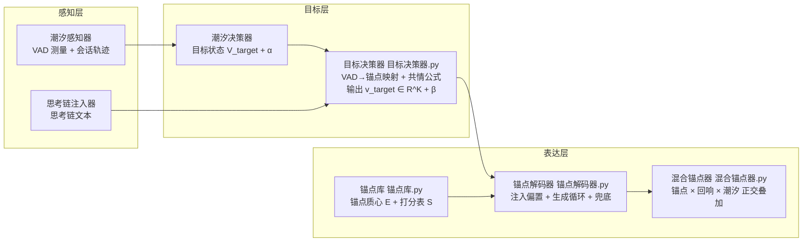

# P4 混合方案设计：锚点回响（Anchor Echo, AE）

> 版本：v1.0（设计稿）｜日期：2026-08-10｜状态：**Task 2 设计定稿，Task 3 按本文档编码**
> 前置结论：Task 1（`灵感验证报告.md`）已验证「锚点方向分离度强成立（t=9.3~17.6）」「只读零修改」「近义覆盖部分成立（7/10，需增强）」。

---

## 1. 总览

### 1.1 一句话定位

**锚点回响（P4）＝ 用模型自身的 token-embedding 权重 `W_e` 作为只读映射接口，把「K 维情感锚点质心」的稠密余弦打分做成低秩 logits 偏置，按会话目标情感权重 v_target 极性定向注入——不写权重、不挂钩子、全词表覆盖、可降级到闭源 API。**

### 1.2 四套方案空间对照表

| 维度 | P1 语义回响 | P2 通用兼容层 V2 | P3 情感潮汐解码 ETD | **P4 锚点回响 AE** |
|---|---|---|---|---|
| 操作空间 | 表示空间（hidden_state） | 配置空间（λ/γ/τ 自动适配） | 概率空间（logits 乘性重加权） | **嵌入空间（token-embedding 权重）** |
| 情感载体 | 回响池质心（模型内部向量） | —（参数体系，本身不注入） | 外部 VAD + 稀疏情感词表 | **K 维情感锚点质心 E ∈ R^{K×d}（6 维）** |
| 需本地权重 | 是（必须本地模型 + hook） | 注入时依赖 P1/P4 通道 | 否（文本感知即可） | **是（需 `get_input_embeddings()`；有三级降级）** |
| 是否改权重 | 否（hook 只读 hidden_state） | 否 | 否 | **否（只读引用，`sum`/`data_ptr` 断言零修改）** |
| 打分密度 | 全词表稠密（随机投影 V 维偏置） | — | 稀疏（情感词表 ≈ 千级 token） | **全词表稠密但低秩（K 维打分表 S ∈ R^{V×K}）** |
| 闭源 API 可用性 | 不可用 | 提示级（思考链兜底） | 部分（logprob/文本感知） | **三级降级链路可用（embedding→logprobs→提示模式）** |
| 注入内存成本 | 投影矩阵 hidden×V（1.5B 约 933MB fp32） | — | 词表 dict（≈KB） | **打分表 V×K×4B（1.5B 仅 3.6MB）** |
| 阶段检测 | 思考/正文软切换 + 阶段 λ | — | 目标决策器输出 α | **目标决策器输出 v_target/β（复用潮汐决策器）** |

### 1.3 P1×P2×P3 混合逻辑说明

- **P1 提供「质心 → 投影 → 注入」骨架**：`logits += 池质心 @ 投影矩阵 × λ` 的整体链路原样保留，唯一替换点是把「固定随机投影矩阵 `R^{hidden×V}`」换成「**模型自身 embedding 接口产出的低秩打分表 S ∈ R^{V×K}**」：
  - 质心（K 维锚点质心 E）取代 hidden_state 池质心——从"每步钩子捕获"变成"一次性构建、生成期零开销"；
  - 投影（随机高斯矩阵）取代为「余弦打分」——从"不可解释的随机方向"变成"可解释的情感方向"；
  - 注入（logits 加偏置 × 强度 λ）完全复用，P4 用 β 与 tanh 有界化增强防坍缩。
- **P2 提供自动适配体系 + 思考链认知外壳**：
  - 「扫描表 + 公式 + 架构族因子 + 量化因子」四级归一化原样扩展，新增 β / T_anchor / 锚点维度数 三个参数档（见第 4 节）；
  - 「未注册模型 → 保守参数 + 思考链中断兜底」两级策略复用：P4 未注册模型走「保守 β + 锚点通道 + 思考链通道」双兜底；
  - 思考链注入器（先想好再表达）直接作为 P4 目标层的一个情感来源（思考链文本 → VAD → v_target）。
- **P3 提供模块化可插拔 + 外部感知 + 退化兜底结构**：
  - 「感知 / 决策 / 表达」三层架构原样照搬：感知层复用 `潮汐感知器`，决策层新增 `目标决策器`（内部复用 `潮汐决策器`），表达层为 `锚点解码器`；
  - 在线退化兜底（熵 < 0.6 或重复率攀升 → 强度减半/归零）、密度控制、AI 腔抑制等成熟结构全部继承设计；
  - P3 的 `混合注入器` 证明「继承父类 + 逐模块 logits 叠加」的接入范式可行——P4 的 `混合锚点器` 沿用同一叠加范式（见第 3 节）。

---

## 2. 三层架构（感知 / 决策 / 表达）

### 2.1 架构总图



### 2.2 ① 锚点层（复用并扩展 `h:\锚点回响（Anchor Echo）\锚点库.py`）

**复用（Task 1 已交付，不动核心）**：

```python
class 锚点库:
    def __init__(self, model, tokenizer, 词集=None, 模式="原始"):  # 模式: "原始"|"层归一化"
    def 构建(self) -> torch.Tensor                    # E ∈ R^{K×d}，每行 L2 归一化
    def 得分(self, token_ids) -> np.ndarray           # (N, K) 逐 token 稠密余弦打分
    def 词得分(self, 词) -> np.ndarray                # (K,)
    def 记录只读基线(self) -> dict                     # {"sum", "data_ptr"}
    def 验证只读(self, 基线=None) -> dict              # 断言 sum/data_ptr 不变
    def 维度名(self) -> list
```

**关键结论（Task 1 实测，直接写入设计）**：
- **构造模式固定为「原始 embedding」**：层归一化（减均值除 std）平均 t 12.12 → 11.69 反而略降，原始 embedding 本身已具备清晰情感方向性，不再做层归一化；
- **词向量 = 该词各 token 嵌入均值**（中文 BPE 多 token 词取均值）；
- **质心 = 种子词向量均值 → L2 归一化**；
- **只读保证**：全部计算基于 `W_e.detach().float()` 副本，原始权重仅 `sum`/`data_ptr` 校验，零修改。

**Task 3 需扩展（对应 Task 1 报告"近义覆盖增强"四条）**：

```python
def 扩展接口(self, 词集=None, 打分模式="均值", 缓存路径=None):
    """
    词集:  {维度名: [种子词]}，每维由 10 词扩至 30~50 词（纳入网络流行语：
          上头/内耗/破防/泪目/治愈/宠溺/孤寡/扎心/心累/崩溃 等）
    打分模式: "均值"（默认，token 向量均值后余弦）
             | "max池化"（逐 token 打分后取最响应 token，缓解均值稀释弱语义词）
    返回: 预计算打分表 S ∈ R^{V×K}（fp32，V×K×4B；1.5B 词表 151936×6 ≈ 3.6MB）
    """
```

**预计算打分表（P4 的核心工程优势）**：

```
S = 锚点库.预计算打分表()
  S[w, k] = f_k(w) = cos(W_e[w], e_k) = (W_e[w] · e_k) / (‖W_e[w]‖ · ‖e_k‖)

内存：V × K × 4B（Qwen2.5-1.5B：151936 × 6 × 4 ≈ 3.6MB）
      对比 P1 投影矩阵 hidden × V（1536 × 151936 × 4 ≈ 933MB）——内存降 3 个量级
用法：构建一次 → 生成循环内仅一次查表/向量乘（S @ v_target），无任何 hook 开销
```

**锚点扩维（可选参数）**：`锚点维度数 K` 初始 6；可扩至 7（新增"流行语"维，词集：上头/内耗/破防/扎心/泪目/治愈/宠溺/孤寡 等网络情感词），打分表内存随 K 线性增长，代价可忽略。

### 2.3 ② 目标层 `目标决策器.py`（新增模块）

**输入**：会话 VAD（复用 `潮汐感知器` + `潮汐决策器`）/ 思考链文本 / 显式指令。
**输出**：`锚点目标(v_target ∈ R^K, β, 活跃度, 决策日志)`。

**VAD → 锚点空间原型表**（每维锚点一个 VAD 原型三元组，人工标注）：

| 锚点维 k | valence | arousal | dominance |
|---|---|---|---|
| 温柔 | 0.30 | 0.20 | 0.20 |
| 开心 | 0.80 | 0.70 | 0.40 |
| 难过 | -0.70 | 0.40 | 0.10 |
| 愤怒 | -0.60 | 0.80 | 0.60 |
| 害怕 | -0.60 | 0.70 | 0.00 |
| 平静 | 0.00 | 0.00 | 0.30 |

**共情公式（参考 `潮汐决策器` 的 β_共情 思路）**：

```
① 目标状态（复用潮汐决策器.计算目标()，角色主导可选）：
   V_target = 用户当前 × β_共情 + 轨迹均值 × (1 - β_共情)
              （有角色时再加：× (1-角色权重) + 角色VAD × 角色权重）

② VAD → 锚点权重（方向余弦 + 平方放大，保持极性）：
   g_k = (V_target · 原型_k) / (‖V_target‖·‖原型_k‖ + ε)     ∈ [-1, 1]
   v_k = 原型强度_k · g_k · |g_k|ᵖ                              （p=1 线性；p≥1 锐化高匹配维）

③ 多源融合（思考链/指令作为情感来源）：
   v_target = w_潮汐 · v_潮汐 + w_思考链 · v_思考链 + w_指令 · v_指令
   v_思考链 = 思考链文本 → 潮汐感知器.测量() → 同 ② 映射
   v_指令   = 用户显式情感指令（如"温柔一点"）→ 词集命中维 → one-hot 加权
   默认来源权重: {"潮汐": 0.5, "思考链": 0.3, "指令": 0.2}

④ 归一化与强度：
   v_target ← v_target / ‖v_target‖₂        （L2 归一化，保证注入有界）
   β = β_基 × (1 + Δarousal) × min(1, 活跃度 × 2.5)，封顶 β_上限
   （Δarousal / 活跃度 复用 潮汐决策器 内部量：用户越激动越要引导）
```

**接口签名（Task 3 实施）**：

```python
class 锚点目标:
    __slots__ = ("v_target", "β", "活跃度", "决策日志")   # v_target: np.ndarray (K,) L2 归一化

class 目标决策器:
    def __init__(self, 感知器: 潮汐感知器, 潮汐决策器: 潮汐决策器,
                 锚点库: 锚点库, 原型表: Optional[dict] = None,
                 β共情: float = 0.6, 角色权重: float = 0.6,
                 β基: float = 0.8, β上限: float = 2.0,
                 来源权重: dict = None, 活跃度窗口: int = 8,
                 锐化指数: float = 1.0):
    def 计算目标(self, 用户当前=None, 思考链文本: str = "",
                 指令: str = "") -> 锚点目标
    def VAD到锚点(self, V: 情感状态) -> np.ndarray          # → R^K
    def 思考链到锚点(self, 思考链文本: str) -> np.ndarray    # → R^K
```

### 2.4 ③ 表达层 `锚点解码器.py`（新增模块）

**核心：稠密打分 + 极性定向注入公式（数学式）**

```
预计算打分表:   S[w, k] = f_k(w) = cos(W_e[w], e_k)          # S ∈ R^{V×K}
极性内积:       a(w) = S[w] · v_target = Σ_k f_k(w) · v_target,k
主注入公式:     logits[w] += β · tanh( a(w) / T_anchor )     # 有界注入（主选）
线性简化式:     logits[w] += β · a(w)                        # T_anchor→∞ 等价
```

**tanh 有界化的理由**：
1. `|b_anchor(w)| ≤ β` —— 每个 token 的 logits 偏移有硬上限，β 直接等于"最大注入幅度"，从机制上杜绝过注入坍缩；
2. `a(w) / T_anchor` 的量级可控：`|f_k| ≤ 1`、`‖v_target‖₂ = 1`，内积量级 ≈ O(√K)；T_anchor ∈ (0.1, 0.5) 放大弱信号、饱和强信号，与 P1 的 λ 语义解耦；
3. 弱信号区 `tanh(x) ≈ x` 保持线性可调，与 P3 乘性重加权"有界插值"精神一致。

**在线退化兜底（复用 P3 `_兜底监测` 结构，作用于 β）**：

```
每句结束监测最近 退化窗口(40) 个 token 的 2-gram 重复率：
  重复率 > 0.6 或 句熵 < 0.6  →  β ← β × 0.5，强制下句重算目标
  连续 3 次退化             →  β ← 0（锚点通道静默，退化为纯采样）
密度控制（复用 P3 密度系数）：
  句内目标方向情感词密度 > 密度目标 → β × 0.3（防情感词堆砌）
```

**接口签名（Task 3 实施）——独立实现但接口对齐 `回响注入器.生成/注入偏置`，评测脚本无痛接入**：

```python
class 锚点解码器:
    def __init__(self, model, tokenizer, 锚点库: 锚点库, 目标决策器: 目标决策器,
                 锚点强度: float = 1.0, β基: float = 0.8, β上限: float = 2.0,
                 T_anchor: float = 0.3,
                 句分隔符: str = r"[。！？!?；;\n～…~]",
                 退化窗口: int = 40, 兜底阈值: float = 0.6,
                 密度基: float = 0.06, 密度增益: float = 0.10, 密度上限: float = 0.25,
                 目标长度: int = 34, 最短字数: int = 12, 最大字数: int = 90,
                 最长句数: int = 2, 句子停止: bool = True, 最小长度: int = 0):
        # 内部: self.打分表 = 锚点库.预计算打分表()   # (V, K) fp32/fp16
        #       self.v_target = None; self.β = 0.0

    @torch.no_grad()
    def 注入偏置(self, logits: torch.Tensor) -> torch.Tensor:
        """logits(1,V) += β · tanh((S @ v_target) / T_anchor)；无目标或 β=0 时原样返回"""
        # a = self.打分表 @ self.v_target           # (V,)
        # logits[0] += self.β * torch.tanh(a / self.T_anchor)

    @torch.no_grad()
    def 生成(self, input_ids, max_new_tokens=256, temperature=1.0,
             top_p=0.9, top_k=50, repetition_penalty=1.0,
             eos_token_id=None, logits_callback=None, tokenizer=None,
             轮次回调=None, 用户文本: str = "", 思考链文本: str = "") -> torch.Tensor:
        """生成循环 = 前向 → 注入偏置(锚点) → 采样 → 句状态/密度/兜底；签名对齐 回响注入器"""

    def 更新目标(self, 用户文本: str, 思考链文本: str = "") -> 锚点目标:
        """复用 潮汐感知器.测量/追加轨迹 + 目标决策器.计算目标"""

    def 重置(self) -> None:
        """清空句状态/目标/β（打分表不重建）"""
```

---

## 3. 混合架构

### 3.1 `混合锚点器.py`（新增模块）—— 锚点 × 回响 × 潮汐 三正交叠加

**三通道均作用于 logits 加法（正交 = 各自空间互不读写、可独立开关），最终注入公式**：

```
logits = 模型原始 logits
       + λ_echo · (回响池质心 @ 投影矩阵)                    # ① 回响（表示空间情感底色，可关）
       + α_潮汐 · 引导倍率 · 极性词表偏置（含密度系数）          # ② 潮汐（概率空间方向密度，可关）
       + β · tanh( (S @ v_target) / T_anchor )              # ③ 锚点（嵌入空间低秩稠密，核心）
       + （可选）AI 腔抑制 / 身份拦截 / 口语化引导 / 长度收尾     # P3 既有通道，默认复用
```

**数据流（文本形式）**：

```
用户消息 ─→ 潮汐感知器.测量() ─→ 潮汐决策器.计算目标() ─→ V_target/α
     │                                                      │
     │── 思考链注入器（思考链文本，可选）─────────────────────→ 目标决策器: v_target, β
     │── 显式情感指令（可选）─────────────────────────────────→│
     └──────────────────────────────────────────────────────┘
                                                        ↓
    模型前向(logits) ── ① 回响注入器.注入偏置 ── ② 潮汐解码器._情感引导
                     ── ③ 锚点解码器.注入偏置 ── 采样 → 句状态/密度/兜底 → 输出
```

**模块独立开关参数**：

| 参数 | 默认 | 含义 |
|---|---|---|
| `--锚点β` | 0.8 | 锚点通道强度（0 = 关闭锚点） |
| `--锚点T` | 0.3 | 锚点温度缩放 |
| `--锚点K` | 6 | 锚点维度数（6 或 7） |
| `--回响λ` | 0.0 | 回响通道强度（默认关，混合时开） |
| `--潮汐倍率` | 0.0 | 潮汐通道引导倍率（默认关，混合时开） |
| `--思考链` | False | 思考链文本作为目标来源开关 |

### 3.2 与 P3 `混合注入器` 的继承/组合关系

- **锚点解码器：独立实现（不继承 `回响注入器`）**。原因：锚点通道不需要 forward hook、不需要 hidden×V 投影矩阵、不需要思考/正文阶段软切换——继承只会背负无用状态。但**接口签名严格对齐 `回响注入器.生成()/注入偏置()`**（参数名、返回类型一致），使现有评测脚本（`评测_LLM_Judge.py` / `评测_EmoCharacter.py` 的 `裸生成/潮汐生成/混合生成` 工厂函数模式）只需新增一个 `锚点生成` 工厂函数即可接入。
- **混合锚点器：组合优于继承**。`混合注入器`（P3）走"继承回响注入器 + 重写生成循环"路线；`混合锚点器` 改为**持有三个表达器实例**（`锚点解码器` + `回响注入器` + `潮汐解码器`），生成循环内按开关依次调用各自的偏置注入方法。理由：三通道来源异构（hook / 词表 / 打分表），无共同父类可复用；组合使各通道可独立构建、独立测试、任意开合。
- **目标层完全复用**：`目标决策器` 内部持有 `潮汐决策器` 实例，`潮汐解码器` 与 `锚点解码器` 共享同一个 `目标决策器` 的输出（v_target 与 α 同源），保证叠加方向一致。

---

## 4. 自动适配（P2 扩展）

### 4.1 注册表扩展：扫描表五元组

`一体化测试运行器.py` 的扫描表从三元组 `(λ, γ, τ)` 扩展为五元组 `(λ, γ, τ, β, T_anchor)`：

| hidden_dim | λ | γ | τ | **β** | **T_anchor** |
|---|---|---|---|---|---|
| 896 | 0.50 | 0.05 | 0.10 | **1.0** | **0.4** |
| **1536（Qwen2.5-1.5B）** | 0.08 | 0.07 | 0.09 | **0.8** | **0.3** |
| 2048 | 0.10 | 0.08 | 0.06 | **0.6** | **0.3** |
| 3584 | 0.06 | 0.12 | 0.05 | **0.5** | **0.2** |

### 4.2 公式兜底（未命中扫描表）

```
β 公式 = β_基础(hidden_dim) × 架构族因子_锚点 × 量化因子
β_基础: hidden < 2048 → 0.8 × (896/hidden)^0.25
        hidden ≥ 2048 → 0.6 × (896/hidden)^0.2
T_anchor: 默认 0.3（0.1~0.5 三档，见 E2 扫描）
锚点维度数 K: 默认 6（扩维开关）
```

**架构族因子_锚点**（独立于 P1 的 λ 因子——锚点偏置直接作用于 logits，敏感性近似 P1 但经 tanh 有界化后更稳，故因子略放宽）：

| 架构族 | λ 因子（P1 沿用） | **β 因子（P4 新增）** | 依据 |
|---|---|---|---|
| Qwen2.5 / 通用 | 1.0 | **1.0** | 基准（Task 1 实测模型） |
| Qwen3 ≤1.7B | 0.3 | **0.4** | P1 实测坍缩敏感，保守 |
| Qwen3 ≥4B | 0.6 | **0.7** | 敏感但可用 |
| Gemma | 0.7 | **0.8** | 命中率高 |
| SmolLM | 0.5 | **0.6** | 边界偏强 |
| Phi | 0.8 | **0.8** | 稳定但中文命中≈0 |

量化因子：fp16 = 1.0，4bit = **0.75**（与 P1 一致；4bit 下 embedding 层通常保留 fp16/fp32，需在 E4 验证打分表质量）。

### 4.3 Qwen2.5-1.5B（hidden 1536）初始建议值

| 参数 | 初始值 | 保守区间 | 说明 |
|---|---|---|---|
| β | **0.8** | 0.2 ~ 2.0 | 扫描表命中值；tanh 有界 ⇒ 每 token 最大偏移 = β |
| T_anchor | **0.3** | 0.1 ~ 0.5 | 内积放大/饱和温度 |
| K | **6** | 6 ~ 7 | 6 维情感 + 可选"流行语"维 |
| β 兜底（未注册） | 0.5 | — | 保守双兜底（+ 思考链通道） |

### 4.4 未注册模型保守兜底规则

```
任意模型加载 → 读取 hidden_size / 模型名 / 量化
  ├─ 命中扫描表(hidden) 且 命中架构族 → 预制五元组（含 β/T_anchor）
  ├─ 未命中 → β = 0.5（保守）、T_anchor = 0.3、K = 6、λ/γ/τ 走 P2 原公式
  └─ 在线坍缩检测（熵 < 0.6 或 2-gram 重复率 > 0.6）：
       → β 减半重试；连续 3 次 → β = 0（锚点通道静默）
       → 若 β = 0 后退化仍持续 → 转「思考链中断注入器」通道（P2 第二步兜底）
```

---

## 5. 三级接口降级链路

| 级别 | 前置条件 | 打分方式 | 注入方式 | 适用对象 |
|---|---|---|---|---|
| **① 本地 embedding 直读** | `model.get_input_embeddings()` 可用 | 全词表预计算 S ∈ R^{V×K}（3.6MB） | `logits += β·tanh(S@v_target/T_anchor)` | 全部本地 HF 模型 |
| **② API 返回 logits/logprobs** | 接口暴露 top-k logprobs | **候选受限打分**（见下） | 伪 logits 重采样 | OpenAI/DeepSeek 类 API |
| **③ 纯黑盒 API** | 无 embedding 无 logprobs | 无打分 | **锚点提示模式**（见下） | 完全黑盒 |

### 5.1 ① 本地 embedding 直读（主路径）

```python
锚点库 = 锚点库(model, tokenizer).构建()
S = 锚点库.预计算打分表()
# 生成循环内: logits[0] += β * torch.tanh(S @ v_target / T_anchor)
```

### 5.2 ② API logprobs 近似（候选受限打分）

```
每步取 API 返回的 top-k logprobs（k=64）作为候选集 C：
  logprob(w) ≈ logits(w) + 常数（softmax 归一化常数，对偏置相对值无影响）
  候选打分（无 embedding，用文本级近似替代 f_k(w)）：
    优先：本地轻量 embedding 模型（m3e/bge-small，<100MB）对候选 token 文本
          与锚点种子词文本算余弦 → f̂(w)
    兜底：词典/子串近似（候选文本命中锚点词集或近义词表 → f̂(w) 取原型向量）
  注入：logitŝ(w) = logprob(w) + β · tanh( f̂(w) · v_target / T_anchor ),  w ∈ C
        C 外 token 保持原 logprob → 重归一化 softmax 采样
```

### 5.3 ③ 锚点提示模式（纯黑盒退化）

```
把「当前维度锚点词」注入 prompt（复用 P3 全局人设的注入位置）：
  模板: 你现在要用「{维度词}」的语气回复我。{维度词}的典型表达是：
        {锚点种子词前 5 个}。请自然、口语化地回应，20~45 字。
每轮由 目标决策器 输出当前主导维度（v_target 的 argmax 维）→ 动态选词注入。
零 embedding、零 logits 需求，代价是引导粒度粗（维度级而非 token 级）。
```

**降级判定顺序**：`hasattr(model, 'get_input_embeddings')` → ①；否则 `logprobs=True` 可请求 → ②；否则 → ③。三级共享同一 `目标决策器` 与同一 `锚点库` 词集，切换只替换表达层打分器。

---

## 6. 评测计划

### 6.1 五基准接入方式（复用 P3 评测脚本，新增锚点模式参数）

| 基准 | 脚本（复用） | 协议要点 | 锚点接入 |
|---|---|---|---|
| **EmoCharacter** | `评测_EmoCharacter.py` | Fidelity 差分（匹配/错配/净区分度）+ Consistency 二选一 + 中性下限；10 角色 × 8 用户回应 | 新增 `锚点生成()` 工厂；角色 VAD 基调 → 目标决策器 角色原型 → v_target |
| **HeartBench**（中文情感支持） | `评测_HeartBench.py` | 中文共情对话质量 | 同上，`--模式 锚点` |
| **LLM-Judge**（图灵） | `评测_LLM_Judge.py` | 配对盲评 vs 真人；win_rate_against_human + average_rating | `--模式` 增加 `锚点/混合锚点`；新增 `--锚点β --锚点T --锚点K`（对齐现有 `--混合λ --混合倍率` 范式） |
| **TuringBench** | 语义回响项目 TuringBench 脚本 | 图灵判定协议 | 与 LLM-Judge 同构，生成侧接入 `锚点解码器` |
| **HEART-BENCH**（英文） | `评测_HEART_BENCH.py` | 英文情感支持 | 新增**英文锚点词集**（基于 `潮汐感知器` 内置 NRC 精简版 + 扩充），每维 30+ 英文词 |

统一改动点：每个评测脚本仅新增「`锚点生成` 工厂函数 + 参数透传」，不改评测协议、不改裁判提示词。

### 6.2 成功指标（单模式 = 锚点模式 vs 裸基线，同种子 42）

| 指标 | 目标 | 判定 |
|---|---|---|
| LLM-Judge win_rate | **≥ 裸 × 1.25（相对 +25%）** 且 ≥ 0.45 | 硬性 |
| EmoCharacter 一致性 | **≥ 裸 × 1.16（相对 +16%）** | 硬性 |
| EmoCharacter 匹配分/净区分度 | ≥ 裸（不劣化） | 硬性 |
| 平均熵 | **≥ 裸 × 0.95**（不因注入塌缩） | 硬性 |
| 重复率 | ≤ 0.6 且 ≤ 裸 + 0.1 | 硬性（无坍缩） |
| 情感命中率（cnsenti） | ≥ 裸（>0 即可，锚点通道提升可叠加） | 软性 |
| 多模型泛化 | **≥ 3 个模型锚点模式整体为正**（熵+命中双不劣化） | 硬性 |

---

## 7. 实验任务编排（流水线）

```
E0 锚点库扩展与预计算
   └→ E1 单模型对照（Qwen2.5-1.5B）
        └→ E2 参数扫描（β × T_anchor 网格）
             └→ E3 五基准正式评测
                  └→ E4 多模型泛化
                       └→ E5 三正交叠加（消融）
                            └→ E6 接口降级验证
```

| 步骤 | 输入 | 操作 | 输出 | 判定 |
|---|---|---|---|---|
| **E0 锚点库扩展** | `锚点库.py` + Task1 报告 | 词集扩至 30~50 词/维、预计算打分表 S、max-pooling 模式、只读复验 | 打分表 S（3.6MB）+ 只读断言通过 | 只读 sum/data_ptr 不变；流行语维 max 余弦 ≥ 0.2 |
| **E1 单模型对照** | Qwen2.5-1.5B、15 提示词、runs=5 | 裸 vs 锚点（β=0.8, T=0.3, K=6） | 熵/重复率/命中率对照表 | 熵 ≥ 裸×0.95、无坍缩、命中 > 0 |
| **E2 参数扫描** | E1 最优基线 | β ∈ {0.2, 0.5, 0.8, 1.2, 2.0} × T_anchor ∈ {0.1, 0.3, 0.5}，15 组合网格 | β-T 热力图（熵/重复率/命中率） | 选出 (β*, T*)：熵不塌且命中最大 |
| **E3 五基准正式评测** | E2 的 (β*, T*) | 五基准跑 锚点 vs 裸（同种子 42） | 五份结果 JSON | 满足 6.2 指标 |
| **E4 多模型泛化** | Qwen2.5-0.5B/3B/7B、Qwen3-1.7B/4B（≥3 模型为正） | 五元组自动适配（含 4bit 因子）跑 裸 vs 锚点 | 多模型对照表 | ≥3 个模型整体为正；Qwen3 系用 β 因子 0.4/0.7 |
| **E5 三正交叠加（消融）** | Qwen2.5-1.5B + (β*, T*) | 7 组：裸 / 锚点 / 回响 / 潮汐 / 锚点+回响 / 锚点+潮汐 / 锚点+回响+潮汐 | 消融矩阵（win_rate/熵/重复率） | 叠加组 win_rate ≥ 任单通道；无坍缩 |
| **E6 接口降级验证** | ① 打分表 / ② 伪 logits / ③ 提示模式 | 同 15 提示词各跑三级别 | 三级质量对比表 | ① ≥ ② ≥ ③ 质量递减可接受；③ 情感命中 > 裸 |

---

## 8. 风险与对策

| # | 风险 | 证据/来源 | 对策 | 落实位置 |
|---|---|---|---|---|
| 1 | **近义覆盖弱点**：网络流行语（上头 0.037 / 内耗 0.069 / 破防 0.126）识别弱，拉低词库外均值 | Task1 验证 c：3/10 词 max 余弦低于 0.15 | ① **更大词集**：每维 10 → 30~50 词，把流行语直接纳入种子词集；② **多词锚点**：质心取更多词求均值提高稳定性；③ **token 级 max-pooling**：打分从"token 向量均值"改"逐 token 打分后取最响应"，避免弱语义词被均值稀释；④ **扩维**：新增第 7"流行语"维（K=6→7） | 锚点库.py 扩展接口 |
| 2 | **β 过注入**：logits 偏移过大 → 情感词堆砌/坍缩（P1 在 Qwen3-1.7B 上实测 λ0.10 即坍缩） | P2 兼容层文档 4.2 | tanh 有界注入（`\|b\| ≤ β`）+ β 保守区间 0.2~2.0 + 在线退化兜底（β 减半/归零）+ 密度系数（句密度超限 β×0.3） | 锚点解码器.py 注入偏置/兜底 |
| 3 | **Qwen3 系敏感**：对 logits 偏置极度敏感（λ0.41/0.10 均坍缩） | P2 兼容层文档 4.1/4.2 | β 架构族因子 0.4（≤1.7B）/ 0.7（≥4B）；坍缩时转思考链通道 | 一体化测试运行器.py 因子表 |
| 4 | **闭源 API 无 embedding/logits** | — | 三级降级链路：① 直读 → ② top-k logprobs 候选受限打分（本地小 embedding 兜底）→ ③ 锚点提示模式 | 降级层（第 5 节） |
| 5 | **量化（4bit）下 embedding 质量**：打分表来自量化后权重可能失真 | P1 实测 4bit 因子 0.75 | embedding 层通常保留 fp16/fp32（不量化）；E4 验证打分表质量，必要时 β×0.75 | E4 + 量化因子 |
| 6 | **多 token 中文词稀释**：BPE 把"上头"切成多 token，均值稀释 | Task1 词向量=token 均值 | 词级 max-pooling 打分模式；打分表同时缓存 token 级（供生成查表）与词级（供目标层） | 锚点库.py 打分模式 |
| 7 | **只读破坏风险**（回归） | Task1 验证 b 已通过 | `记录只读基线/验证只读` 断言纳入 E0 强制步骤，每次构建后复验 | 锚点库.py + E0 |
| 8 | **三通道叠加后熵异常**：回响（+40~45% 熵）与锚点叠加可能双高 | P3 混合注入器经验 | E5 消融逐通道开关验证；叠加时各通道参数减半起步（β×0.5、λ×0.5） | E5 消融 |

---

## 附录 A：模块文件清单（Task 3 交付物）

| 文件 | 类型 | 内容 |
|---|---|---|
| `h:\锚点回响（Anchor Echo）\锚点库.py` | 扩展 | 词集扩充、`预计算打分表()`、max-pooling 打分模式、只读复验 |
| `h:\锚点回响（Anchor Echo）\目标决策器.py` | 新增 | VAD→锚点映射、共情公式、多源融合、输出 v_target/β |
| `h:\锚点回响（Anchor Echo）\锚点解码器.py` | 新增 | 稠密打分注入、生成循环、退化兜底（接口对齐回响注入器） |
| `h:\锚点回响（Anchor Echo）\混合锚点器.py` | 新增 | 锚点 × 回响 × 潮汐 三通道叠加、独立开关 |
| `i:\Desktop\语义回响\experiments\一体化测试运行器.py` | 扩展 | 扫描表五元组、β/T_anchor/K 因子、未注册兜底 |
| 评测脚本（ETD 目录 5 个） | 扩展 | 新增 `锚点生成` 工厂 + `--锚点β/--锚点T/--锚点K` 参数 |

## 附录 B：核心公式速查

```
打分表:      S[w,k] = cos(W_e[w], e_k)，E 每行 L2 归一化            （锚点层）
目标:        v_target = w_潮汐·v_潮汐 + w_思考链·v_思考链 + w_指令·v_指令，L2 归一化   （目标层）
注入:        logits[w] += β · tanh( S[w]·v_target / T_anchor )     （表达层）
β 自适应:    β = β_基 × (1 + Δarousal) × min(1, 活跃度×2.5)，封顶 β_上限
混合叠加:    logits = base + λ·(质心@投影) + α·倍率·词表偏置 + β·tanh(S@v_target/T)
退化兜底:    重复率>0.6 或 熵<0.6 → β×0.5；连续 3 次 → β=0
自动适配:    β = 表或公式 × 架构族因子_锚点 × 量化因子(4bit=0.75)
```
