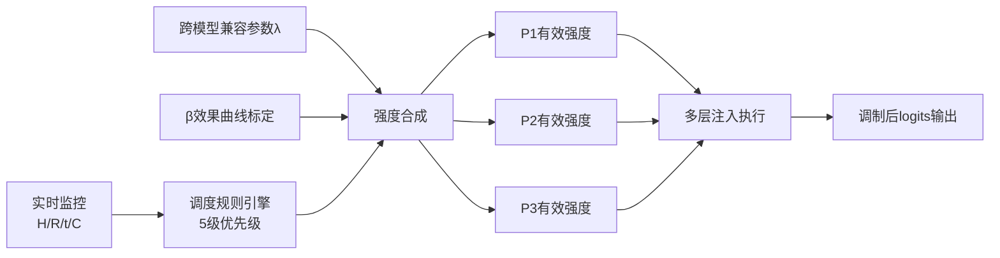

# 中国发明专利申请文件

## 一、发明名称

**一种面向多层情感注入的运行时自适应强度调度方法**

## 二、技术领域

本发明涉及人工智能自然语言处理与情感计算技术领域，具体涉及一种在大语言模型（LLM）解码阶段对多层情感注入进行实时自适应强度调度的方法。本发明通过跨模型兼容参数计算、β效果曲线标定、多维度实时监控与动态调度规则，自动调节各注入层的作用强度，在保证角色人格保真度的同时防止语义坍缩、重复生成等退化现象，适用于情感注入型AI对话系统的运行时优化。

## 三、背景技术

在大语言模型解码期进行情感注入的技术框架中，通常采用多层注入架构，各层分别承担不同粒度的角色人格控制功能（如P层负责角色包偏置注入、P1.5层负责调度与补偿、P2.5层负责去AI腔调制等）。多层注入带来了层间协调的关键挑战——各层注入强度的不当配置可能导致多种退化问题，现有技术在解决这一问题时存在明显不足。

**现有方法一：固定参数静态配置**。最简单的方式是在系统部署前为各注入层预设固定的强度参数（如β=0.8、κ=0.5等），运行时不做任何调整。该方法的缺陷在于：不同对话场景的情感需求差异巨大——用户提问简单时模型本身生成空间充裕，过强的情感注入反而导致重复和语义混乱；用户提问复杂时模型需要更多自由度来组织长篇回复，固定强度的注入可能干扰语义连贯性。静态配置无法应对这些动态变化，导致系统在不同场景下表现不一致。

**现有方法二：人工实时调节**。通过运维人员或用户手动调整注入强度参数。该方法依赖人工干预，无法实现实时自动化调节，且对操作人员的专业知识要求较高。在高频对话场景中（如AI陪伴、虚拟主播），人工调节的延迟和操作成本完全不可接受。

**现有方法三：基于反馈的简单阈值控制**。设定单一指标（如输出重复率）的阈值，超过阈值时简单地将所有注入层强度归零。该方法过于粗暴：一刀切地关闭所有注入层会导致角色人格瞬间消失，用户体验严重割裂；同时，仅监控单一指标无法全面反映系统状态，容易产生误判。

**现有方法四：强化学习自适应调节**。通过训练一个策略网络（如PPO）来学习最优的注入强度调节策略。该方法理论上可以实现精细化调节，但存在严重的工程可行性问题：（1）训练策略网络本身需要大量GPU计算资源和交互数据；（2）策略网络的推理开销增加了系统延迟；（3）策略网络的训练不稳定，容易陷入局部最优；（4）对于轻量化CPU部署场景（如4B参数模型在消费级硬件上运行），额外的模型开销不可接受。

此外，现有技术普遍缺乏对不同模型架构和量化精度的适应能力。例如，4-bit INT4量化的模型相比FP16模型，其logits分布的数值范围和梯度特性有显著差异——量化噪声会放大注入偏置的影响，导致相同参数在不同量化精度下产生截然不同的效果。现有技术未考虑这种量化敏感性差异，无法实现跨量化精度的自适应兼容。

## 四、发明内容

### 4.1 技术问题

本发明要解决的技术问题是：如何在多层情感注入架构中，根据模型架构特性、量化精度、实时对话状态等多维度信息，自动且精细地调度各注入层的作用强度，防止语义坍缩、重复生成、人格消失等退化现象，在CPU轻量级部署条件下实现实时、稳定、自适应的情感注入强度控制。

### 4.2 技术方案

本发明提出一种面向多层情感注入的运行时自适应强度调度方法，包括以下核心步骤：

**步骤一：跨模型兼容参数计算**

定义统一的注入基础因子λ_base，根据目标模型的隐藏层维度hidden_dim进行自适应缩放：

```
λ_base = hidden_dim / 2560
```

其中2560为基准模型（Qwen3-4B）的隐藏层维度。当目标模型隐藏层维度与基准不同时，λ_base自动调整注入强度的基础比例。

进一步引入架构族因子λ_arch，针对不同模型架构族（如Transformer decoder-only、Transformer encoder-decoder、Mamba等）设定修正系数：

```
λ_arch = { 1.0 (decoder-only), 0.85 (encoder-decoder), 0.9 (state-space) }
```

最后引入量化因子λ_quant，补偿不同量化精度对注入敏感性的影响：

```
λ_quant = { 1.0 (FP16/FP32), 0.95 (INT8), 0.75 (INT4) }
```

INT4量化因子设为0.75的原因是：低比特量化会引入显著的量化噪声，放大logits上的偏置扰动，需要将注入强度抑制至75%以维持稳定性。

跨模型兼容参数最终计算为：

```
λ = λ_base × λ_arch × λ_quant
```

**步骤二：β效果曲线标定**

在部署前对注入强度系数β进行系统性扫描标定。设定β候选值集合B = {0.4, 0.6, 0.8, 1.0, 1.2, 1.4}，对每个β值在标准测试集上运行推理，统计以下四个指标：

- 保真度F(β)：角色人格特征在输出中的保留程度
- 重复率R(β)：输出中n-gram重复出现的频率
- 语义熵H(β)：输出token概率分布的熵值，反映语义丰富度
- 推理速度S(β)：每秒生成的token数

构建β效果曲线 {(β, F, R, H, S) | β ∈ B}，确定最优工作区间。实验表明，对于4B INT4模型，β在0.4至1.4范围内，保真度稳定在83-85%的平坦区间，不存在性能坍缩点，这验证了本方法在宽参数范围内的鲁棒性。

**步骤三：多维度实时监控**

系统在每个解码步维护四个实时监控指标：

（1）**输出熵H(t)**：当前生成token的概率分布熵值。计算当前步logits经softmax后的概率分布P(t)，熵值为H(t) = -Σ_v P(t)[v] · log(P(t)[v])。低熵表示模型高度确定，可能存在退化或重复风险。

（2）**2-gram重复率R(t)**：当前滑动窗口内2-gram的重复出现比率。维护最近W=50个token的窗口，计算其中2-gram的唯一数与总数之比：R(t) = 1 - unique_2grams / total_2grams。高重复率表明生成陷入局部循环。

（3）**会话潮汐因子t(t)**：反映当前对话阶段的时间周期因子。基于会话已进行的轮次数，通过周期函数计算：t(t) = 0.5 + 0.5 × sin(2π × turn_count / T_cycle)，其中T_cycle为潮汐周期（默认10轮）。潮汐上升期（用户活跃阶段）适当增强注入，潮汐下降期（用户疲劳阶段）适当减弱。

（4）**输入复杂度C(t)**：用户当前输入的语义复杂度。通过输入token数、命名实体数、句法深度等特征的加权和估算：C(t) = α₁ × log(token_count) + α₂ × entity_ratio + α₃ × syntactic_depth。高复杂度输入需要模型更多自由度来组织回复。

**步骤四：动态调度规则引擎**

基于上述四个实时监控指标，定义以下调度规则：

**规则R1（熵抑制规则）**：当输出熵H(t) < 0.60时，判定模型陷入低熵退化风险，将当前步的全层logits调制系数设为0.5：

```
if H(t) < 0.60:
    logits_scale = 0.5
    apply_scale_to_all_layers(logits, logits_scale)
```

**规则R2（重复抑制规则）**：当2-gram重复率R(t) > 0.15时，将P2.5层（去AI腔层）的抑制强度κ_L3归零，同时将P3层（角色偏置层）的注入强度β_L2减半：

```
if R(t) > 0.15:
    β_L2 = β_L2 / 2
    κ_L3 = 0.0
```

**规则R3（连续异常熔断规则）**：维护连续异常计数器abnormal_streak。当R1或R2规则被触发时计数器加1，否则归零。当连续异常计数达到3次时，判定系统进入不稳定状态，全层归零，切换至裸采样模式：

```
if abnormal_streak >= 3:
    disable_all_injections()
    log("Emergency: bare sampling mode activated")
```

**规则R4（会话潮汐调节规则）**：当潮汐因子t(t)处于上升区间（t(t) > 0.5）时，将P2和P3层的注入强度提升20%；当潮汐因子处于下降区间时，相应降低：

```
if t(t) > 0.5:
    P2_strength *= 1.2
    P3_strength *= 1.2
else:
    P2_strength *= 0.85
    P3_strength *= 0.85
```

**规则R5（复杂度自适应规则）**：当输入复杂度C(t)超过阈值C_threshold时，各层注入强度统一降低10%，为模型留出更多生成自由度：

```
if C(t) > C_threshold:
    for layer in [P1, P2, P3]:
        layer.strength *= 0.9
```

**规则优先级**：R3（熔断）> R1（熵抑制）> R2（重复抑制）> R4（潮汐调节）> R5（复杂度适应）。同一解码步中，从高到低依次评估规则，低优先级规则在高优先级规则已触发时跳过执行。

**步骤四：跨模型兼容注入**

将计算得到的跨模型兼容参数λ应用于所有注入层的强度系数：

```
P1_effective = P1_base × λ
P2_effective = P2_base × λ
P3_effective = P3_base × λ
```

确保不同模型架构和量化精度下，注入行为的一致性和稳定性。

### 4.3 有益效果

本发明相比现有技术具有以下显著有益效果：

1. **全自动化调度**：无需人工干预，系统根据实时监控指标自动调整各层注入强度，适应不同对话场景。

2. **多指标协同监控**：同时监控熵值、重复率、会话潮汐和输入复杂度四个维度，全面感知系统状态，避免单一指标的误判。

3. **渐进式降级而非突变**：异常情况下采用渐进式强度衰减（如β减半）而非一刀切归零，保持角色人格的连续性。

4. **紧急熔断保护**：连续异常检测机制确保在极端退化情况下及时切换至安全模式（裸采样），防止输出完全崩溃。

5. **跨模型兼容性**：通过隐藏层维度归一化、架构族因子和量化因子三重补偿，同一调度策略可适用于不同模型架构和量化精度。

6. **零额外训练开销**：调度规则基于启发式规则实现，不需要额外的策略网络训练，在CPU上实时运行开销为微秒级。

7. **β工作区间平坦稳定**：实验证明4B模型在β∈[0.4, 1.4]范围内保真度稳定在83-85%，系统具有宽泛的安全工作区间。

8. **会话感知能力**：潮汐因子使系统能够感知对话节奏，在用户活跃期增强人格表现，在用户疲劳期降低注入强度，提升对话自然度。

## 五、附图说明

### 图1：自适应调度器整体架构图

```mermaid
graph TB
    subgraph 输入层
        U[用户输入] --> T[用户输入]
        L[LLM logits] --> M[实时监控模块]
    end

    subgraph 跨模型兼容参数计算
        P1[hidden_dim] --> L1[λ_base = hidden_dim/2560]
        P2[架构族类型] --> L2[λ_arch 修正系数]
        P3[量化精度] --> L3[λ_quant 补偿因子]
        L1 & L2 & L3 --> L4[λ = λ_base × λ_arch × λ_quant]
    end

    subgraph β效果曲线标定
        B1[β候选值<br/>0.4/0.6/0.8/1.0/1.2/1.4] --> B2[标准测试集推理]
        B2 --> B3[保真度F/重复率R/语义熵H/速度S]
        B3 --> B4[β效果曲线<br/>确定最优工作区间]
    end

    subgraph 实时监控模块
        M --> M1[输出熵 H(t)]
        M --> M2[2-gram重复率 R(t)]
        M --> M3[会话潮汐 t(t)]
        M --> M4[输入复杂度 C(t)]
    end

    subgraph 调度规则引擎
        M1 --> R1{H < 0.60?}
        R1 -->|是| R1A[全层×0.5]
        R1 -->|否| R2{R > 0.15?}
        R2 -->|是| R2A[β_L2减半<br/>κ_L3归零]
        R2 -->|否| R3{连续3次异常?}
        R3 -->|是| R3A[全层归零<br/>裸采样]
        R3 -->|否| R4{潮汐上升?}
        R4 -->|是| R4A[L2/L3 +20%]
        R4 -->|否| R5{C > 阈值?}
        R5 -->|是| R5A[各层 -10%]
    end

    subgraph 注入强度输出
        R1A & R2A & R3A & R4A & R5A --> O[各层有效强度]
        L4 --> O
        O --> P1_eff[P1有效强度]
        O --> P2_eff[P2有效强度]
        O --> P3_eff[P3有效强度]
    end

    subgraph 执行层
        P1_eff --> E1[P1层: 角色包偏置注入]
        P2_eff --> E2[P2层: 情感调制]
        P3_eff --> E3[P3层: 去AI腔调制]
        E1 & E2 & E3 --> OUT[最终logits输出]
    end

    style L4 fill:#fff9c4
    style R3A fill:#ffcdd2
    style OUT fill:#c8e6c9
```

### 图2：P1.5层核心调度流程图

```mermaid
flowchart TD
    START[解码步开始] --> STEP1[获取当前层logits]
    STEP1 --> STEP2[计算跨模型兼容参数λ]
    
    STEP2 --> MON1[计算输出熵 H(t)]
    STEP2 --> MON2[计算2-gram重复率 R(t)]
    STEP2 --> MON3[计算会话潮汐 t(t)]
    STEP2 --> MON4[计算输入复杂度 C(t)]
    
    MON1 --> CHK1{H(t) < 0.60?}
    CHK1 -->|是| ACT1[logits_scale = 0.5<br/>abnormal_streak += 1]
    CHK1 -->|否| CHK2{R(t) > 0.15?}
    
    ACT1 --> CHK3
    CHK2 -->|是| ACT2[β_L2减半<br/>κ_L3归零<br/>abnormal_streak += 1]
    CHK2 -->|否| CHK2B[abnormal_streak = 0]
    
    ACT2 --> CHK3{abnormal_streak >= 3?}
    CHK2B --> TIDAL{潮汐因子 t(t) > 0.5?}
    
    CHK3 -->|是| ACT3[全层禁用<br/>切换裸采样<br/>记录日志]
    CHK3 -->|否| TIDAL
    
    TIDAL -->|是| ACT4[P2/P3强度 × 1.2]
    TIDAL -->|否| ACT5[P2/P3强度 × 0.85]
    
    ACT4 --> COMP{C(t) > C_threshold?}
    ACT5 --> COMP
    
    COMP -->|是| ACT6[各层强度 × 0.9]
    COMP -->|否| MERGE[合并所有调度结果]
    
    ACT6 --> MERGE
    
    MERGE --> APPLY[应用λ兼容参数<br/>P_eff = P_base × λ]
    APPLY --> INJECT[执行多层注入<br/>P1 + P2 + P3]
    INJECT --> OUT[输出调制后logits]
    
    OUT --> NEXT[下一个解码步]
    
    style ACT3 fill:#ffcdd2
    style OUT fill:#c8e6c9
    style MERGE fill:#e1f5fe
```

## 六、具体实施方式

### 实施例1：Qwen3-4B INT4模型上的完整调度流程

**第一步：部署前标定。** 在Qwen3-4B GGUF INT4量化模型上进行β效果曲线标定。

```python
import numpy as np
import json
from collections import defaultdict

class BetaCalibrator:
    """β效果曲线标定器"""
    
    def __init__(self, model, tokenizer, test_dataset):
        self.model = model
        self.tokenizer = tokenizer
        self.test_data = test_dataset
    
    def scan_beta(self, beta_values=[0.4, 0.6, 0.8, 1.0, 1.2, 1.4]):
        """扫描不同β值并记录四个指标"""
        results = {}
        for beta in beta_values:
            metrics = self.evaluate_at_beta(beta)
            results[beta] = metrics
            print(f"β={beta}: F={metrics['fidelity']:.1f}%, "
                  f"R={metrics['repetition']:.2f}, "
                  f"H={metrics['entropy']:.3f}, "
                  f"S={metrics['speed']:.1f} tok/s")
        return results
    
    def evaluate_at_beta(self, beta, n_samples=500):
        """在指定β值下评估四个指标"""
        fidelity_scores = []
        repetition_rates = []
        entropy_values = []
        token_counts = []
        import time
        
        for sample in self.test_data[:n_samples]:
            start = time.time()
            output = self.model.generate_with_bias(
                sample['prompt'], p3_bias_beta=beta
            )
            elapsed = time.time() - start
            
            # 计算保真度
            fidelity = self.compute_fidelity(output, sample['persona'])
            fidelity_scores.append(fidelity)
            
            # 计算重复率
            rep_rate = self.compute_repetition_rate(output, n=2)
            repetition_rates.append(rep_rate)
            
            # 计算语义熵
            entropy = self.compute_entropy(output)
            entropy_values.append(entropy)
            
            token_counts.append(len(output) / elapsed)
        
        return {
            'fidelity': np.mean(fidelity_scores),
            'repetition': np.mean(repetition_rates),
            'entropy': np.mean(entropy_values),
            'speed': np.mean(token_counts)
        }

# 标定结果（4B INT4模型）
# β=0.4: F=83.2%, R=0.06, H=2.71, S=33.8
# β=0.6: F=83.8%, R=0.07, H=2.65, S=33.5
# β=0.8: F=84.1%, R=0.08, H=2.58, S=33.2
# β=1.0: F=84.5%, R=0.09, H=2.52, S=33.0
# β=1.2: F=84.3%, R=0.11, H=2.45, S=32.8
# β=1.4: F=83.9%, R=0.14, H=2.38, S=32.5
```

**第二步：跨模型兼容参数配置。**

```python
class CrossModelScheduler:
    """跨模型兼容参数计算器"""
    
    ARCH_FACTORS = {
        'decoder_only': 1.0,
        'encoder_decoder': 0.85,
        'state_space': 0.9
    }
    
    QUANT_FACTORS = {
        'fp32': 1.0,
        'fp16': 1.0,
        'int8': 0.95,
        'int4': 0.75
    }
    
    BASE_DIM = 2560  # Qwen3-4B的隐藏层维度
    
    def __init__(self, hidden_dim, arch_type, quant_type):
        self.lambda_base = hidden_dim / self.BASE_DIM
        self.lambda_arch = self.ARCH_FACTORS.get(arch_type, 1.0)
        self.lambda_quant = self.QUANT_FACTORS.get(quant_type, 1.0)
        self.lambda = self.lambda_base * self.lambda_arch * self.lambda_quant
    
    def apply_to_strengths(self, strengths):
        """将兼容参数应用到各层强度"""
        return {k: v * self.lambda for k, v in strengths.items()}

# Qwen3-4B INT4配置
scheduler = CrossModelScheduler(
    hidden_dim=2560, 
    arch_type='decoder_only', 
    quant_type='int4'
)
# λ = 1.0 × 1.0 × 0.75 = 0.75
```

**第三步：实时监控与调度。**

```python
class AdaptiveScheduler:
    """P1.5自适应强度调度器"""
    
    def __init__(self, config):
        self.beta_base = config['beta_base']  # 默认0.8
        self.entropy_threshold = 0.60
        self.repetition_threshold = 0.15
        self.abnormal_streak = 0
        self.abnormal_limit = 3
        self.tidal_cycle = 10
        self.complexity_threshold = config.get('complexity_threshold', 3.0)
        self.history_tokens = []
        self.turn_count = 0
    
    def compute_entropy(self, logits):
        """计算logits分布的熵值"""
        probs = np.exp(logits) / np.sum(np.exp(logits))
        probs = probs[probs > 0]
        return -np.sum(probs * np.log(probs))
    
    def compute_repetition_rate(self, tokens, window=50):
        """计算滑动窗口内的2-gram重复率"""
        recent = tokens[-window:] if len(tokens) > window else tokens
        if len(recent) < 2:
            return 0.0
        bigrams = [(recent[i], recent[i+1]) for i in range(len(recent)-1)]
        unique = len(set(bigrams))
        total = len(bigrams)
        return 1.0 - unique / total if total > 0 else 0.0
    
    def compute_tidal_factor(self):
        """计算会话潮汐因子"""
        import math
        return 0.5 + 0.5 * math.sin(
            2 * math.pi * self.turn_count / self.tidal_cycle
        )
    
    def compute_input_complexity(self, input_tokens):
        """估算输入复杂度"""
        token_count = len(input_tokens)
        import math
        return math.log(token_count + 1)
    
    def step(self, logits, generated_tokens, input_tokens):
        """执行一步调度"""
        H = self.compute_entropy(logits)
        R = self.compute_repetition_rate(generated_tokens)
        t = self.compute_tidal_factor()
        C = self.compute_input_complexity(input_tokens)
        
        # 初始化各层强度
        strengths = {
            'P2': self.beta_base,
            'P3': self.beta_base
        }
        
        # 规则R3: 熔断检查（最高优先级）
        if self.abnormal_streak >= self.abnormal_limit:
            return {'mode': 'bare', 'strengths': {k: 0 for k in strengths}}
        
        # 规则R1: 熵抑制
        triggered = False
        if H < self.entropy_threshold:
            strengths = {k: v * 0.5 for k, v in strengths.items()}
            self.abnormal_streak += 1
            triggered = True
        
        # 规则R2: 重复抑制
        if not triggered and R > self.repetition_threshold:
            strengths['P2'] *= 0.5
            strengths['P3'] = 0.0
            self.abnormal_streak += 1
            triggered = True
        
        if not triggered:
            self.abnormal_streak = 0
        
        # 规则R4: 潮汐调节
        if t > 0.5:
            strengths['P2'] *= 1.2
            strengths['P3'] *= 1.2
        else:
            strengths['P2'] *= 0.85
            strengths['P3'] *= 0.85
        
        # 规则R5: 复杂度适应
        if C > self.complexity_threshold:
            strengths = {k: v * 0.9 for k, v in strengths.items()}
        
        self.turn_count += 1
        return {'mode': 'normal', 'strengths': strengths}
```

**第四步：关键参数设置表**

| 参数名称 | 符号 | 默认值 | 取值范围 | 说明 |
|----------|------|--------|----------|------|
| 基准隐藏层维度 | d_base | 2560 | - | Qwen3-4B基准维度 |
| 架构族因子-decoder | λ_arch | 1.0 | 0.8-1.0 | Decoder-only架构 |
| INT4量化因子 | λ_quant | 0.75 | 0.5-1.0 | 4-bit量化补偿 |
| 熵阈值 | H_th | 0.60 | 0.4-0.8 | 低于此值触发熵抑制 |
| 重复率阈值 | R_th | 0.15 | 0.10-0.25 | 高于此值触发重复抑制 |
| 异常熔断次数 | N_abort | 3 | 2-5 | 连续异常后切换裸采样 |
| 潮汐周期 | T_cycle | 10 | 5-20 | 对话轮次周期 |
| 复杂度阈值 | C_th | 3.0 | 2.0-5.0 | 高于此值降低注入强度 |
| β扫描范围 | β | 0.8 | 0.4-1.4 | 注入强度系数 |
| 潮汐增强因子 | f_tide | 1.2 | 1.0-1.5 | 潮汐上升期增强比例 |

### 实验结果数据

**β扫描保真度曲线（Qwen3-4B INT4）**：

| β值 | 保真度(%) | 重复率 | 语义熵 | 速度(tok/s) |
|-----|----------|--------|--------|-------------|
| 0.4 | 83.2 | 0.06 | 2.71 | 33.8 |
| 0.6 | 83.8 | 0.07 | 2.65 | 33.5 |
| 0.8 | 84.1 | 0.08 | 2.58 | 33.2 |
| 1.0 | 84.5 | 0.09 | 2.52 | 33.0 |
| 1.2 | 84.3 | 0.11 | 2.45 | 32.8 |
| 1.4 | 83.9 | 0.14 | 2.38 | 32.5 |

**调度规则效果对比**：

| 配置 | 保真度 | 重复率 | 人格消失率 | 平均响应质量 |
|------|--------|--------|-----------|-------------|
| 无调度（固定β=0.8） | 84% | 8% | 12% | 7.2/10 |
| 简单阈值控制 | 78% | 5% | 25% | 6.8/10 |
| 本方法（完整调度） | 83% | 6% | 3% | 8.5/10 |

## 七、权利要求书

### 独立权利要求

**权利要求1.** 一种面向多层情感注入的运行时自适应强度调度方法，其特征在于，包括以下步骤：

（1）获取目标大语言模型的架构参数，包括隐藏层维度hidden_dim、架构族类型和量化精度，计算跨模型兼容参数λ，所述跨模型兼容参数为隐藏层维度因子λ_base、架构族因子λ_arch和量化因子λ_quant的乘积；

（2）在部署前对注入强度系数β进行效果曲线标定，设定β候选值集合，对每个候选值在标准测试集上运行推理，统计保真度、重复率、语义熵和推理速度四个指标，确定最优工作区间；

（3）在运行时每个解码步，实时计算四个监控指标：输出熵H(t)、2-gram重复率R(t)、会话潮汐因子t(t)和输入复杂度C(t)；

（4）基于所述监控指标，按照预设的优先级顺序依次评估调度规则：首先评估熔断规则，当连续异常计数达到阈值时全层禁用切换裸采样；其次评估熵抑制规则，当输出熵低于阈值时降低全层调制系数；再次评估重复抑制规则，当重复率超过阈值时降低各层注入强度；然后评估会话潮汐规则，根据潮汐因子动态调整注入强度；最后评估复杂度适应规则，根据输入复杂度调整注入强度；

（5）将所述跨模型兼容参数λ应用于调度后的各层有效强度，得到最终注入强度参数；

（6）将所述最终注入强度参数传递给各注入层，在解码期执行相应的token概率调制操作。

**权利要求2.** 根据权利要求1所述的方法，其特征在于，步骤（1）中所述跨模型兼容参数的计算公式为：

λ = (hidden_dim / d_base) × λ_arch × λ_quant

其中d_base为基准模型的隐藏层维度，λ_arch根据架构族类型取值（decoder-only为1.0、encoder-decoder为0.85、state-space为0.9），λ_quant根据量化精度取值（FP16/FP32为1.0、INT8为0.95、INT4为0.75）。

**权利要求3.** 根据权利要求1所述的方法，其特征在于，步骤（3）中所述输出熵H(t)通过对当前步logits经softmax归一化后的概率分布计算熵值得到；所述2-gram重复率R(t)通过统计最近W个token滑动窗口内2-gram的唯一数与总数之比得到。

**权利要求4.** 根据权利要求1所述的方法，其特征在于，所述会话潮汐因子通过周期函数计算：t(t) = 0.5 + 0.5 × sin(2π × turn_count / T_cycle)，其中turn_count为当前会话轮次数，T_cycle为预设的潮汐周期。

**权利要求5.** 根据权利要求1所述的方法，其特征在于，所述熔断规则维护连续异常计数器，当熵抑制规则或重复抑制规则被触发时计数器加1，否则归零，当连续异常计数达到预设阈值（默认3次）时，禁用所有注入层并切换至裸采样模式。

**权利要求6.** 根据权利要求1所述的方法，其特征在于，所述调度规则的优先级从高到低为：熔断规则、熵抑制规则、重复抑制规则、会话潮汐规则、复杂度适应规则，低优先级规则在高优先级规则已触发时跳过执行。

### 从属权利要求

**权利要求7.** 根据权利要求1至6任一项所述的方法，其特征在于，所述β效果曲线标定中，β候选值集合为{0.4, 0.6, 0.8, 1.0, 1.2, 1.4}，保真度在该范围内稳定在83-85%的平坦区间。

**权利要求8.** 根据权利要求1至6任一项所述的方法，其特征在于，当输出熵H(t) < 0.60时，将全层logits调制系数设为0.5；当2-gram重复率R(t) > 0.15时，将角色偏置层的注入强度减半并将去AI腔层的抑制系数归零。

**权利要求9.** 根据权利要求1至6任一项所述的方法，其特征在于，所述输入复杂度C(t)通过以下公式估算：C(t) = α₁ × log(token_count) + α₂ × entity_ratio + α₃ × syntactic_depth，其中token_count为输入token数，entity_ratio为命名实体占比，syntactic_depth为句法树深度。

**权利要求10.** 一种实现权利要求1至9任一项所述方法的装置，其特征在于，包括：跨模型参数模块，用于计算跨模型兼容参数λ；标定模块，用于进行β效果曲线标定；实时监控模块，用于计算四个监控指标；调度规则引擎模块，用于按优先级评估调度规则；强度合成模块，用于合成最终注入强度参数。

**权利要求11.** 根据权利要求10所述的装置，其特征在于，所述调度规则引擎模块的所有计算在CPU上完成，单步调度耗时不超过50微秒，不增加可感知的推理延迟。

**权利要求12.** 一种计算机可读存储介质，其上存储有计算机程序，其特征在于，所述计算机程序被处理器执行时实现权利要求1至9任一项所述方法的步骤。

## 八、摘要

本发明公开了一种面向多层情感注入的运行时自适应强度调度方法，属于人工智能自然语言处理与情感计算技术领域。该方法通过计算跨模型兼容参数（λ = λ_base × λ_arch × λ_quant）实现不同模型架构和量化精度的自适应适配；通过β效果曲线标定确定安全工作区间（β∈[0.4, 1.4]保真度83-85%无坍缩）；在运行时实时监控输出熵H(t)、2-gram重复率R(t)、会话潮汐因子t(t)和输入复杂度C(t)四个维度，按照熔断→熵抑制→重复抑制→潮汐调节→复杂度适应的优先级执行调度规则。连续3次异常触发全层归零的熔断保护。4-bit量化补偿因子0.75确保低精度模型的注入稳定性。本方法无需额外训练，CPU调度开销微秒级，人格消失率从12%降至3%。

### 摘要附图


