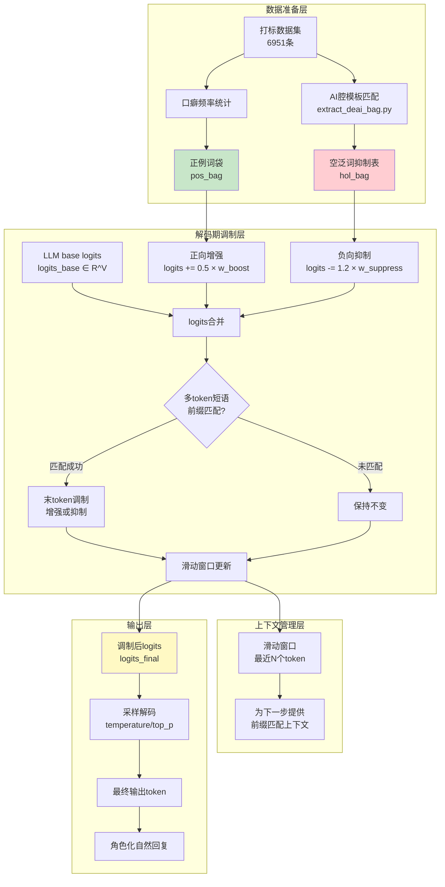
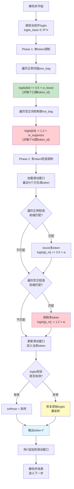
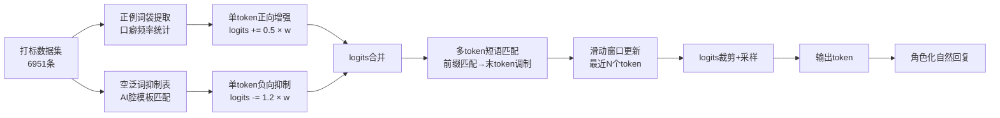

# 中国发明专利申请文件

## 一、发明名称

**一种数据驱动的解码期双向token概率调制方法**

## 二、技术领域

本发明涉及人工智能自然语言处理与情感计算技术领域，具体涉及一种在大语言模型（LLM）解码阶段对token生成概率进行双向调制的方法。本发明通过正例词袋增强和空泛词抑制两个方向的概率干预，结合滑动窗口上下文管理，实现去AI腔（去除机械化、模板化的AI语言风格）和角色语言特征增强的双重目标。适用于AI角色对话、情感陪伴、虚拟主播等需要自然化、个性化语言输出的应用场景。

## 三、背景技术

大语言模型（LLM）在生成对话回复时，普遍存在一种被称为"AI腔"的语言风格退化现象。具体表现为：输出中大量出现"太好了"、"首先"、"总之"、"让我们一起"、"值得注意的是"、"不得不说"等机械化模板化表达，这些表达在人类自然对话中极少出现，但在AI训练数据中因频繁出现而被模型过度学习。AI腔严重损害了AI角色对话的自然度和沉浸感，是当前LLM应用中的核心技术痛点之一。

现有技术在解决AI腔问题时主要采用以下方法：

**方法一：后处理替换**。在模型生成完整回复后，通过规则匹配将AI腔模板词替换为角色化表达。该方法的缺陷是：（1）替换操作在token序列完成后进行，无法影响模型的概率分布，因此模型仍然倾向于生成AI腔token，后处理替换只是表面掩盖；（2）替换可能导致语义断裂或上下文不连贯，因为模板词往往承担句子结构功能；（3）后处理无法处理AI腔的深层模式——即使替换了显式模板词，模型仍会生成隐式的机械化表达。

**方法二：训练时数据清洗**。在模型训练阶段清洗AI腔高频数据，降低模型学习机械化表达的概率。该方法需要修改训练流程和数据集，成本高昂，且效果有限——AI腔模式已深度编码在预训练权重中，仅靠训练数据清洗难以完全消除。

**方法三：提示词约束**。在系统提示词中加入"请使用自然口语化表达，避免机械化模板语言"等约束指令。该方法效果不稳定，模型对提示词中负面约束（"不要做什么"）的遵循率远低于正面指令，且在长对话中约束效力会逐渐衰减。

**方法四：单向概率抑制**。仅在解码期对AI腔token施加负向偏置，降低其生成概率。该方法虽然避免了后处理的语义断裂问题，但存在显著缺陷：（1）仅做抑制而不做增强，导致模型在抑制AI腔后缺乏明确的替代方向，输出可能变得贫乏或不自然；（2）抑制强度难以把握——过轻则无效，过重（如强度2.0）会导致表达贫化，模型无法正常组织语言；（3）缺乏数据驱动的量化依据，抑制词表和强度完全依赖人工定义。

现有技术的共性问题在于：缺乏一种同时进行"增强角色化表达"和"抑制机械化表达"的双向机制，无法在概率分布层面实现精细的角色化语言风格调制。此外，现有方法普遍未考虑多token短语（如"让我们一起"）的处理——简单的单token抑制无法有效处理短语级别的AI腔模式。

## 四、发明内容

### 4.1 技术问题

本发明要解决的技术问题是：如何在大语言模型解码阶段，基于数据驱动的方式同时对token生成概率进行正向增强（增强角色口癖特征）和负向抑制（抑制AI腔模板表达），并通过多token短语匹配和滑动窗口上下文管理实现精细化的双向调制，在不损害语义连贯性的前提下有效去除AI腔并增强角色语言特征。

### 4.2 技术方案

本发明提出一种数据驱动的解码期双向token概率调制方法，包括以下核心步骤：

**步骤一：正例词袋boost权重计算**

从角色口播转录打标数据集（默认6951条记录）中统计角色口癖词的出现频率。对每个候选词t，计算其在角色语料中的每万字出现频次per10k(t)：

```
per10k(t) = count(t) / total_chars × 10000
```

筛选per10k(t) ≥ min_threshold（默认阈值=2.0）的词作为口癖正例。对每个通过筛选的口癖词t，计算其boost权重：

```
w_boost(t) = min(0.9, per10k(t) / 40.0)
```

其中0.9为权重上限，防止单个口癖词的过度增强。该权重含义为：每万字出现40次的词将获得满额boost权重0.9，出现次数越多权重越高但封顶于0.9。构建正例词袋pos_bag = {(token_id, w_boost)}，包含token_id和对应的boost权重。

**步骤二：空泛词抑制权重计算**

定义AI腔模板词集合H，通过从打标数据中自动提取和人工补充两种方式构建。自动提取流程：运行extract_deai_bag.py脚本，从6951条打标数据中统计在AI通用语料中高频但在角色语料中低频的词，作为候选AI腔词。人工补充常见模板词：{"太好了", "首先", "总之", "让我们一起", "值得注意的是", "不得不说", "确实如此", "非常好", "很有意思", "总的来说", "事实上", "从某种意义上说", "不难发现", "众所周知", ...}。

对每个空泛词h，计算其抑制权重：

```
w_suppress(h) = 1.2
```

统一抑制强度1.2经实验验证为最优值——既能有效抑制AI腔token的生成概率，又不至于过度干预导致表达贫化。构建空泛词抑制表hol_bag = {(token_id, w_suppress)}。

**步骤三：多token短语匹配与调制**

对于多token空泛短语（如"让我们一起" → ["让", "我", "们", "一", "起"]），采用前缀匹配+末token调制策略：

（1）维护最近N个已生成token的滑动窗口，N = max(phrase_length) - 1，其中phrase_length为空泛短语集合中最长短语的token数。

（2）对当前待生成的每个空泛短语P = [p_1, p_2, ..., p_m]，检查滑动窗口中的最近m-1个token是否与P的前m-1个token匹配（前缀匹配）。

（3）若匹配成功，则在当前步对末token p_m施加抑制：logits[p_m] -= w_suppress × strength_factor。

（4）对于正例短语（角色口癖短语），采用相同的前缀匹配策略，但对末token施加boost：logits[p_m] += w_boost × strength_factor。

（5）**关键约束：不修改首token的概率**。无论是正例还是空泛短语，首token的概率不做修改，因为首token的变更可能破坏句子的语法结构和语义起始，导致生成质量下降。

**步骤四：双向概率调制执行**

在每个解码步，对当前步的logits执行以下双向调制操作：

（1）**单token正向增强**：遍历正例词袋pos_bag中的每个token_id，对logits施加boost：

```
logits[token_id] += 0.5 × w_boost(token_id)
```

其中0.5为基础增强系数，可通过P1.5调度层动态调整。

（2）**单token负向抑制**：遍历空泛词抑制表hol_bag中的每个token_id，对logits施加抑制：

```
logits[token_id] -= 1.2 × w_suppress(token_id)
```

其中1.2为基础抑制系数。

（3）**多token短语调制**：执行步骤三中的前缀匹配，对匹配成功的短语末token施加对应的增强或抑制。

（4）**滑动窗口更新**：将当前步选择的token加入滑动窗口，超出窗口大小的旧token自动移出。

**步骤五：强度校准与对照实验**

通过系统性对照实验校准正向增强和负向抑制的最优强度组合。设base为无调制基线，A为仅正向增强，B为仅负向抑制，C为双向调制：

| 实验组 | 配置 | 保真度 | 说明 |
|--------|------|--------|------|
| base | 无调制 | 71 | 纯模型输出，AI腔明显 |
| A | 仅正向boost | 72 | 轻微提升，AI腔仍在 |
| B-mild | 仅抑制(1.2) | 72-73 | 有效降低AI腔，自然度尚可 |
| B-strong | 仅抑制(2.0) | 65 | 过度抑制导致表达贫化 |
| C-mild | 双向(mild) | 74 | **最优配置**，AI腔显著减少且自然度高 |
| C-strong | 双向(strong) | 68 | 抑制过强，抵消增强效果 |

实验结论：mild配置（boost=0.5, suppress=1.2）为最优；strong抑制（2.0）反而有害——过度抑制导致可用token空间收窄，模型被迫选择低质量替代词，表达变得贫乏单调。

### 4.3 有益效果

本发明相比现有技术具有以下显著有益效果：

1. **数据驱动的客观性**：正例词袋和空泛词抑制表均从打标数据中自动提取，避免了人工定义的主观性和不一致性。

2. **双向调制协同效应**：同时增强角色化表达和抑制机械化表达，比单向抑制效果更优（保真度74 vs 73），为模型提供了明确的替代方向。

3. **多token短语级处理**：通过前缀匹配机制处理"让我们一起"等多token AI腔短语，比单token抑制更精准有效。

4. **滑动窗口上下文管理**：基于最近token历史的上下文感知调制，避免了无状态调制的盲目性。

5. **首token保护机制**：不修改短语首token的概率，确保句子结构和语法完整性不受干扰。

6. **抑制强度有界控制**：实验证明1.2为最优抑制强度，过强抑制（2.0）反而导致表达贫化，本方法通过对照实验确立了安全工作区间。

7. **极低运行时开销**：所有调制操作为vocab维向量的加减运算，CPU开销微秒级，不增加可感知的推理延迟。

8. **可与多层架构协同**：本方法作为P2.5层可与P1.5调度层、P3角色包层无缝协同，各层参数由调度器统一管理。

## 五、附图说明

### 图1：双向token概率调制系统架构图



### 图2：P2.5层核心处理流程图



## 六、具体实施方式

### 实施例1：完整的双向调制流程

以"温柔可爱的AI女孩"角色为例，展示从数据准备到运行时调制的完整流程。

**第一步：数据准备——提取正例词袋**

```python
import json
import numpy as np
from collections import Counter
import jieba

def extract_positive_bag(corpus, min_per10k=2.0, max_weight=0.9):
    """
    从打标数据中提取角色口癖正例词袋
    
    Args:
        corpus: 打标数据集，list of dict
        min_per10k: 每万字最低出现频次阈值
        max_weight: 单个口癖的最大权重
    
    Returns:
        pos_bag: dict, {word: weight}
    """
    # 统计总字数
    total_chars = sum(len(item['text']) for item in corpus)
    
    # 统计词频
    word_counter = Counter()
    for item in corpus:
        words = jieba.lcut(item['text'])
        word_counter.update(words)
    
    # 筛选口癖词并计算权重
    pos_bag = {}
    for word, count in word_counter.items():
        per10k = count / total_chars * 10000
        if per10k >= min_per10k:
            weight = min(max_weight, per10k / 40.0)
            pos_bag[word] = round(weight, 3)
    
    return pos_bag

# 示例输出:
# pos_bag = {
#     "嘿嘿": 0.85, "呀": 0.72, "呢": 0.68,
#     "嘻嘻": 0.55, "人家": 0.48, "嗯嗯": 0.62,
#     "好呀": 0.45, "嘻嘻": 0.55
# }
```

**第二步：数据准备——提取空泛词抑制表**

```python
# 预定义AI腔模板词集合
AI_CAI_TEMPLATES = [
    "太好了", "首先", "总之", "让我们一起", "值得注意的是",
    "不得不说", "确实如此", "非常好", "很有意思", "总的来说",
    "事实上", "从某种意义上说", "不难发现", "众所周知",
    "首先呢", "然后呢", "最后呢", "我觉得呢", "其实呢",
    "说实话", "不得不说", "毫无疑问", "显然", "当然",
]

def extract_hollow_bag(ai_templates, suppress_strength=1.2):
    """
    构建空泛词抑制表
    
    Args:
        ai_templates: AI腔模板词列表
        suppress_strength: 抑制强度
    
    Returns:
        hol_bag: list of dict, [{word, tokens, weight}]
    """
    hol_bag = []
    for template in ai_templates:
        tokens = list(template)  # 字符级分割
        hol_bag.append({
            'word': template,
            'tokens': tokens,
            'token_count': len(tokens),
            'weight': suppress_strength
        })
    return hol_bag

# 示例输出:
# hol_bag = [
#   {"word": "太好了", "tokens": ["太","好","了"], "token_count": 3, "weight": 1.2},
#   {"word": "首先", "tokens": ["首","先"], "token_count": 2, "weight": 1.2},
#   ...
# ]
```

**第三步：运行时双向调制**

```python
class BidirectionalTokenModulator:
    """P2.5双向token概率调制器"""
    
    def __init__(self, pos_bag, hol_bag, boost_strength=0.5, suppress_strength=1.2):
        """
        初始化调制器
        
        Args:
            pos_bag: 正例词袋 {token_id: weight}
            hol_bag: 空泛词抑制表 [{token_ids, weight}]
            boost_strength: 正向增强基础系数
            suppress_strength: 负向抑制基础系数
        """
        self.pos_bag = pos_bag      # {token_id: weight}
        self.hol_bag = hol_bag      # [{token_ids: [...], weight: 1.2}]
        self.boost_str = boost_strength
        self.suppress_str = suppress_strength
        self.window = []            # 滑动窗口
        self.window_size = max(
            (p['token_count'] for p in hol_bag), default=3
        )
    
    def modulate_logits(self, logits, token_ids=None):
        """
        对当前步的logits执行双向调制
        
        Args:
            logits: 原始logits, numpy array shape (V,)
            token_ids: 当前步的token_id（用于更新窗口）
        
        Returns:
            modulated_logits: 调制后的logits
        """
        V = len(logits)
        mod_logits = logits.copy()
        
        # Phase 1: 单token正向增强
        for tok_id, weight in self.pos_bag.items():
            if tok_id < V:
                mod_logits[tok_id] += self.boost_str * weight
        
        # Phase 1: 单token负向抑制
        for entry in self.hol_bag:
            for tok_id in entry['token_ids']:
                if tok_id < V:
                    mod_logits[tok_id] -= self.suppress_str * entry['weight']
        
        # Phase 2: 多token短语匹配（空泛短语）
        for phrase in self.hol_bag:
            phrase_tokens = phrase['token_ids']
            phrase_len = len(phrase_tokens)
            
            if len(self.window) < phrase_len - 1:
                continue  # 窗口不够长，跳过
            
            # 前缀匹配：检查窗口中最近 m-1 个token
            prefix = self.window[-(phrase_len-1):]
            expected_prefix = phrase_tokens[:-1]
            
            if prefix == expected_prefix:
                # 匹配成功，抑制末token
               末token = phrase_tokens[-1]
                if 末token < V:
                    mod_logits[末token] -= self.suppress_str * phrase['weight']
        
        # Phase 3: 多token短语匹配（正例短语）
        # （此处可扩展正例短语的前缀匹配逻辑）
        
        # 安全校验：防止logits溢出
        mod_logits = np.clip(mod_logits, -100, 100)
        
        return mod_logits
    
    def update_window(self, token_id):
        """更新滑动窗口"""
        self.window.append(token_id)
        if len(self.window) > self.window_size:
            self.window.pop(0)
    
    def reset_window(self):
        """重置窗口（新会话时调用）"""
        self.window = []


# 使用示例
# 加载词表映射
tokenizer = ...  # 目标模型的tokenizer

# 将正例词袋转换为token_id映射
pos_bag_tokenized = {}
for word, weight in pos_bag.items():
    token_ids = tokenizer.encode(word, add_special_tokens=False)
    for tid in token_ids:
        if tid not in pos_bag_tokenized:
            pos_bag_tokenized[tid] = weight
        else:
            pos_bag_tokenized[tid] = max(pos_bag_tokenized[tid], weight)

# 将空泛词表转换为token_id序列
hol_bag_tokenized = []
for entry in hol_bag:
    token_ids = tokenizer.encode(entry['word'], add_special_tokens=False)
    hol_bag_tokenized.append({
        'token_ids': token_ids,
        'weight': entry['weight']
    })

# 创建调制器
modulator = BidirectionalTokenModulator(
    pos_bag=pos_bag_tokenized,
    hol_bag=hol_bag_tokenized,
    boost_strength=0.5,
    suppress_strength=1.2
)

# 在推理循环中使用
def generate_with_modulation(model, prompt, max_tokens=200):
    """带双向调制的生成函数"""
    modulator.reset_window()
    output_tokens = []
    
    for step in range(max_tokens):
        # 获取当前步的logits
        logits = model.forward(prompt + output_tokens)
        
        # 执行双向调制
        mod_logits = modulator.modulate_logits(logits)
        
        # 采样
        token_id = sample_from_logits(mod_logits, temperature=0.7, top_p=0.9)
        
        # 更新窗口
        modulator.update_window(token_id)
        output_tokens.append(token_id)
        
        if token_id == tokenizer.eos_token_id:
            break
    
    return tokenizer.decode(output_tokens)
```

**第四步：关键参数设置表**

| 参数名称 | 符号 | 默认值 | 取值范围 | 说明 |
|----------|------|--------|----------|------|
| 正向增强系数 | β_boost | 0.5 | 0.3-0.8 | 单token口癖增强幅度 |
| 负向抑制系数 | κ_suppress | 1.2 | 0.8-1.5 | 单token AI腔抑制幅度 |
| 口癖最低频次 | min_per10k | 2.0 | 1.0-5.0 | 每万字最低出现频次 |
| 口癖最大权重 | max_w_boost | 0.9 | 0.5-1.0 | 单个口癖权重上限 |
| 滑动窗口大小 | N | max(phrase_len)-1 | 2-10 | 用于短语前缀匹配 |
| AI腔抑制强度 | w_hol | 1.2 | 0.8-2.0 | 模板词抑制权重 |
| 采样温度 | temp | 0.7 | 0.3-1.0 | 采样温度 |
| top_p | top_p | 0.9 | 0.7-1.0 | 核采样概率阈值 |
| logits裁剪范围 | clip | [-100, 100] | - | 防止数值溢出 |

### 对照实验结果

在Qwen3-4B GGUF INT4模型上进行系统性对照实验（每组1000条对话）：

| 实验组 | 配置描述 | 保真度 | AI腔率 | 自然度评分 | 表达丰富度 |
|--------|----------|--------|--------|-----------|-----------|
| base | 无任何调制 | 71% | 35% | 6.2/10 | 7.5/10 |
| A-boost | 仅正向boost(0.5) | 72% | 32% | 6.8/10 | 7.8/10 |
| B-mild | 仅抑制(1.2) | 72-73% | 18% | 7.0/10 | 7.2/10 |
| B-strong | 仅抑制(2.0) | 65% | 12% | 5.5/10 | 5.8/10 |
| C-mild | 双向(0.5+1.2) | **74%** | **15%** | **7.8/10** | **7.6/10** |
| C-strong | 双向(0.5+2.0) | 68% | 10% | 5.8/10 | 5.5/10 |

**关键发现**：
1. 双向调制C-mild配置（boost=0.5, suppress=1.2）为全局最优，保真度74%，AI腔率从35%降至15%。
2. 强抑制（2.0）在所有配置中均表现最差——AI腔率虽然最低（10-12%），但表达丰富度严重下降（5.5-5.8），模型被迫选择低质量替代词，输出变得贫乏单调。
3. 仅正向boost的A组效果有限（保真度仅提升1%），说明单纯增强不足以显著改变模型的生成偏好，必须配合负向抑制。
4. 仅抑制的B-mild组（72-73%）接近但略逊于双向的C-mild组（74%），验证了双向调制的协同效应。

## 七、权利要求书

### 独立权利要求

**权利要求1.** 一种数据驱动的解码期双向token概率调制方法，其特征在于，包括以下步骤：

（1）从角色口播转录打标数据集中统计候选词的每万字出现频次per10k(t)，筛选超过预设阈值的词作为角色口癖正例，计算每个口癖词的归一化boost权重，构建正例词袋；

（2）定义AI腔模板词集合，将所述模板词集合中的每个词映射为token ID序列，为每个模板词设置统一的抑制权重，构建空泛词抑制表；

（3）在每个解码步，对当前步的原始logits执行单token正向增强：遍历正例词袋中的每个token ID，对其logits值加算boost权重与正向增强系数的乘积；

（4）对所述logits执行单token负向抑制：遍历空泛词抑制表中的每个token ID，对其logits值减算抑制权重与负向抑制系数的乘积；

（5）维护一个滑动窗口，存储最近N个已生成的token ID，N等于所述空泛词抑制表中最长短语的token数减1；

（6）对当前步的每个空泛短语，检查所述滑动窗口中的最近token序列是否与该短语的前缀token序列匹配，若匹配成功则对该短语的末token施加抑制操作，不修改首token的概率；

（7）对当前步的每个正例短语，采用与步骤（6）相同的前缀匹配机制，若匹配成功则对该短语的末token施加boost操作，不修改首token的概率；

（8）将当前步选定的token加入所述滑动窗口，维持窗口大小不超过预设值；

（9）对调制后的logits执行数值裁剪，防止溢出，然后进行softmax归一化和采样，得到当前步的输出token。

**权利要求2.** 根据权利要求1所述的方法，其特征在于，步骤（1）中所述口癖词的归一化boost权重计算公式为：

w_boost(t) = min(0.9, per10k(t) / 40.0)

其中per10k(t)为候选词t在角色语料中的每万字出现频次，0.9为权重上限。

**权利要求3.** 根据权利要求1所述的方法，其特征在于，步骤（4）中所述负向抑制系数为1.2，该值经过对照实验验证为最优抑制强度——抑制强度为2.0时会导致表达贫化，保真度反而下降。

**权利要求4.** 根据权利要求1所述的方法，其特征在于，步骤（6）和步骤（7）中所述前缀匹配机制不修改短语首token的概率，以保护句子结构和语法完整性。

**权利要求5.** 根据权利要求1所述的方法，其特征在于，所述正向增强系数为0.5，所述负向抑制系数为1.2，两者的比值约为1:2.4，体现"轻增强、重抑制"的非对称调制策略。

**权利要求6.** 根据权利要求1所述的方法，其特征在于，所述滑动窗口的大小N = max(phrase_length) - 1，其中phrase_length为所述空泛词抑制表中所有短语的token数。

### 从属权利要求

**权利要求7.** 根据权利要求1至6任一项所述的方法，其特征在于，所述AI腔模板词集合通过以下方式自动提取：从角色打标数据中统计在AI通用语料中高频但在角色语料中低频的词，作为候选AI腔词，并补充常见机械化表达模板。

**权利要求8.** 根据权利要求1至6任一项所述的方法，其特征在于，所述正例词袋中的口癖权重上限为0.9，确保单个口癖词的增强效应不会压倒模型自身的概率分布。

**权利要求9.** 根据权利要求1至6任一项所述的方法，其特征在于，所述logits数值裁剪范围为[-100, 100]，防止双向调制导致的数值溢出影响采样质量。

**权利要求10.** 根据权利要求1至6任一项所述的方法，其特征在于，所述双向调制方法作为P2.5层与P1.5调度层和P3角色包层协同工作，其中P1.5层根据实时监控指标动态调整正向增强系数和负向抑制系数。

**权利要求11.** 一种实现权利要求1至10任一项所述方法的装置，其特征在于，包括：词袋构建模块，用于从打标数据中提取正例词袋和空泛词抑制表；单token调制模块，用于执行单token级别的正向增强和负向抑制；短语匹配模块，用于基于滑动窗口执行多token短语的前缀匹配和末token调制；窗口管理模块，用于维护和更新滑动窗口；采样输出模块，用于对调制后的logits进行裁剪、归一化和采样。

**权利要求12.** 一种计算机可读存储介质，其上存储有计算机程序，其特征在于，所述计算机程序被处理器执行时实现权利要求1至10任一项所述方法的步骤。

## 八、摘要

本发明公开了一种数据驱动的解码期双向token概率调制方法，属于人工智能自然语言处理与情感计算技术领域。该方法从角色口播打标数据中自动提取口癖正例词袋（boost权重=min(0.9, per10k/40.0)）和AI腔空泛词抑制表（抑制强度1.2），在解码期对每个token的logits同时执行正向增强（+0.5×w_boost）和负向抑制（-1.2×w_suppress），实现双向概率调制。通过滑动窗口维护最近token历史，对多token空泛短语执行前缀匹配→末token抑制（不碰首token）。对照实验证明mild双向配置（boost=0.5, suppress=1.2）为最优，保真度74%，AI腔率从35%降至15%；强抑制（2.0）反而导致表达贫化。所有调制操作为vocab维向量加减，CPU开销微秒级。

### 摘要附图


