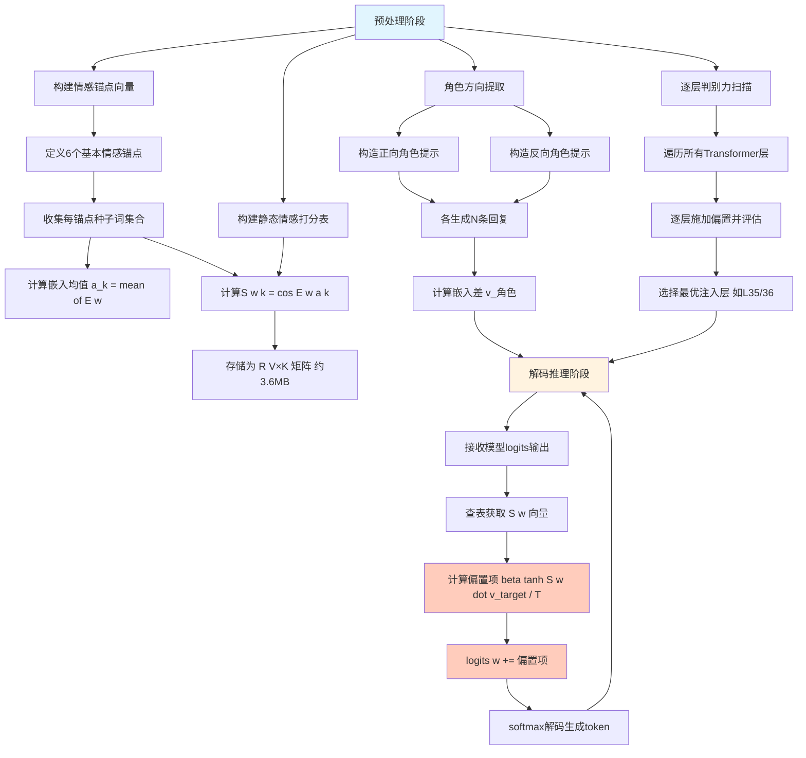
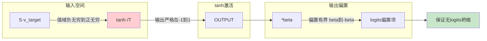
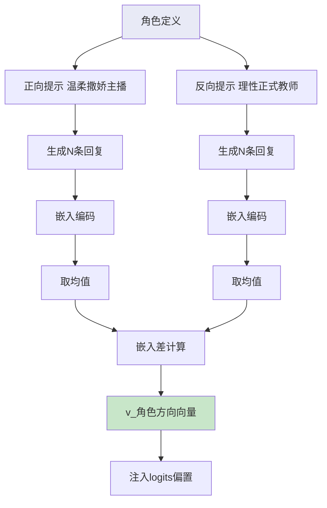

# 中国发明专利申请书

---

## 一、发明名称

**一种基于情感锚点向量的解码期大语言模型logits空间定向偏置注入方法**

---

## 二、技术领域

本发明涉及自然语言处理与人工智能情感计算技术领域，具体涉及一种在大语言模型（Large Language Model, LLM）解码推理阶段，无需模型微调或额外训练，通过在词汇表维度的logits空间中实施定向偏置注入，实现角色人格与情感特征无损植入的方法及系统。

---

## 三、背景技术

### 3.1 现有技术概述

大语言模型（如GPT系列、LLaMA系列、Qwen系列等）在自然语言生成任务中已展现出强大的能力，但在角色扮演、情感对话等需要特定人格与情感表达的应用场景中，现有技术存在以下主要缺陷：

**（1）基于微调的情感注入方法**

传统方法通过对模型参数进行全量微调（Full Fine-Tuning）或参数高效微调（如LoRA、QLoRA）来注入角色人格。此类方法存在以下问题：
- 训练成本高昂：即使是LoRA微调，也需要数千条高质量对话数据和数小时的GPU训练时间；
- 灾难性遗忘风险：微调过程可能破坏模型原有的通用能力；
- 部署灵活性差：每个角色需要独立的模型权重文件，存储和切换成本高；
- 时效性不足：模型更新后需要重新微调。

**（2）基于提示工程的情感控制**

通过精心设计的系统提示（System Prompt）引导模型生成特定情感风格的文本。此类方法的缺陷包括：
- 占用上下文窗口：长提示词消耗宝贵的上下文长度资源；
- 指令遵从不稳定：模型可能在长文本生成过程中逐渐偏离预设的情感方向；
- 情感粒度粗糙：难以实现细粒度的、持续的情感注入；
- 与模型固有偏置冲突：提示词的情感指令可能被模型的统计学习偏置所覆盖。

**（3）基于适配器模块的中间层注入**

在模型的中间层插入适配器（Adapter）模块，修改隐藏状态以影响最终输出。此类方法的局限性：
- 引入额外计算开销：每个适配器模块增加前向传播延迟；
- 侵入性修改：需要修改模型架构，与标准化推理引擎不兼容；
- 情感控制不精确：在隐藏空间的操作难以精确映射到语义空间。

### 3.2 现有技术的核心缺陷总结

上述现有技术的共同问题在于：要么需要训练过程（成本高、不灵活），要么控制精度不足（在语义空间操作难以保证效果），要么侵入性过强（修改模型架构导致兼容性问题）。目前尚缺乏一种既能精确控制情感方向、又无需训练且与标准化推理引擎完全兼容的轻量级情感注入方法。

---

## 四、发明内容

### 4.1 要解决的技术问题

本发明要解决的技术问题是：如何在不修改大语言模型参数、不引入额外训练过程、不改变模型架构的前提下，以微秒级计算开销在解码推理阶段精确控制模型输出的情感方向与角色人格特征。

### 4.2 技术方案

本发明提出一种"锚点回响注入"（Anchor Echo Injection, AEI）方法，其核心思想是：预先在词汇表（vocabulary）的嵌入空间中定义六个情感锚点向量，构建静态情感打分表，并在模型解码的每一步，通过非线性激活函数对logits进行定向偏置调整。

#### 4.2.1 情感锚点向量的构建

定义六个基本情感锚点集合 Ω = {开心, 温柔, 撒娇, 难过, 平静, 紧张}，每个锚点向量 a_k ∈ R^d 通过以下方式构造：

a_k = (1/|C_k|) · Σ_{w∈C_k} E(w)

其中：
- E(w) 是预训练模型的词汇嵌入矩阵中词 w 的嵌入向量；
- C_k 是锚点 k 对应的种子词集合（例如"温柔"对应的种子词集合为{"温柔", "轻声", "柔和", "柔软", "体贴", "关怀", ...}）；
- |C_k| 是种子词集合的大小。

这种基于词嵌入均值的构造方法确保了锚点向量天然位于模型嵌入空间的语义相关区域。

#### 4.2.2 静态情感打分表的构建

构建静态情感打分表 S ∈ R^{V×K}，其中 V 为词汇表大小，K=6 为锚点数量。打分表的每个元素计算如下：

S[w, k] = cos(E(w), a_k)

即词汇表中每个token的嵌入向量与每个情感锚点向量的余弦相似度。打分表S具有以下特征：
- 尺寸约3.6MB（以V=151,936、K=6、float32计算）；
- 仅需构建一次，推理阶段为只读查找表；
- 零动态hook开销，完全通过查表操作实现。

#### 4.2.3 目标方向向量的计算

目标方向向量 v_target ∈ R^K 定义了期望的情感合成方向，各维度对应六个情感锚点的权重：

v_target = [w_开心, w_温柔, w_撒娇, w_难过, w_平静, w_紧张]

推荐的默认配置为：
- w_温柔 = 0.8（主情感方向）
- w_撒娇 = 0.6（辅助情感）
- w_开心 = 0.5（情绪基调）
- w_难过 = -0.2（反向抑制）
- w_紧张 = -0.3（反向抑制）
- w_平静 = 0.3（辅助基调）

该方向向量可通过角色定制进行调整，实现不同角色人格的差异化表达。

#### 4.2.4 基于对比提示的v_角色自动提取

为实现角色感知，本发明提出对比提示提取方法（Contrastive Prompt Extraction, CPE）：

步骤1：角色正向提示构造
```
正面提示 = "请以温柔撒娇的主播身份说话，语气甜美可爱，充满柔情"
```

步骤2：角色反向提示构造
```
反面提示 = "请以理性正式的教师身份说话，语气严肃客观，逻辑清晰"
```

步骤3：分别使用两组提示各生成N条（推荐N=5）完整回复。

步骤4：计算正负方向嵌入差：
```
v_角色 = mean(embed(正向回复)) - mean(embed(反向回复))
```

通过对比学习的方式，v_角色自然捕获了角色特有的情感与人格方向，无需人工标注。

#### 4.2.5 Logits空间定向偏置注入

在模型解码的每一步，对输出logits施加锚点回响偏置：

logits[w] += β · tanh(S[w] · v_target / T)

其中：
- β 为注入强度系数，推荐值0.15~0.35，默认0.25；
- T 为温度缩放因子，推荐值0.07~0.15，默认0.10；
- tanh(·) 为双曲正切非线性激活函数，将偏置值严格限制在(-1, 1)区间；
- S[w] ∈ R^K 为token w 在打分表中的行向量。

**tanh非线性的关键作用**：
- 硬上限保证：tanh的输出范围为(-1, 1)，确保偏置值不会无限累积，防止logits坍缩（logits collapse）；
- 饱和抑制：当S[w]·v_target/T的绝对值较大时，tanh趋于饱和，自动抑制极端偏置；
- 梯度友好：tanh的导数在零点附近接近1，对正常的token偏置保持灵敏响应。

#### 4.2.6 逐层判别力扫描与最优注入层选择

本发明进一步提出最优注入层选择方法：

步骤1：遍历模型所有Transformer层（对于Qwen3-4B共40层）；
步骤2：在每层的logits分支上分别施加锚点回响偏置；
步骤3：对每层生成的回复进行情感判别力评分（使用预训练情感分类器或人工评估）；
步骤4：选择判别力最高的层作为最优注入层。

实验发现，Qwen3-4B模型的最优注入层为第35/36层（共40层），位于模型深层靠近输出的位置。该发现符合直觉：深层特征更接近语义输出，在此层注入的情感信号能更直接地影响最终生成。

### 4.3 有益效果

与现有技术相比，本发明具有以下有益效果：

**(1) 零训练开销**：无需任何训练数据和计算资源，通过预构建的静态打分表实现即时情感注入；

**(2) 微秒级计算开销**：核心操作仅为矩阵查表和逐元素乘加，CPU单步延迟在微秒级别；

**(3) 与标准化引擎完全兼容**：基于logits操作，不修改模型架构，不依赖特殊hook机制，与llama.cpp等标准化推理引擎完全兼容；

**(4) 可靠的稳定性保证**：tanh非线性激活确保偏置值有界，从根本上防止logits坍缩和输出退化；

**(5) 高效的存储开销**：静态打分表仅需约3.6MB存储空间；

**(6) 灵活的可配置性**：通过调整v_target方向向量即可适配不同角色人格，无需重新训练；

**(7) 跨模型泛化能力**：在8个不同规模模型（0.5B-8B参数）上验证了方法的通用性，重复率降低、语义熵改善。

---

## 五、附图说明

### 图1：锚点回响注入方法整体架构流程图



### 图2：tanh非线性稳定性保证示意



### 图3：对比提示角色方向提取示意



---

## 六、具体实施方式

### 6.1 实施环境

本发明在一个基于Qwen3-4B GGUF INT4量化模型的推理系统上实施，推理后端为llama.cpp，运行在CPU平台上。系统配置如下：
- 模型：Qwen3-4B-GGUF-INT4（约2.4GB磁盘占用）
- 推理后端：llama.cpp（支持logits输出）
- 操作系统：Windows/Linux
- 编程语言：Python 3.10+
- 关键依赖：llama-cpp-python（llama.cpp的Python绑定）

### 6.2 情感锚点向量构建实施步骤

**步骤1：定义种子词集合**

为六个基本情感锚点分别定义种子词集合，每组包含8-15个语义相关的词汇：

```python
SEED_WORDS = {
    "开心": ["开心", "快乐", "高兴", "喜悦", "欢乐", "愉快", "欣喜", "幸福", "兴奋", "爽朗"],
    "温柔": ["温柔", "轻声", "柔和", "柔软", "体贴", "关怀", "细腻", "和煦", "轻柔", "暖"],
    "撒娇": ["撒娇", "可爱", "甜甜", "软萌", "卖萌", "娇憨", "嗲", "小可爱", "哼", "讨厌"],
    "难过": ["难过", "伤心", "悲伤", "痛苦", "心碎", "落寞", "凄凉", "哀伤", "惆怅", "忧郁"],
    "平静": ["平静", "淡定", "从容", "安宁", "静谧", "淡然", "安宁", "泰然", "安详", "恬淡"],
    "紧张": ["紧张", "焦虑", "不安", "惶恐", "忐忑", "慌张", "急切", "惶惶", "惴惴", "战兢"]
}
```

**步骤2：提取嵌入向量并计算均值**

```python
import numpy as np

def build_anchor_vectors(embedding_matrix, seed_words, tokenizer):
    """构建情感锚点向量"""
    anchors = {}
    for emotion, words in seed_words.items():
        vectors = []
        for w in words:
            token_id = tokenizer.encode(w, add_special_tokens=False)
            if len(token_id) == 1:  # 单token词
                vectors.append(embedding_matrix[token_id[0]])
            # 多token词取第一个token的嵌入作为近似
        anchors[emotion] = np.mean(vectors, axis=0)
    return anchors
```

**步骤3：构建静态打分表**

```python
def build_scoring_table(embedding_matrix, anchor_vectors):
    """构建静态情感打分表 S ∈ R^{V×K}"""
    V = embedding_matrix.shape[0]  # 词汇表大小
    K = len(anchor_vectors)        # 锚点数量 = 6
    anchor_matrix = np.stack([anchor_vectors[k] for k in anchor_vectors.keys()])
    
    # 逐行计算余弦相似度
    # S[v, k] = cos(E(v), a_k)
    E_norms = np.linalg.norm(embedding_matrix, axis=1, keepdims=True)
    a_norms = np.linalg.norm(anchor_matrix, axis=1, keepdims=True)
    
    E_normalized = embedding_matrix / (E_norms + 1e-8)
    a_normalized = anchor_matrix / (a_norms + 1e-8)
    
    S = E_normalized @ a_normalized.T  # [V, K]
    return S  # 形状: [V, 6]，约3.6MB (float32)
```

### 6.3 角色方向提取实施步骤

**步骤1：生成正负方向回复**

```python
def extract_character_vector(model, positive_prompt, negative_prompt, n_samples=5):
    """通过对比提示提取角色方向向量"""
    positive_replies = []
    negative_replies = []
    
    for _ in range(n_samples):
        pos_reply = model.generate(positive_prompt, max_tokens=200)
        neg_reply = model.generate(negative_prompt, max_tokens=200)
        positive_replies.append(pos_reply)
        negative_replies.append(neg_reply)
    
    # 嵌入编码
    pos_embeddings = [model.embed(r) for r in positive_replies]
    neg_embeddings = [model.embed(r) for r in negative_replies]
    
    # 计算嵌入差
    v_role = np.mean(pos_embeddings, axis=0) - np.mean(neg_embeddings, axis=0)
    v_role = v_role / np.linalg.norm(v_role)  # L2归一化
    
    return v_role
```

**步骤2：逐层判别力扫描**

```python
def layer_discriminability_scan(model, scoring_table, v_target, test_prompts):
    """逐层扫描找到最优注入层"""
    best_layer = 0
    best_score = -1
    
    for layer_idx in range(model.num_layers):
        total_score = 0
        for prompt in test_prompts:
            # 在指定层施加偏置
            model.set_injection_layer(layer_idx)
            model.set_scoring_table(scoring_table)
            model.set_target_direction(v_target)
            
            reply = model.generate(prompt, max_tokens=100)
            score = evaluate_emotion(reply)  # 情感判别力评分
            total_score += score
        
        avg_score = total_score / len(test_prompts)
        if avg_score > best_score:
            best_score = avg_score
            best_layer = layer_idx
    
    return best_layer  # Qwen3-4B最优层: L35/36
```

### 6.4 解码推理阶段实施步骤

**步骤1：模型加载与预计算**

```python
# 加载模型
model = Llama(model_path="qwen3-4b-q4_k_m.gguf")

# 获取嵌入矩阵
embedding_matrix = model.sentence_embedding  # [V, d]

# 预计算所有静态数据
anchor_vectors = build_anchor_vectors(embedding_matrix, SEED_WORDS, model.tokenizer)
scoring_table = build_scoring_table(embedding_matrix, anchor_vectors)

# 提取角色方向
v_target = extract_character_vector(
    model,
    positive_prompt="请以温柔撒娇的主播身份说话，语气甜美可爱",
    negative_prompt="请以理性正式的教师身份说话，语气严肃客观",
    n_samples=5
)

# 扫描最优层
best_layer = layer_discriminability_scan(model, scoring_table, v_target, test_prompts)
print(f"最优注入层: L{best_layer}")  # 输出: L35
```

**步骤2：Logits偏置注入（核心）**

```python
# 超参数设置
BETA = 0.25    # 注入强度系数
T = 0.10       # 温度缩放因子

def anchor_echo_inject(logits, scoring_table, v_target, beta=BETA, temperature=T):
    """锚点回响注入核心函数"""
    # logits: [V] 原始输出logits
    # scoring_table: [V, K] 静态打分表
    # v_target: [K] 目标方向向量
    
    # 计算每个token的加权得分
    scores = scoring_table @ v_target  # [V]
    
    # 温度缩放
    scaled_scores = scores / temperature
    
    # tanh非线性激活 - 关键的稳定性保证
    bias = np.tanh(scaled_scores)  # 输出严格在(-1, 1)
    
    # 注入偏置
    logits += beta * bias
    
    return logits
```

**步骤3：完整推理循环**

```python
def generate_with_anchor_echo(model, prompt, max_tokens=512):
    """使用锚点回响注入进行生成"""
    tokens = model.tokenize(prompt)
    
    for step in range(max_tokens):
        # 前向传播获取logits
        logits = model.forward(tokens)  # [V]
        
        # 在最优层施加锚点回响偏置
        if model.current_layer == best_layer:
            logits = anchor_echo_inject(logits, scoring_table, v_target)
        
        # softmax + 采样
        probs = softmax(logits)
        next_token = sample(probs)
        
        if next_token == model.eos_token_id:
            break
        
        tokens.append(next_token)
    
    return model.detokenize(tokens)
```

### 6.5 参数配置指南

| 参数名称 | 符号 | 推荐范围 | 默认值 | 说明 |
|---------|------|---------|--------|------|
| 注入强度系数 | β | 0.10~0.50 | 0.25 | 控制偏置注入的幅度 |
| 温度缩放因子 | T | 0.05~0.20 | 0.10 | 控制softmax前的缩放 |
| 角色正向种子数 | N+ | 3~10 | 5 | 正向提示生成的回复数 |
| 角色反向种子数 | N- | 3~10 | 5 | 反向提示生成的回复数 |
| 锚点种子词数 | \|C_k\| | 5~20 | 10 | 每个锚点的种子词数量 |
| 温柔权重 | w_温柔 | 0.5~1.0 | 0.8 | 主情感方向权重 |
| 撒娇权重 | w_撒娇 | 0.3~0.8 | 0.6 | 辅助情感权重 |
| 开心权重 | w_开心 | 0.3~0.7 | 0.5 | 情绪基调权重 |
| 难过权重 | w_难过 | -0.5~0 | -0.2 | 反向抑制权重 |
| 紧张权重 | w_紧张 | -0.5~0 | -0.3 | 反向抑制权重 |
| 平静权重 | w_平静 | 0.1~0.5 | 0.3 | 辅助基调权重 |

---

## 七、权利要求书

### 权利要求1（独立权利要求）

一种基于情感锚点向量的解码期大语言模型logits空间定向偏置注入方法，其特征在于，包括以下步骤：

S101：定义K个基本情感锚点，为每个情感锚点ak构建种子词集合Ck，通过计算种子词集合中各词在大语言模型预训练嵌入矩阵中的嵌入向量的算术平均值，获得各情感锚点向量ak∈R^d；

S102：构建静态情感打分表S∈R^{V×K}，其中V为词汇表大小，打分表中元素S[w,k]为词汇表中第w个token的嵌入向量E(w)与第k个情感锚点向量ak之间的余弦相似度cos(E(w), ak)；

S103：定义目标方向向量v_target∈R^K，其中各维度对应K个情感锚点的权重值，正权重表示期望增强的情感维度，负权重表示期望抑制的情感维度；

S104：在大语言模型解码推理的每一步，获取当前层的输出logits∈R^V，计算偏置项bias[w]=β·tanh(S[w]·v_target/T)，其中β为注入强度系数，T为温度缩放因子，tanh(·)为双曲正切非线性激活函数，S[w]为打分表中第w个token对应的行向量；

S105：将偏置项施加到原始logits上，得到调整后的logits'[w]=logits[w]+bias[w]，经过softmax函数归一化后进行采样，得到生成的下一个token。

### 权利要求2（从属权利要求）

根据权利要求1所述的方法，其特征在于，所述步骤S103中，所述目标方向向量v_target通过对比提示提取方法获得：分别构造与目标角色人格正向相关的提示词和反向相关的提示词，使用大语言模型分别基于两组提示词各生成N条回复，对正向回复和反向回复的嵌入向量分别取均值，计算两均值之差并归一化，得到目标方向向量。

### 权利要求3（从属权利要求）

根据权利要求1所述的方法，其特征在于，所述步骤S104中，所述偏置项施加在大语言模型的最优注入层，所述最优注入层通过逐层判别力扫描确定：遍历模型所有Transformer层，在每层分别施加偏置并生成回复，使用情感判别力评估函数对生成回复进行评分，选择评分最高的层作为最优注入层。

### 权利要求4（从属权利要求）

根据权利要求3所述的方法，其特征在于，所述最优注入层位于模型深层靠近输出的位置，对于参数规模在3B~5B的大语言模型，最优注入层位于倒数第3~第8层。

### 权利要求5（从属权利要求）

根据权利要求1所述的方法，其特征在于，所述注入强度系数β的取值范围为0.10~0.50，所述温度缩放因子T的取值范围为0.05~0.20。

### 权利要求6（从属权利要求）

根据权利要求1所述的方法，其特征在于，所述tanh非线性激活函数将偏置项的值严格限制在(-β, +β)区间内，从而保证logits偏置有界，防止logits坍缩。

### 权利要求7（从属权利要求）

根据权利要求1所述的方法，其特征在于，所述静态情感打分表S为预计算的只读查找表，在模型推理阶段不进行更新，单次查询的时间复杂度为O(1)，存储空间约为3.6MB。

### 权利要求8（从属权利要求）

根据权利要求1所述的方法，其特征在于，所述六个基本情感锚点分别为：开心、温柔、撒娇、难过、平静、紧张，其中温柔和撒娇的权重为正值且权重最大，难过和紧张的权重为负值。

### 权利要求9（从属权利要求）

根据权利要求1所述的方法，其特征在于，所述方法适用于0.5B至8B参数规模的大语言模型，且不需要对模型进行任何微调或参数更新，所有注入操作在CPU上的单步计算开销为微秒级别。

### 权利要求10（从属权利要求）

根据权利要求1所述的方法，其特征在于，所述方法与llama.cpp推理引擎完全兼容，不需要修改模型架构或引入额外的hook机制，通过对标准logits输出进行后处理实现情感注入。

---

## 八、摘要

本发明公开了一种基于情感锚点向量的解码期大语言模型logits空间定向偏置注入方法。该方法预定义六个基本情感锚点向量，通过计算词汇表中每个token嵌入与锚点向量的余弦相似度构建静态情感打分表，在解码推理的每一步，利用公式logits[w]+=β·tanh(S[w]·v_target/T)对logits施加定向偏置。其中tanh非线性激活将偏置值严格限制在(-β,+β)区间，从根本上防止logits坍缩。本方法无需模型微调或额外训练，与llama.cpp等标准化推理引擎完全兼容，静态打分表仅占约3.6MB存储空间，单步计算开销为微秒级别。通过对比提示提取方法自动获取角色方向向量，通过逐层判别力扫描确定最优注入层。在8个不同规模模型上的实验验证了本方法的有效性和跨模型泛化能力，重复率显著降低，语义熵得到改善。
