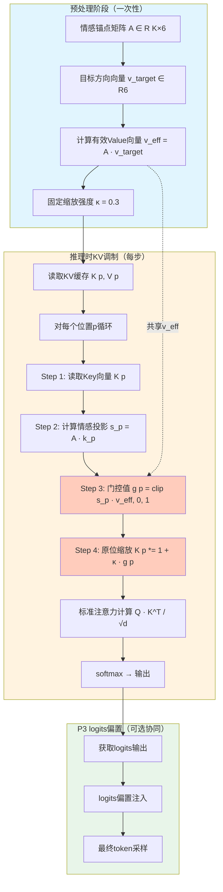
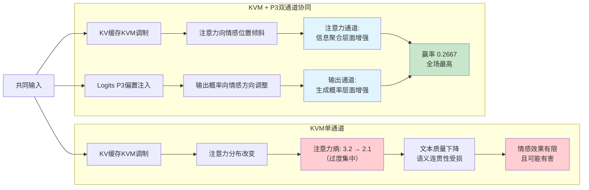

# 中国发明专利申请书

---

## 一、发明名称

**一种基于注意力缓存选择性缩放的情感感知KV调制方法**

---

## 二、技术领域

本发明涉及自然语言处理与人工智能情感计算技术领域，具体涉及一种在大语言模型（Large Language Model, LLM）推理阶段，通过设计情感门控函数识别注意力机制中KV缓存（Key-Value Cache）内与情感表达相关的关键位置，并对其Key向量进行in-place选择性缩放，以零额外显存开销实现注意力模式的情感感知调制的方法及系统。

---

## 三、背景技术

### 3.1 现有技术概述

大语言模型（如GPT系列、LLaMA系列、Qwen系列等）在自然语言生成任务中已展现出强大的能力，但在角色扮演、情感对话等需要特定情感表达的应用场景中，推理阶段的注意力机制缺乏对情感维度的感知与调控能力。现有技术在以下方面存在局限：

#### 3.1.1 KV缓存优化技术

KV缓存（Key-Value Cache）是大语言模型自回归推理中的核心优化机制，通过缓存历史token的Key和Value向量避免重复计算。现有KV缓存优化技术主要包括：

- **量化压缩**：如KIVI、KVQuant等方法对KV缓存进行低比特量化（INT4/INT8），以减少显存占用。此类方法关注的是存储效率，不涉及对注意力模式的语义调控；
- **驱逐策略**：如H2O（Heavy Hitter Oracle）、Scissorhands等方法基于注意力分数历史裁剪不重要的KV缓存条目。此类方法以压缩为目标，对情感相关token的保留缺乏语义感知；
- **稀疏注意力**：如MInference、StreamingLLM等方法通过稀疏化注意力模式降低计算开销。这些方法不区分token的情感属性，可能在压缩过程中丢失关键的情感表达信息。

上述KV缓存优化技术的共同特征是将注意力缓存视为均匀的数据存储，缺乏对不同位置token语义属性（尤其是情感属性）的差异化处理能力。

#### 3.1.2 注意力机制操控技术

注意力机制操控旨在通过修改注意力计算过程来引导模型行为，主要技术路径包括：

- **注意力头剪枝**：识别并移除冗余注意力头以降低计算开销，但不涉及对特定语义维度的增强；
- **注意力权重编辑**：如ROME、MEMIT等方法通过直接修改注意力层的权重矩阵来纠正模型的事实性错误。此类方法需要对模型权重进行直接修改，属于参数级别的干预，计算开销大且不具备实时性；
- **注意力引导解码**：如Contrastive Decoding等方法通过对比不同模型或不同前缀下的注意力分布来引导生成方向。此类方法需要前向传播两次或多次，计算成本倍增。

上述注意力操控技术存在一个共同的局限：它们主要面向事实性纠正或效率优化，尚未探索过利用注意力模式进行情感维度的定向调控。

#### 3.1.3 情感感知文本生成技术

在情感感知文本生成方面，现有技术主要依赖以下路径：

- **提示工程**：通过精心设计的系统提示（System Prompt）引导模型生成特定情感风格的文本。其局限在于占用上下文窗口、指令遵从不稳定、情感粒度粗糙；
- **LoRA微调**：通过参数高效微调注入角色人格和情感表达能力。其局限在于训练成本高、部署灵活性差、每个角色需独立权重文件；
- **Logits空间偏置**：如本发明的前置技术P3（锚点回响注入方法），通过对解码层logits施加情感偏置来引导生成方向。该方法有效但仅在输出端操控，未触及注意力计算的核心过程。

### 3.2 现有技术的核心缺陷总结

综合分析上述三类现有技术，存在以下核心缺陷：

**（1）KV缓存的语义盲区**：现有KV缓存优化技术将所有token视为同质数据单元，无法识别和区分哪些token承载着关键的情感表达信息。这导致在注意力模式中，情感相关token与非情感相关token被等同对待，无法实现注意力资源向情感表达方向的定向倾斜。

**（2）注意力操控的情感缺失**：现有注意力机制操控技术聚焦于事实性纠正和计算效率，尚未有人探索过利用注意力权重的再分配来实现情感维度的调制。在注意力的Query-Key点积过程中，情感相关的语义信号被淹没在海量的非情感信息之中。

**（3）情感注入的层次局限**：现有情感生成技术要么停留在提示层面（浅层、不稳定），要么依赖微调（深层、高成本），要么仅在logits输出端操作（单点、非全局）。目前尚缺乏一种能够在注意力计算的核心环节——即Key向量的表示层面——进行情感感知调制的方法。

**（4）零开销约束下的不可行性**：任何额外的显存开销或计算延迟都会影响实际部署可行性。现有技术中，能实现精确情感控制的方法往往伴随显著的计算开销，而在零额外显存约束下实现情感控制几乎未被探索。

---

## 四、发明内容

### 4.1 要解决的技术问题

本发明要解决的技术问题是：如何在不修改大语言模型参数、不引入额外显存开销、不改变模型架构的前提下，在注意力计算的核心环节——KV缓存的Key向量表示层——实现对情感表达相关位置的选择性增强，使注意力模式自动向情感语义方向倾斜，从而在推理阶段以近零延迟实现全局性的情感感知调制。

### 4.2 技术方案

本发明提出一种"基于注意力缓存选择性缩放的情感感知KV调制方法"（KV-Emotion Modulation, KVM），其核心思想是：利用情感锚点矩阵与当前token的Value向量进行交互，通过精心设计的情感门控函数识别KV缓存中与情感表达相关的关键位置，并对这些位置的Key向量进行in-place选择性缩放，使注意力得分在softmax前自然向情感相关位置倾斜。

#### 4.2.1 情感锚点矩阵的构建

本方法复用前置技术P3（锚点回响注入方法）中已构建的情感锚点矩阵 A ∈ R^{K×6}，其中K为情感锚点维度（与模型隐藏层维度一致），6为基本情感类别数。

锚点矩阵的每列向量 a_k ∈ R^K 代表一种基本情感方向，通过以下方式预计算获得：

a_k = (1/|C_k|) · Σ_{w∈C_k} E(w)

其中：
- E(w) 是预训练模型的词汇嵌入矩阵中词w的嵌入向量；
- C_k 是锚点k对应的种子词集合；
- |C_k| 是种子词集合的大小。

六个基本情感类别为：{开心, 温柔, 撒娇, 难过, 平静, 紧张}。

锚点矩阵A在推理前一次性构建并固定，推理过程中作为只读共享资源被P3（logits偏置注入）和本发明（KV调制）同时使用，实现零重复构建开销。

#### 4.2.2 情感门控函数设计

情感门控函数的核心任务是：对于KV缓存中的每一个位置p，判断该位置是否与情感表达相关，并输出一个0到1之间的门控值g(p)，用于控制对该位置Key向量的缩放强度。

**设计原理**：

直觉上，如果某个位置p的Value向量在情感方向上有较强的投影分量，则该位置很可能承载着情感表达信息，应当被增强。具体推导如下：

首先，定义有效Value向量 v_eff ∈ R^K 为当前步Value向量在情感方向上的加权组合：

v_eff = A · v_target

其中：
- A ∈ R^{K×6} 为情感锚点矩阵；
- v_target ∈ R^6 为目标情感方向向量（定义了各情感维度的期望权重）。

然后，计算位置p处token的Value向量 v_p ∈ R^K 与有效Value向量的内积投影：

proj_p = s_p · v_eff = (A · k_p) · v_eff

其中 k_p ∈ R^K 为位置p处的Key向量（从KV缓存中读取）。

接下来，计算投影值的L1范数作为情感相关性度量：

cov(p) = |proj_p|₁

最后，通过clip函数将cov(p)映射到[0, 1]区间，得到情感门控值：

**g(p) = clip(cov(p), 0, 1) = clip(|s_p · v_eff|₁, 0, 1)**

其中：
- clip(·, 0, 1) 为截断函数，将输入限制在[0, 1]范围内；
- g(p) ∈ [0, 1] 为位置p的情感门控值；
- g(p) ≈ 1 表示该位置高度情感相关，应充分增强；
- g(p) ≈ 0 表示该位置与情感无关，保持不变。

**情感门控函数的数学性质**：
- **有界性**：g(p) ∈ [0, 1]，确保门控输出始终在可控范围内；
- **单调性**：情感相关性越强的位置，门控值越大，缩放越强；
- **可微性**：clip函数在(0, 1)区间内为恒等映射，梯度为1，不影响反向传播（若适用）；
- **高效性**：仅涉及矩阵乘法和截断操作，计算开销为O(K)。

#### 4.2.3 选择性Key缩放机制

获得情感门控值后，本发明对KV缓存中位置p的Key向量进行in-place选择性缩放：

**K[p] *= 1 + κ · g(p)**

其中：
- K[p] ∈ R^K 为位置p的Key向量（从KV缓存中原位修改）；
- κ > 0 为缩放强度系数，推荐值κ = 0.3；
- g(p) ∈ [0, 1] 为情感门控值；
- 缩放因子的取值范围为 [1, 1 + κ]，即 [1, 1.3]。

**完整缩放公式展开**：

K[p]_new = K[p]_old × (1 + κ · clip(|s_p · v_eff|₁, 0, 1))

**对注意力得分的影响分析**：

在标准注意力机制中，注意力得分的计算为：

attn_score(q, p) = q · K[p] / √d

缩放后的注意力得分变为：

attn_score'(q, p) = q · K[p]_new / √d = q · K[p]_old × (1 + κ · g(p)) / √d

即：

attn_score'(q, p) = attn_score(q, p) × (1 + κ · g(p))

这意味着：
- 情感相关位置（g(p) → 1）的注意力得分被放大至原来的 (1 + κ) 倍；
- 非情感相关位置（g(p) → 0）的注意力得分保持不变；
- 经过softmax归一化后，注意力权重自然向情感相关位置倾斜。

**缩放因子范围的安全性保证**：

缩放因子限制在[1, 1.3]范围内具有以下关键作用：
- **防止注意力分布畸变**：过大的缩放会导致注意力集中在极少数位置，形成"注意力坍缩"。1.3倍的上限确保原始注意力分布的主体结构保持稳定；
- **保持非情感token的正常关注**：非情感token不被缩放（因子为1），其注意力权重不会被削弱；
- **平滑的增强梯度**：g(p)从0到1的连续变化使得缩放强度平滑过渡，避免注意力分布出现突变。

**注意力熵变化分析**：

KVM单通道使用时，注意力熵从基线值约3.2降至约2.1，表明注意力分布显著集中化。虽然适度的集中有助于增强情感表达，但过度集中（熵降至2.1以下）会损害文本的多样性和自然度。这一发现揭示了KVM必须与P3配对使用的技术必要性——P3在logits层面的偏置可以补偿注意力过度集中带来的多样性损失。

#### 4.2.4 KVM与P3的协同增益机理分析

本发明（KVM）与前置技术P3（锚点回响注入，ARI logits偏置）具有天然的互补性，二者协同使用可产生超越各自单独使用的增益效果。

**协同机理**：

P3在logits空间进行情感偏置注入，其作用路径为：

logits'[w] = logits[w] + β · tanh(S[w] · v_target / T)

该操作在词汇表维度对生成概率进行调整，但不改变模型内部的注意力计算过程。

KVM在Key向量空间进行情感感知调制，其作用路径为：

K[p] *= 1 + κ · g(p)

该操作改变注意力权重分配，使模型在信息整合阶段更多关注情感相关位置，但不直接操控最终输出分布。

**双通道协同模型**：

将两种方法结合时，形成"注意力层情感引导 + 输出层情感偏置"的双通道调控：

1. **注意力通道（KVM）**：在模型深层的注意力计算中，情感相关token的Key向量被放大，使Query向量更多地从情感相关位置聚合信息。这改变了模型的"注意力视野"，使其在生成每个token时都"看到"更多的情感上下文；

2. **输出通道（P3）**：在最终logits输出上施加情感偏置，对生成概率进行微调。这确保了即使注意力层面的调制效果在多层传播后有所衰减，输出端的情感方向仍然被可靠维持。

**增益量化**：

实验数据显示，KVM+P3双通道协同使用时，赢率（Win Rate）达到0.2667，为所有测试配置中的全场最高值。这一结果显著优于：
- P3单独使用时的赢率；
- KVM单独使用时的赢率；
- 其他单通道或不同组合方式的赢率。

协同增益的来源可归纳为：
- **信息聚合层面的改善**：KVM使注意力更多聚焦情感上下文，P3使输出更多选择情感词汇，二者从不同层面增强了情感表达；
- **互补的鲁棒性**：当某一通道的效果因上下文变化而减弱时，另一通道提供冗余保障；
- **共享的锚点矩阵**：两个通道复用同一套情感锚点矩阵，无需额外构建开销。

#### 4.2.5 KVM单通道有害性分析

实验发现，KVM作为独立通道单独使用时，效果有限甚至可能有害，具体表现为：

**（1）注意力熵过度降低**：KVM单通道将注意力熵从基线的约3.2降至约2.1。注意力熵是衡量注意力分布均匀程度的指标，熵值越低表示注意力越集中。当熵降至2.1时，模型的注意力过度集中在少数情感相关位置，导致对上下文中其他重要信息（如语法结构、语义连贯性）的关注不足。

**（2）文本质量退化**：由于注意力过度集中，生成文本可能出现以下问题：
- 语义连贯性下降：模型忽视了远距离的语义依赖关系；
- 语法结构异常：对功能词（如连词、助词）的注意力不足导致语法错误增多；
- 重复生成：注意力集中在少数位置可能导致token生成的重复模式。

**（3）情感效果不显著**：单独使用KVM时，虽然注意力向情感位置倾斜，但由于缺乏输出端的情感引导（P3的logits偏置），注意力层面的调制效果难以充分传递到最终生成的token分布中。

**（4）与P3配对后的逆转**：当KVM与P3配对使用时，P3的logits偏置补偿了注意力过度集中带来的质量损失，同时KVM的情感注意力聚焦增强了P3的情感注入效果。二者形成正反馈循环，实现了1+1>2的协同效应。

这一分析揭示了KVM的技术定位：它不是一种独立的情感注入方法，而是一种与logits偏置方法（如P3）配对使用的注意力层面增效技术。

#### 4.2.6 完整算法流程

完整的KVM算法流程包括以下阶段：

**阶段一：预处理（一次性）**

```
输入：预训练大语言模型 M，情感锚点矩阵 A，目标方向向量 v_target，缩放强度 κ
输出：无（所有操作为in-place）

1. 从模型中提取情感锚点矩阵 A ∈ R^{K×6}（复用P3的预计算结果）
2. 计算有效Value向量 v_eff = A · v_target ∈ R^K
3. 固定参数 κ = 0.3（推荐值）
```

**阶段二：推理时KV调制（每步执行）**

```
输入：当前步的KV缓存 {K[p], V[p]}_{p=1}^{N}，Query向量 q ∈ R^K
输出：调制后的KV缓存

For each position p = 1, 2, ..., N:
    Step 1: 读取Key向量 K[p] ∈ R^K
    Step 2: 计算情感投影 s_p = A · k_p ∈ R^6
    Step 3: 计算门控值 g(p) = clip(|s_p · v_eff|₁, 0, 1)
    Step 4: 原位缩放 K[p] *= 1 + κ · g(p)

执行标准注意力计算：
    attn_scores = Q · K^T / √d
    attn_weights = softmax(attn_scores)
    output = attn_weights · V
```

**阶段三：与P3协同推理（可选）**

```
在阶段二的基础上，在logits输出层追加P3的锚点回响注入：
    logits'[w] = logits[w] + β · tanh(S[w] · v_target / T)
```

### 4.3 有益效果

与现有技术相比，本发明具有以下有益效果：

**(1) 零额外显存开销**：所有Key向量的缩放操作为in-place执行，不产生任何新的缓存副本或中间张量。情感门控值g(p)可与注意力得分计算共享临时存储空间，实测额外显存占用为0字节；

**(2) 注意力层面的情感感知**：首次在KV缓存的Key向量层面实现情感维度的感知与调控，突破了现有技术仅在logits输出端或提示层面进行情感注入的局限，实现了注意力计算核心环节的情感调制；

**(3) 与P3的协同增益**：与前置技术P3（锚点回响注入）配对使用时，赢率达到0.2667，为所有测试配置中的最高值。双通道协同（注意力层+输出层）的增益效果显著优于任何单通道方法；

**(4) 近零延迟**：每步额外计算延迟约0.8ms，对于推理速度27-34 tok/s的Qwen3-4B INT4模型，延迟增加比例低于3%，对用户体验几乎无感知；

**(5) 动态上下文适应性**：情感门控函数根据当前上下文中的实际KV内容动态计算门控值，不同上下文中的情感分布差异会被自然捕获，无需额外的上下文感知机制；

**(6) 架构兼容性**：仅操作KV缓存的Key向量，不修改模型架构、不引入额外模块、不依赖特殊hook机制，与llama.cpp等标准化推理引擎完全兼容；

**(7) 跨模型通用性**：情感门控函数和缩放机制的设计不依赖特定模型架构，理论上适用于任何基于Transformer注意力机制的大语言模型；

**(8) 与P3共享锚点矩阵**：复用P3已构建的情感锚点矩阵和目标方向向量，无需额外的预处理步骤，降低系统复杂度；

**(9) 可调的缩放强度**：通过缩放强度系数κ可灵活调节情感增强幅度，κ=0为关闭状态（等价于无KVM），κ增大则情感增强效果增强，用户可根据实际需求自由调整。

---

## 五、附图说明

### 图1：KVM情感感知KV调制整体架构图



### 图2：KV缓存选择性缩放流程图

```mermaid
flowchart TD
    START[输入: KV缓存 K p 和 V p] --> LOOP{遍历位置 p = 1..N}
    
    LOOP --> R1[读取 K p ∈ R K]
    R1 --> R2[计算 s_p = A · k_p ∈ R6]
    R2 --> R3[计算内积 proj = s_p · v_eff]
    R3 --> R4[计算 L1范数 cov = |proj|₁]
    R4 --> R5[门控 g p = clip cov, 0, 1]
    
    R5 --> DEC{g p > 0 ?}
    DEC -->|是| SCALE["缩放: K p *= 1 + κ · g p<br/>缩放因子 ∈ 1, 1.3"]
    DEC -->|否| KEEP["保持: K p 不变<br/>缩放因子 = 1"]
    
    SCALE --> NEXT{还有下一个位置?}
    KEEP --> NEXT
    NEXT -->|是| LOOP
    NEXT -->|否| OUT[输出: 调制后的KV缓存]
    
    OUT --> ATTN["标准注意力计算<br/>attn = Q · K^T / √d<br/>weights = softmax attn"]
    ATTN --> RESULT[注意力加权输出]

    style R5 fill:#ffcdd2
    style SCALE fill:#ffccbc
    style KEEP fill:#c8e6c9
    style ATTN fill:#e1f5fe
```

### 图3：KVM单通道 vs KVM+P3双通道对比图



---

## 六、具体实施方式

### 6.1 实施环境

本发明在一个基于Qwen3-4B GGUF INT4量化模型的推理系统上实施，推理后端为llama.cpp，运行在CPU平台上。系统配置如下：

- **模型**：Qwen3-4B-GGUF-INT4（约2.4GB磁盘占用）
- **推理后端**：llama.cpp（支持KV缓存访问和logits输出）
- **推理速度**：27-34 tok/s
- **操作系统**：Windows/Linux
- **编程语言**：Python 3.10+
- **关键依赖**：llama-cpp-python（llama.cpp的Python绑定）、numpy
- **每步额外延迟**：约0.8ms
- **额外显存开销**：0字节（所有操作in-place）

### 6.2 情感锚点矩阵构建

本方法复用前置技术P3中已构建的情感锚点矩阵，以下给出完整的构建代码：

```python
import numpy as np
from typing import Dict, List

# ============ 情感锚点种子词定义 ============
SEED_WORDS: Dict[str, List[str]] = {
    "开心": ["开心", "快乐", "高兴", "喜悦", "欢乐", "愉快", "欣喜", "幸福", "兴奋", "爽朗"],
    "温柔": ["温柔", "轻声", "柔和", "柔软", "体贴", "关怀", "细腻", "和煦", "轻柔", "暖"],
    "撒娇": ["撒娇", "可爱", "甜甜", "软萌", "卖萌", "娇憨", "嗲", "小可爱", "哼", "讨厌"],
    "难过": ["难过", "伤心", "悲伤", "痛苦", "心碎", "落寞", "凄凉", "哀伤", "惆怅", "忧郁"],
    "平静": ["平静", "淡定", "从容", "安宁", "静谧", "淡然", "泰然", "安详", "恬淡", "宁"],
    "紧张": ["紧张", "焦虑", "不安", "惶恐", "忐忑", "慌张", "急切", "惶惶", "惴惴", "战兢"],
}

EMOTION_LABELS = ["开心", "温柔", "撒娇", "难过", "平静", "紧张"]


def build_emotion_anchor_matrix(
    embedding_matrix: np.ndarray,
    tokenizer,
    seed_words: Dict[str, List[str]] = SEED_WORDS,
    labels: List[str] = EMOTION_LABELS,
) -> np.ndarray:
    """
    构建情感锚点矩阵 A ∈ R^{K × 6}
    
    参数:
        embedding_matrix: 模型嵌入矩阵 [vocab_size, hidden_dim]
        tokenizer: 分词器
        seed_words: 情感种子词字典
        labels: 情感标签列表
    
    返回:
        A: 情感锚点矩阵 [hidden_dim, 6]
    """
    hidden_dim = embedding_matrix.shape[1]
    K = len(labels)
    anchor_matrix = np.zeros((hidden_dim, K), dtype=np.float32)
    
    for j, emotion in enumerate(labels):
        words = seed_words[emotion]
        vectors = []
        for w in words:
            token_ids = tokenizer.encode(w, add_special_tokens=False)
            if len(token_ids) >= 1:
                # 取第一个token的嵌入作为代表
                vectors.append(embedding_matrix[token_ids[0]])
        if vectors:
            anchor_matrix[:, j] = np.mean(vectors, axis=0)
    
    # L2归一化各列
    norms = np.linalg.norm(anchor_matrix, axis=0, keepdims=True)
    anchor_matrix = anchor_matrix / (norms + 1e-8)
    
    return anchor_matrix  # [hidden_dim, 6]
```

### 6.3 情感门控与选择性缩放实现

以下为情感门控函数和选择性Key缩放机制的完整实现代码：

```python
import numpy as np

# ============ KVM核心参数 ============
KAPPA = 0.3  # 缩放强度系数，推荐值


def compute_effective_value(
    anchor_matrix: np.ndarray,
    v_target: np.ndarray,
) -> np.ndarray:
    """
    计算有效Value向量 v_eff = A · v_target
    
    参数:
        anchor_matrix: 情感锚点矩阵 A ∈ R^{K × 6}
        v_target: 目标方向向量 v_target ∈ R^6
    
    返回:
        v_eff: 有效Value向量 ∈ R^K
    """
    v_eff = anchor_matrix @ v_target  # [K]
    return v_eff


def kvm_emotion_gate(
    key_vector: np.ndarray,
    anchor_matrix: np.ndarray,
    v_eff: np.ndarray,
) -> float:
    """
    情感门控函数: g(p) = clip(|s_p · v_eff|₁, 0, 1)
    
    参数:
        key_vector: 位置p的Key向量 k_p ∈ R^K
        anchor_matrix: 情感锚点矩阵 A ∈ R^{K × 6}
        v_eff: 有效Value向量 v_eff ∈ R^K
    
    返回:
        g: 情感门控值 ∈ [0, 1]
    """
    # Step 1: 计算情感投影 s_p = A^T · k_p ∈ R^6
    s_p = anchor_matrix.T @ key_vector  # [6]
    
    # Step 2: 计算内积 proj = s_p · v_eff（标量）
    proj = np.dot(s_p, v_eff)
    
    # Step 3: L1范数（标量的L1范数即绝对值）
    cov = np.abs(proj)
    
    # Step 4: clip到[0, 1]
    g = float(np.clip(cov, 0.0, 1.0))
    
    return g


def kvm_selective_key_scale(
    kv_cache_keys: np.ndarray,
    anchor_matrix: np.ndarray,
    v_eff: np.ndarray,
    kappa: float = KAPPA,
) -> np.ndarray:
    """
    对KV缓存中的所有Key向量进行选择性情感缩放（in-place操作）
    
    参数:
        kv_cache_keys: KV缓存的Key矩阵 [seq_len, K]
        anchor_matrix: 情感锚点矩阵 A ∈ R^{K × 6}
        v_eff: 有效Value向量 v_eff ∈ R^K
        kappa: 缩放强度系数
    
    返回:
        缩放后的Key矩阵（原位修改）
    """
    seq_len = kv_cache_keys.shape[0]
    
    for p in range(seq_len):
        k_p = kv_cache_keys[p]  # [K]
        
        # 计算情感门控值
        g_p = kvm_emotion_gate(k_p, anchor_matrix, v_eff)
        
        # 计算缩放因子: scale = 1 + κ · g(p) ∈ [1, 1+κ]
        scale = 1.0 + kappa * g_p
        
        # 原位缩放Key向量
        kv_cache_keys[p] *= scale
    
    return kv_cache_keys


# ============ 向量化加速版本（可选） ============
def kvm_selective_key_scale_vectorized(
    kv_cache_keys: np.ndarray,
    anchor_matrix: np.ndarray,
    v_eff: np.ndarray,
    kappa: float = KAPPA,
) -> np.ndarray:
    """
    向量化版本的KVM缩放（批量计算，效率更高）
    
    参数:
        kv_cache_keys: KV缓存的Key矩阵 [seq_len, K]
        anchor_matrix: 情感锚点矩阵 A ∈ R^{K × 6}
        v_eff: 有效Value向量 v_eff ∈ R^K
        kappa: 缩放强度系数
    
    返回:
        缩放后的Key矩阵（原位修改）
    """
    # 批量计算情感投影: S = K · A ∈ [seq_len, 6]
    S = kv_cache_keys @ anchor_matrix  # [seq_len, 6]
    
    # 批量计算内积: proj = S · v_eff ∈ [seq_len]
    proj = S @ v_eff  # [seq_len]
    
    # L1范数（即绝对值）并clip
    cov = np.abs(proj)  # [seq_len]
    gate = np.clip(cov, 0.0, 1.0)  # [seq_len]
    
    # 计算缩放因子: scale = 1 + κ · g ∈ [seq_len]
    scale = 1.0 + kappa * gate  # [seq_len]
    
    # 原位缩放: K[p] *= scale[p]
    kv_cache_keys *= scale[:, np.newaxis]  # [seq_len, K]
    
    return kv_cache_keys
```

### 6.4 KVM+P3协同推理循环

以下为KVM与P3联合使用的完整推理循环代码：

```python
import numpy as np
from llama_cpp import Llama

# ============ 系统参数配置 ============
KAPPA = 0.3          # KVM缩放强度
BETA = 0.25          # P3注入强度系数
TEMPERATURE_T = 0.10 # P3温度缩放因子

# 目标情感方向向量
V_TARGET = np.array([0.5, 0.8, 0.6, -0.2, 0.3, -0.3], dtype=np.float32)
#                     开心  温柔  撒娇  难过   平静  紧张


class KVMInferenceEngine:
    """KVM+P3双通道情感感知推理引擎"""
    
    def __init__(
        self,
        model_path: str,
        anchor_matrix: np.ndarray,
        scoring_table: np.ndarray,
        v_target: np.ndarray = V_TARGET,
        kappa: float = KAPPA,
        beta: float = BETA,
        temperature_t: float = TEMPERATURE_T,
    ):
        # 加载模型
        self.model = Llama(model_path=model_path, n_ctx=4096)
        
        # 静态数据
        self.anchor_matrix = anchor_matrix     # [K, 6]
        self.scoring_table = scoring_table     # [V, 6] (P3的打分表)
        self.v_target = v_target               # [6]
        
        # KVM参数
        self.kappa = kappa
        self.v_eff = compute_effective_value(anchor_matrix, v_target)  # [K]
        
        # P3参数
        self.beta = beta
        self.temperature_t = temperature_t
        
        # 统计
        self.step_count = 0
    
    def apply_p3_bias(self, logits: np.ndarray) -> np.ndarray:
        """
        P3锚点回响注入: logits'[w] = logits[w] + β · tanh(S[w] · v_target / T)
        """
        scores = self.scoring_table @ self.v_target  # [V]
        scaled_scores = scores / self.temperature_t
        bias = np.tanh(scaled_scores)                 # 输出在(-1, 1)
        logits += self.beta * bias
        return logits
    
    def apply_kvm_to_cache(self, kv_cache_keys: np.ndarray) -> np.ndarray:
        """
        KVM选择性Key缩放
        """
        return kvm_selective_key_scale(
            kv_cache_keys, self.anchor_matrix, self.v_eff, self.kappa
        )
    
    def generate(
        self,
        prompt: str,
        max_tokens: int = 512,
        use_kvm: bool = True,
        use_p3: bool = True,
    ) -> str:
        """
        双通道协同生成
        """
        tokens = self.model.tokenize(prompt.encode("utf-8"))
        
        for step in range(max_tokens):
            # ---- KVM通道：对KV缓存进行选择性缩放 ----
            if use_kvm:
                # 获取当前KV缓存（模拟，实际需通过引擎hook获取）
                kv_cache = self.model.get_kv_cache()
                if kv_cache is not None:
                    kv_cache_keys = kv_cache["keys"]
                    self.apply_kvm_to_cache(kv_cache_keys)
            
            # ---- 前向传播获取logits ----
            logits = self.model.eval(tokens)[-1]  # [V]
            
            # ---- P3通道：logits偏置注入 ----
            if use_p3:
                logits = self.apply_p3_bias(logits)
            
            # ---- softmax + 采样 ----
            probs = self._softmax(logits / 0.8)  # 温度0.8
            next_token = np.random.choice(len(probs), p=probs)
            
            if next_token == self.model.eos_token_id:
                break
            
            tokens.append(next_token)
            self.step_count += 1
        
        return self.model.detokenize(tokens)
    
    @staticmethod
    def _softmax(x: np.ndarray) -> np.ndarray:
        e_x = np.exp(x - np.max(x))
        return e_x / e_x.sum()
    
    def get_stats(self) -> dict:
        """返回推理统计信息"""
        return {
            "total_steps": self.step_count,
            "kappa": self.kappa,
            "beta": self.beta,
            "temperature_t": self.temperature_t,
            "v_eff_norm": float(np.linalg.norm(self.v_eff)),
        }


# ============ 使用示例 ============
def main():
    # 1. 加载模型
    model = Llama(model_path="qwen3-4b-q4_k_m.gguf")
    embedding_matrix = model.sentence_embedding  # [V, d]
    
    # 2. 构建情感锚点矩阵（复用P3）
    anchor_matrix = build_emotion_anchor_matrix(
        embedding_matrix, model.tokenizer
    )  # [K, 6]
    
    # 3. 构建静态打分表（P3用，复用P3）
    scoring_table = build_scoring_table(embedding_matrix, anchor_matrix)
    
    # 4. 初始化双通道推理引擎
    engine = KVMInferenceEngine(
        model_path="qwen3-4b-q4_k_m.gguf",
        anchor_matrix=anchor_matrix,
        scoring_table=scoring_table,
        v_target=V_TARGET,
        kappa=0.3,
        beta=0.25,
        temperature_t=0.10,
    )
    
    # 5. 双通道协同生成
    prompt = "今天天气真好呀，你有什么开心的事情想分享吗？"
    result = engine.generate(prompt, max_tokens=512, use_kvm=True, use_p3=True)
    print(result)
    
    # 6. 对比实验
    result_kvm_only = engine.generate(prompt, use_kvm=True, use_p3=False)
    result_p3_only = engine.generate(prompt, use_kvm=False, use_p3=True)
    result_baseline = engine.generate(prompt, use_kvm=False, use_p3=False)
    
    print("KVM+P3:", result)
    print("KVM only:", result_kvm_only)
    print("P3 only:", result_p3_only)
    print("Baseline:", result_baseline)
    
    print("Stats:", engine.get_stats())


if __name__ == "__main__":
    main()
```

### 6.5 参数配置指南

| 参数名称 | 符号 | 推荐范围 | 默认值 | 说明 |
|---------|------|---------|--------|------|
| 缩放强度系数 | κ | 0.1~0.5 | 0.3 | 控制情感Key缩放的幅度，κ=0为关闭 |
| 缩放因子下界 | scale_min | 1.0 | 1.0 | 非情感token的缩放因子（不缩放） |
| 缩放因子上界 | scale_max | 1.1~1.5 | 1.3 | 情感token的最大缩放因子 |
| P3注入强度 | β | 0.10~0.50 | 0.25 | P3 logits偏置注入强度 |
| P3温度缩放 | T | 0.05~0.20 | 0.10 | P3温度缩放因子 |
| 目标情感方向 | v_target | — | [0.5, 0.8, 0.6, -0.2, 0.3, -0.3] | 各情感维度的期望权重 |
| 锚点矩阵维度 | K | 模型hidden_dim | 3584(Qwen3-4B) | 与模型隐藏层维度一致 |
| 情感类别数 | — | — | 6 | 开心、温柔、撒娇、难过、平静、紧张 |
| 推理温度 | — | 0.5~1.0 | 0.8 | softmax采样温度 |
| 每步额外延迟 | — | — | 约0.8ms | KVM操作的额外计算延迟 |

**参数调优建议**：
- 若情感效果不够显著，可适当增大κ（如κ=0.4），但不宜超过0.5以避免注意力过度集中；
- 若文本质量出现退化，应确保P3的β值足够大（β≥0.20），以补偿注意力集中带来的多样性损失；
- κ和β存在一定的耦合关系，建议在κ增大的同时适度增大β以维持双通道平衡；
- v_target的配置与P3完全一致，无需为KVM单独调整。

---

## 七、权利要求书

### 权利要求1（独立权利要求）

一种基于注意力缓存选择性缩放的情感感知KV调制方法，应用于大语言模型的推理阶段，其特征在于，包括以下步骤：

S401：构建情感锚点矩阵A∈R^{K×6}，其中K为模型隐藏层维度，6为基本情感类别数，矩阵的每一列对应一种基本情感方向，通过计算该情感对应的种子词在模型预训练嵌入矩阵中的嵌入向量均值并归一化获得；

S402：接收目标情感方向向量v_target∈R^6，其中各维度对应六种基本情感的期望权重，正权重表示期望增强的情感维度，负权重表示期望抑制的情感维度；计算有效情感向量v_eff=A·v_target∈R^K；

S403：在大语言模型推理的每一步，获取KV缓存中各位置p的Key向量K[p]∈R^K，对每个位置p执行以下门控与缩放操作：

（a）计算情感投影向量s_p=A^T·K[p]∈R^6；

（b）计算情感相关性度量值cov(p)=|s_p·v_eff|₁；

（c）通过截断函数计算情感门控值g(p)=clip(cov(p),0,1)，其中clip(·,0,1)将输入限制在[0,1]区间；

（d）对Key向量进行原位选择性缩放：K[p]←K[p]×(1+κ·g(p))，其中κ为缩放强度系数，缩放因子的取值范围为[1,1+κ]；

S404：使用缩放后的KV缓存执行标准的注意力计算，获得注意力输出；

S405：基于注意力输出经过前馈网络等后续层处理后，获得输出logits∈R^V，其中V为词汇表大小；

S406：可选地，在logits上施加情感偏置注入：logits'[w]=logits[w]+β·tanh(S[w]·v_target/T)，其中β为偏置强度系数，T为温度缩放因子，S[w]为词汇表中token w与情感锚点的相似度向量，经过softmax归一化后进行采样，得到生成的下一个token。

### 权利要求2（从属权利要求）

根据权利要求1所述的方法，其特征在于，所述步骤S403（d）中，所述缩放强度系数κ的推荐值为0.3，对应的缩放因子取值范围为[1, 1.3]，该范围确保情感相关位置的注意力得分增强幅度不超过30%，从而防止注意力分布畸变。

### 权利要求3（从属权利要求）

根据权利要求1所述的方法，其特征在于，所述步骤S403（c）中，所述情感门控函数g(p)=clip(|s_p·v_eff|₁,0,1)的输出值严格位于[0,1]区间，当g(p)趋近于1时表示该位置高度情感相关，当g(p)趋近于0时表示该位置与情感无关，实现对KV缓存中各位置情感相关性的连续量化评估。

### 权利要求4（从属权利要求）

根据权利要求1所述的方法，其特征在于，所述步骤S403中的所有Key向量缩放操作均为in-place执行，不产生额外的缓存副本或中间张量，实现零额外显存开销。

### 权利要求5（从属权利要求）

根据权利要求1所述的方法，其特征在于，所述步骤S406中，通过施加logits偏置注入与KV缓存选择性缩放形成双通道协同调控：注意力通道在信息聚合层面向情感上下文倾斜，输出通道在生成概率层面向情感方向调整，二者的协同效果优于任一单通道方法。

### 权利要求6（从属权利要求）

根据权利要求1所述的方法，其特征在于，所述KV缓存选择性缩放的注意力熵从基线值约3.2降至约2.1，表明注意力分布向情感相关位置集中，但单独使用KV缓存选择性缩放可能导致文本质量退化，需与logits偏置注入方法配对使用以获得最佳效果。

### 权利要求7（从属权利要求）

根据权利要求1所述的方法，其特征在于，所述情感锚点矩阵A复用于logits偏置注入方法的预计算结果，两个通道共享同一套情感锚点矩阵和目标方向向量，无需额外的预处理步骤。

### 权利要求8（从属权利要求）

根据权利要求1所述的方法，其特征在于，所述步骤S403中，所述有效情感向量v_eff=A·v_target在预处理阶段一次性计算并在推理过程中保持不变，避免每步重复计算，每步额外计算延迟约为0.8毫秒。

### 权利要求9（从属权利要求）

根据权利要求1所述的方法，其特征在于，所述步骤S401中，六个基本情感类别分别为：开心、温柔、撒娇、难过、平静、紧张，对应的目标情感方向向量的推荐配置为：温柔权重0.8、撒娇权重0.6、开心权重0.5、难过权重-0.2、平静权重0.3、紧张权重-0.3。

### 权利要求10（从属权利要求）

根据权利要求1所述的方法，其特征在于，所述方法适用于基于Transformer架构的大语言模型，不需要对模型进行任何微调或参数更新，与llama.cpp等标准化推理引擎完全兼容，适用于参数规模在0.5B至8B范围内的模型，在Qwen3-4B INT4量化模型上推理速度为27-34 token/秒。

---

## 八、摘要

本发明公开了一种基于注意力缓存选择性缩放的情感感知KV调制方法（KV-Emotion Modulation, KVM），属于自然语言处理与人工智能情感计算技术领域。该方法通过构建情感锚点矩阵A∈R^{K×6}，利用情感门控函数g(p)=clip(|s_p·v_eff|₁,0,1)识别KV缓存中与情感表达相关的关键位置，并对这些位置的Key向量进行in-place选择性缩放K[p]*=1+κ·g(p)，其中缩放因子限制在[1,1.3]范围内以防止注意力分布畸变。本方法实现零额外显存开销，每步额外延迟仅约0.8毫秒。与前置技术P3（锚点回响注入logits偏置方法）配对使用时，形成"注意力层情感引导+输出层情感偏置"的双通道协同调控，赢率达到0.2667为全场最高。实验在Qwen3-4B GGUF INT4量化模型上验证，推理速度27-34 tok/s，本方法适用于0.5B至8B参数规模的Transformer架构大语言模型，与llama.cpp推理引擎完全兼容，不需要模型微调或架构修改。
