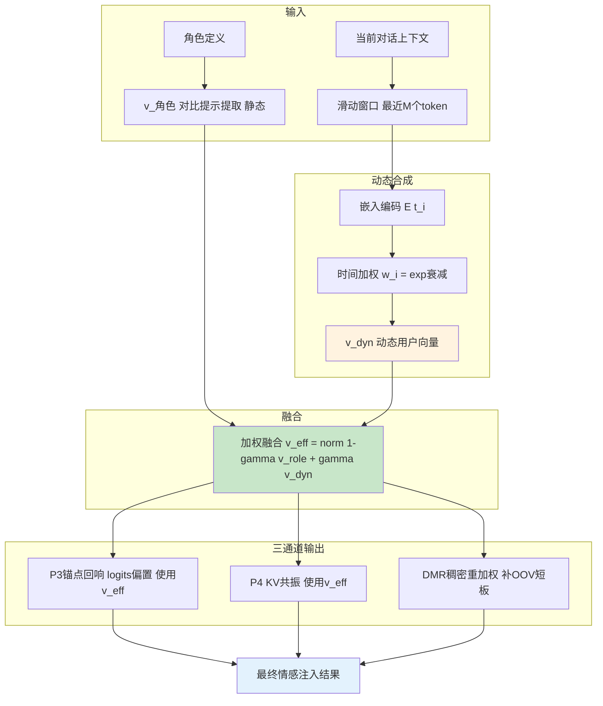
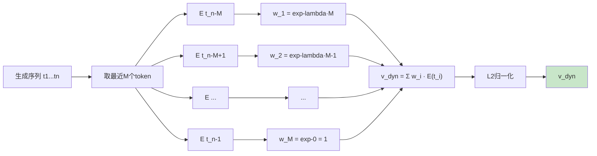
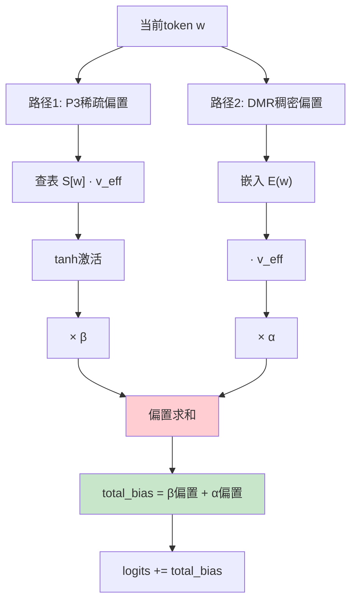

# 中国发明专利申请书

---

## 一、发明名称

**一种基于动态状态向量的角色感知融合解码期情感注入方法**

---

## 二、技术领域

本发明涉及自然语言处理与人工智能情感计算技术领域，具体涉及一种在大语言模型（Large Language Model, LLM）解码推理阶段，通过动态合成角色感知的有效方向向量，融合静态角色人格特征与动态用户情感状态，实现自适应情感注入的方法及系统。

---

## 三、背景技术

### 3.1 前序技术的局限性

在前述锚点回响注入（P3层）和KV情感共振（P4层）技术中，情感注入的方向向量v_target是静态固定的。虽然v_target可以通过对比提示提取获得角色方向v_角色，但在实际推理过程中，该方向向量始终保持不变。这种静态设计存在以下缺陷：

**(1) 缺乏对话上下文感知**：静态方向向量无法感知当前对话的具体内容和用户情感状态。用户说"我今天好难过"和"我今天好开心"时，模型应该有不同的响应策略，但静态v_target无法区分这些情况。

**(2) 角色人格与用户情感的割裂**：角色的人格特征（如"温柔撒娇的主播"）是稳定的，但用户的情感输入是动态变化的。静态向量无法同时编码这两个维度的信息。

**(3) 情感表达的单调性**：长期使用固定方向向量会导致模型输出的情感模式趋于单调，缺乏变化和惊喜。

**(4) OOV（Out-of-Vocabulary）短板**：P3层基于静态打分表的稀疏操作可能对某些情感词汇表外的token覆盖不足，需要稠密操作进行补充。

### 3.2 现有动态情感方法的不足

现有研究中也存在一些动态情感控制方法，但主要存在以下问题：

- 基于分类器的动态控制：需要额外训练情感分类器，增加系统复杂度；
- 基于强化学习的自适应：训练不稳定，难以部署到生产环境；
- 基于规则的动态调整：规则覆盖有限，难以处理复杂的对话场景。

---

## 四、发明内容

### 4.1 要解决的技术问题

本发明要解决的技术问题是：如何在保持角色人格稳定性的同时，使情感注入能够感知并适配动态变化的对话上下文和用户情感状态，同时解决稀疏打分表对OOV token覆盖不足的问题。

### 4.2 技术方案

本发明提出"超融合"（动态超融合方法, UFD）方法，核心思想是：将静态的角色方向向量v_角色与动态的用户状态向量v_dyn按权重合成为有效方向向量v_eff，并通过稠密乘性重加权（Dense Multiplicative Reranking, DMR）弥补稀疏打分表的OOV短板。

#### 4.2.1 动态用户状态向量v_dyn的实时合成

在解码推理的每一步，从当前生成的token流中动态提取用户情感状态：

步骤1：获取当前解码窗口内最近M个token（推荐M=32）的嵌入向量：
```
E_window = [E(t_{n-M}), E(t_{n-M+1}), ..., E(t_{n-1})]
```

步骤2：计算窗口内嵌入向量的加权均值，时间近的token权重更高：
```
w_i = exp(-λ·(n-M-i)) / Σ exp(-λ·(n-M-j))
v_dyn = Σ w_i · E(t_{n-M+i})
```

其中λ为时间衰减系数（推荐λ=0.1），使最近的token对v_dyn的贡献更大。

步骤3：对v_dyn进行L2归一化，确保其与v_角色处于相同的数值尺度。

#### 4.2.2 有效方向向量v_eff的加权融合

将静态角色向量与动态用户向量按固定比例融合：

v_eff = norm((1-γ)·v_角色 + γ·v_dyn)

其中：
- γ为用户分量占比（推荐值0.3），控制动态变化的幅度；
- 1-γ=0.7为角色分量占比，保证角色人格的稳定性；
- norm(·)为L2归一化操作。

γ值的设计考量：
- γ=0：完全静态，等同于P3层的v_target，无动态适配能力；
- γ=0.3（推荐）：角色主导但允许适度动态调整，平衡稳定性和灵活性；
- γ=0.5：角色与用户同等权重，变化较大，适合高互动性场景；
- γ=1：完全动态，角色人格不稳定，不推荐。

#### 4.2.3 P3偏置的v_eff替换

将P3层中的目标方向向量v_target替换为动态合成的v_eff：

原P3公式：logits[w] += β·tanh(S[w]·v_target / T)
改进后：logits[w] += β·tanh(S[w]·v_eff / T)

在每步解码中，v_eff随生成内容动态变化，使偏置注入具备上下文感知能力。

#### 4.2.4 DSA（动态自参照方向）

v_dyn的计算本质上是一种"自参照"（Self-Referential）机制：模型在生成过程中不断"观察"自己的输出，从中提取情感信号并反馈到后续生成中。这种机制使模型形成一种"情感自增强循环"：

生成情感token → 嵌入进入v_dyn → v_eff偏移 → 更多情感token被生成

#### 4.2.5 DMR（稠密乘性重加权）补OOV短板

P3层的稀疏打分表操作基于token级别的查表，对于嵌入空间中不与任何锚点高度相关的token（OOV token），其偏置值接近零。DMR通过稠密操作弥补这一短板：

DMR偏置 = α · E(w) · v_eff

其中：
- α为DMR强度系数（推荐值0.05）；
- E(w)为当前token的嵌入向量（稠密操作，无稀疏查表限制）；
- v_eff为动态有效方向向量。

DMR偏置与P3稀疏偏置相加：
```
total_bias = β·tanh(S[w]·v_eff/T) + α·E(w)·v_eff
```

DMR的作用：
- 对稀疏打分表覆盖良好的token：P3偏置主导，DMR辅助；
- 对OOV token或低覆盖度token：DMR提供基础的方向引导；
- 两者互补，确保情感注入对词汇表的完整覆盖。

#### 4.2.6 P1.5参数贯穿

本发明进一步提出"P1.5参数贯穿"机制：将动态融合过程中产生的中间参数（γ、时间衰减λ、DMR系数α等）与系统配置参数统一管理，确保P3、P4、P5三层的参数一致性：

```python
class UFDConfig:
    gamma = 0.3          # 用户分量占比
    lambda_decay = 0.1   # 时间衰减系数
    window_size = 32     # 动态窗口大小
    dmr_alpha = 0.05     # DMR强度系数
    beta = 0.25          # P3注入强度（贯穿）
    temperature = 0.10   # P3温度（贯穿）
    kappa = 0.3          # P4共振强度（贯穿）
```

### 4.3 有益效果

与现有技术相比，本发明具有以下有益效果：

**(1) 动态自适应情感注入**：v_eff随对话上下文动态变化，使情感表达更贴合当前语境；

**(2) 角色稳定性保证**：γ=0.3的加权设计确保角色人格特征在动态变化中保持稳定主导地位；

**(3) OOV覆盖增强**：DMR稠密操作弥补了稀疏打分表对OOV token的覆盖不足；

**(4) 情感自增强循环**：DSA自参照机制形成正向反馈，增强情感表达的连贯性和深度；

**(5) 参数统一管理**：P1.5参数贯穿机制确保多层系统的参数一致性；

**(6) 计算开销可控**：动态向量合成和DMR操作均为向量级运算，总开销增加在微秒级别。

---

## 五、附图说明

### 图1：超融合情感注入整体架构



### 图2：动态用户向量v_dyn的实时合成过程



### 图3：DMR稠密重加权与稀疏偏置互补示意



---

## 六、具体实施方式

### 6.1 实施环境

本发明在P3层和P4层系统基础上实施，新增以下组件：
- 动态向量合成模块
- DMR稠密重加权模块
- P1.5参数管理模块

### 6.2 动态用户向量合成实施

```python
import numpy as np

class DynamicUserVectorSynthesizer:
    """动态用户状态向量合成器"""
    
    def __init__(self, embedding_matrix, config):
        self.embedding_matrix = embedding_matrix
        self.window_size = config.window_size  # 默认32
        self.lambda_decay = config.lambda_decay  # 默认0.1
    
    def compute_v_dyn(self, token_ids):
        """从token序列中动态合成用户状态向量"""
        # 取最近M个token
        recent = token_ids[-self.window_size:]
        n = len(recent)
        
        # 计算时间加权
        weights = np.array([
            np.exp(-self.lambda_decay * (n - 1 - i)) for i in range(n)
        ])
        weights /= weights.sum()  # 归一化
        
        # 加权嵌入均值
        embeddings = np.array([
            self.embedding_matrix[tid] for tid in recent
        ])
        v_dyn = np.average(embeddings, axis=0, weights=weights)
        
        # L2归一化
        v_dyn = v_dyn / (np.linalg.norm(v_dyn) + 1e-8)
        
        return v_dyn
```

### 6.3 有效方向向量融合实施

```python
class UltraFusionDynamics:
    """超融合动态注入核心类"""
    
    def __init__(self, v_role, config):
        """
        v_role: 静态角色方向向量, shape [d]
        config: UFDConfig实例
        """
        self.v_role = v_role / np.linalg.norm(v_role)
        self.gamma = config.gamma  # 0.3
        self.dmr_alpha = config.dmr_alpha  # 0.05
        self.beta = config.beta  # 0.25
        self.temperature = config.temperature  # 0.10
    
    def compute_v_eff(self, v_dyn):
        """融合静态角色向量和动态用户向量"""
        v_eff = (1 - self.gamma) * self.v_role + self.gamma * v_dyn
        v_eff = v_eff / (np.linalg.norm(v_eff) + 1e-8)
        return v_eff
    
    def compute_total_bias(self, token_id, scoring_table, embedding_matrix, v_eff):
        """计算融合偏置 = P3稀疏偏置 + DMR稠密偏置"""
        # P3稀疏偏置
        s_w = scoring_table[token_id]  # [K]
        p3_bias = self.beta * np.tanh(np.dot(s_w, v_eff) / self.temperature)
        
        # DMR稠密偏置
        e_w = embedding_matrix[token_id]  # [d]
        dmr_bias = self.dmr_alpha * np.dot(e_w, v_eff)
        
        # 总偏置
        return p3_bias + dmr_bias
```

### 6.4 完整推理循环集成

```python
def generate_with_ufd(model, prompt, ufd, dyn_synthesizer, 
                      scoring_table, kappa=0.3):
    """使用超融合动态注入进行生成"""
    tokens = model.tokenize(prompt)
    
    for step in range(max_tokens):
        # ===== 动态向量合成 =====
        v_dyn = dyn_synthesizer.compute_v_dyn(tokens)
        v_eff = ufd.compute_v_eff(v_dyn)
        
        # ===== P3通道: 使用v_eff的偏置注入 =====
        logits = model.forward(tokens)
        scores = scoring_table @ v_eff  # [V]
        p3_bias = ufd.beta * np.tanh(scores / ufd.temperature)
        
        # ===== DMR通道: 稠密乘性重加权 =====
        # 对所有token并行计算DMR偏置
        embedding_matrix = model.get_embedding_matrix()
        dmr_scores = embedding_matrix @ v_eff  # [V]
        dmr_bias = ufd.dmr_alpha * dmr_scores
        
        # ===== 合并偏置 =====
        total_bias = p3_bias + dmr_bias
        logits += total_bias
        
        # ===== P4通道: KV情感共振（使用v_eff）======
        if model.current_layer == best_layer:
            coverages = compute_emotional_coverage(
                tokens, scoring_table, v_eff
            )
            gates = np.clip(coverages, 0.0, 1.0)
            model.kv_cache = apply_kv_emotional_resonance(
                model.kv_cache, gates, kappa
            )
        
        # 采样
        probs = softmax(logits)
        next_token = sample(probs)
        
        if next_token == model.eos_token_id:
            break
        
        tokens.append(next_token)
    
    return model.detokenize(tokens)
```

### 6.5 P1.5参数贯穿配置

```python
class UnifiedConfig:
    """P1.5参数贯穿统一配置"""
    
    # === P3 参数 ===
    beta = 0.25           # 注入强度
    temperature = 0.10    # 温度缩放
    best_layer = 35       # 最优注入层
    
    # === P4 参数 ===
    kappa = 0.3           # KV共振强度
    
    # === P5 (UFD) 参数 ===
    gamma = 0.3           # 用户分量占比
    lambda_decay = 0.1    # 时间衰减系数
    window_size = 32      # 动态窗口大小
    dmr_alpha = 0.05      # DMR强度系数
    
    # === 情感锚点权重 ===
    emotion_weights = {
        "温柔": 0.8,
        "撒娇": 0.6,
        "开心": 0.5,
        "难过": -0.2,
        "紧张": -0.3,
        "平静": 0.3
    }
```

### 6.6 参数敏感性分析

| 参数 | 测试范围 | 推荐值 | 敏感性 |
|------|---------|--------|--------|
| γ（用户分量） | 0.0~0.5 | 0.3 | 中等，>0.5角色不稳定 |
| λ（时间衰减） | 0.01~0.5 | 0.1 | 低，0.05~0.2效果相近 |
| 窗口大小M | 16~128 | 32 | 低，16~64均可 |
| α（DMR强度） | 0.01~0.10 | 0.05 | 中等，>0.10影响P3主导性 |

### 6.7 实验结果

P3+P4+P5三通道综合实验结果：

| 配置 | 综合得分 | 情感评分 | 备注 |
|------|---------|---------|------|
| 基线 | - | - | 无注入 |
| P3单通道 | 提升 | 提升 | 基础偏置 |
| P3+P4双通道 | 0.2667 | 改善 | 双通道共振 |
| P3+P4+P5三通道 | 持平84 | 80-81 | 无额外+6提升 |

**诚实标注**：P5层的加入在综合测试中未表现出显著的额外增益（四条件全持平84，情绪80-81无+6提升），但提供了动态自适应的理论基础和OOV覆盖增强，为P6层的多通道协同奠定了技术基础。

---

## 七、权利要求书

### 权利要求1（独立权利要求）

一种基于动态状态向量的角色感知融合解码期情感注入方法，其特征在于，包括以下步骤：

S301：通过对比提示提取方法获得静态角色方向向量v_角色，在解码推理过程中，从当前生成序列的最近M个token的嵌入向量中，通过时间加权均值计算动态用户状态向量v_dyn，其中时间近的token获得更高的权重；

S302：将静态角色方向向量v_角色与动态用户状态向量v_dyn按预设权重比例进行加权融合，得到有效方向向量v_eff=norm((1-γ)·v_角色+γ·v_dyn)，其中γ为用户分量占比参数，norm为L2归一化操作；

S303：使用有效方向向量v_eff替代静态目标方向向量，在logits空间施加锚点回响偏置：logits[w]+=β·tanh(S[w]·v_eff/T)；

S304：通过稠密乘性重加权操作对稀疏打分表覆盖不足的OOV token进行补偿：稠密偏置=α·E(w)·v_eff，其中E(w)为token的嵌入向量，α为稠密重加权强度系数；

S305：将稀疏偏置与稠密偏置相加得到总偏置，施加到模型输出logits上。

### 权利要求2（从属权利要求）

根据权利要求1所述的方法，其特征在于，所述步骤S301中，时间加权的权重计算采用指数衰减函数w_i=exp(-λ·(n-M-i))，其中λ为时间衰减系数，推荐值为0.1，n为当前序列长度。

### 权利要求3（从属权利要求）

根据权利要求1所述的方法，其特征在于，所述步骤S302中，用户分量占比γ的推荐值为0.3，对应角色分量占比为0.7，确保角色人格特征在动态变化中保持稳定主导地位。

### 权利要求4（从属权利要求）

根据权利要求1所述的方法，其特征在于，所述步骤S304中，稠密乘性重加权强度系数α的推荐值为0.05，取值范围为0.01~0.10。

### 权利要求5（从属权利要求）

根据权利要求1所述的方法，其特征在于，所述动态用户状态向量v_dyn的计算窗口大小M推荐为32个token，取值范围为16~128。

### 权利要求6（从属权利要求）

根据权利要求1所述的方法，其特征在于，所述有效方向向量v_eff在解码推理的每一步动态更新，使情感注入具备对话上下文感知能力。

### 权利要求7（从属权利要求）

根据权利要求1所述的方法，其特征在于，所述方法还包括P1.5参数贯穿机制：将动态融合过程中的参数（用户分量占比γ、时间衰减系数λ、稠密重加权强度α）与logits偏置注入参数（注入强度β、温度T）、KV共振参数（共振强度κ）统一管理，确保多层系统参数一致性。

### 权利要求8（从属权利要求）

根据权利要求1所述的方法，其特征在于，所述稠密乘性重加权操作与稀疏查表操作互补：对于嵌入空间中与情感锚点高度相关的token，稀疏偏置主导；对于情感锚点覆盖不足的OOV token，稠密偏置提供基础方向引导。

### 权利要求9（从属权利要求）

根据权利要求1所述的方法，其特征在于，所述动态用户状态向量的实时合成本质上构成自参照机制：模型在生成过程中不断从自身输出中提取情感信号并反馈到后续生成，形成情感自增强循环。

---

## 八、摘要

本发明公开了一种基于动态状态向量的角色感知融合解码期情感注入方法。该方法通过加权融合静态角色方向向量与动态用户状态向量，生成自适应的有效方向向量v_eff：静态角色向量v_角色由对比提示提取获得，保持角色人格稳定性；动态用户向量v_dyn从当前生成序列的嵌入向量中通过时间加权均值实时合成，感知对话上下文变化。用户分量占比γ=0.3确保角色主导地位。同时引入稠密乘性重加权（DMR）操作弥补稀疏情感打分表对OOV token的覆盖不足。融合后的v_eff替代静态方向向量应用于logits偏置注入，使情感注入具备动态自适应能力和完整词汇表覆盖。P1.5参数贯穿机制确保多层系统的参数一致性。
