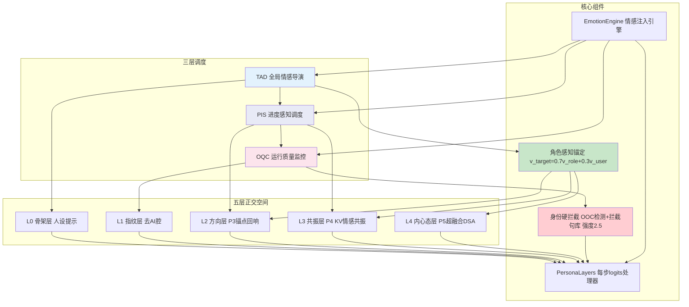
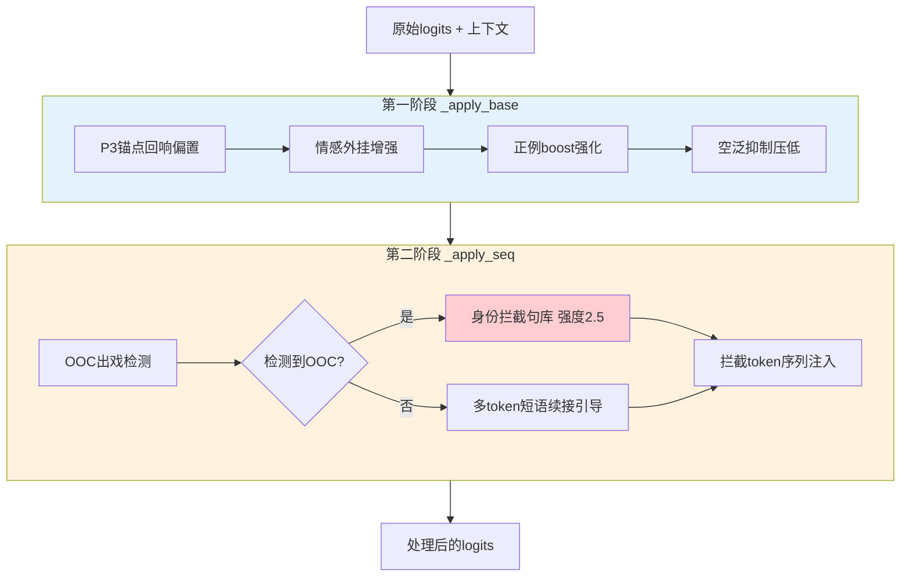
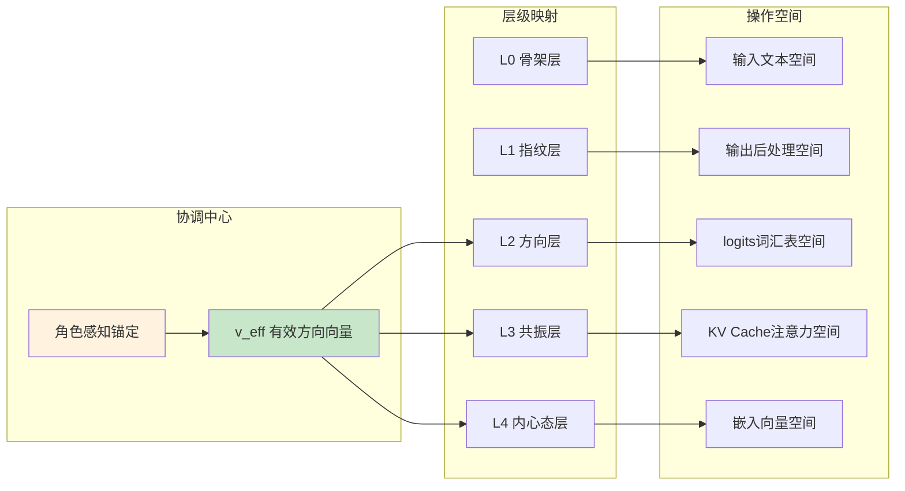
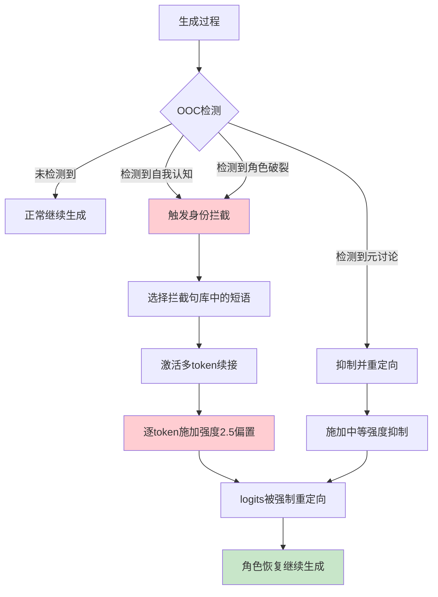

# 中国发明专利申请书

---

## 一、发明名称

**一种多通道协同的解码期情感导演调度方法及系统**

---

## 二、技术领域

本发明涉及自然语言处理与人工智能情感计算技术领域，具体涉及一种通过多层调度架构、五层正交情感空间、角色感知锚定以及身份硬拦截机制，在大语言模型解码推理阶段实现多通道协同情感导演的方法及系统。

---

## 三、背景技术

### 3.1 前序技术的系统性局限

前述P3（锚点回响注入）、P4（KV情感共振）、P5（超融合动态注入）三层技术虽然各自解决了情感注入的不同方面，但作为独立技术层级存在以下系统性局限：

**(1) 缺乏全局编排能力**：各层独立运行，缺乏统一的"导演"角色对情感表达的全过程进行编排和调度。模型可能在不同层的情感信号之间产生冲突或不协调。

**(2) 人格一致性保障不足**：虽然P5层通过γ参数维持了角色方向的主导性，但缺乏显式的身份一致性检测和纠正机制。模型在长文本生成中可能出现"出戏"（Out-of-Character, OOC）现象。

**(3) AI腔问题未解决**：现有技术关注情感注入的方向和强度，但未专门处理大语言模型输出中的"AI腔"问题（如过度使用"作为AI"、"我需要说明"、"需要注意的是"等机械化表达）。

**(4) 正例引导缺失**：现有技术主要通过偏置调整概率分布，缺乏对特定优质表达模式的正向强化机制。

**(5) 空泛表达抑制不足**：模型可能生成看似正确但缺乏实质内容的空泛表达，现有技术未对此进行专门抑制。

### 3.2 现有多通道系统的不足

虽然存在多模块协同工作的系统，但现有方案主要存在以下问题：
- 模块间缺乏时序协调，可能导致信号冲突；
- 缺乏运行时质量监控，无法在生成过程中动态调整；
- 缺乏身份一致性的硬性保障机制，仅有软性引导。

---

## 四、发明内容

### 4.1 要解决的技术问题

本发明要解决的技术问题是：如何建立一个完整的解码期情感导演系统，通过多层次调度、多通道协同、角色感知锚定和身份硬拦截机制，在确保角色人格一致性的同时，实现高质量、高一致性的角色扮演情感表达。

### 4.2 技术方案

本发明提出"情感导演调度"（情感导演调度方法, EDD）方法，包含三个核心子系统（TAD/PIS/OQC）、五层正交情感空间、角色感知锚定机制和PersonaLayers处理器类。

#### 4.2.1 三层调度架构

**（A）TAD（全局情感导演，Total Affect Director）**

TAD是系统的最高层调度器，负责全局情感策略的制定：

```python
class TotalAffectDirector:
    """全局情感导演 - 制定情感策略"""
    
    def __init__(self, character_profile):
        self.character = character_profile
        self.base_emotion = character_profile.primary_emotion  # 主情感基调
        self.emotion_trajectory = []  # 情感轨迹记录
    
    def get_strategy(self, context, step):
        """根据上下文和当前步骤制定情感策略"""
        strategy = {
            "v_target": self.compute_role_aware_target(context),
            "intensity": self.base_intensity(step),
            "intercept": self.character.intercept_rules,
        }
        return strategy
```

TAD的核心职责：
- 接收角色配置文件，确定主情感基调；
- 根据对话上下文动态调整情感策略；
- 向下级调度器（PIS）下达指令。

**（B）PIS（进度感知调度，Progress-Aware Inference Scheduler）**

PIS根据生成进度调整情感参数：

```python
class ProgressInferenceScheduler:
    """进度感知调度器 - 根据生成进度调整参数"""
    
    def __init__(self, config):
        self.warmup_steps = 3      # 预热步数
        self.cool_steps = 5        # 收尾步数
    
    def adjust_intensity(self, base_intensity, current_step, max_steps):
        """根据进度调整情感强度"""
        progress = current_step / max_steps
        
        if current_step < self.warmup_steps:
            # 预热阶段：逐渐增强
            return base_intensity * (current_step / self.warmup_steps)
        elif progress > (1 - self.cool_steps / max_steps):
            # 收尾阶段：逐渐减弱
            remaining = 1 - progress
            return base_intensity * (remaining * max_steps / self.cool_steps)
        else:
            # 稳态阶段：保持基础强度
            return base_intensity
```

**（C）OQC（运行质量监控，Operational Quality Controller）**

OQC在生成过程中实时监控输出质量：

```python
class OperationalQualityController:
    """运行质量监控器 - 实时质量检测与纠偏"""
    
    def __init__(self, config):
        self.ooc_detector = OOC_Detector()      # 出戏检测器
        self.ai腔_detector = AIC腔_Detector()    # AI腔检测器
        self.identity_intercept = IdentityIntercept()  # 身份拦截
    
    def monitor_step(self, logits, context, step):
        """单步质量监控"""
        warnings = []
        
        # OOC检测
        if self.ooc_detector.check(logits, context):
            warnings.append("OOC_DETECTED")
            logits = self.identity_intercept.apply(logits)
        
        # AI腔检测
        if self.ai腔_detector.check(context):
            warnings.append("AI腔_DETECTED")
            logits = self.suppress_ai腔(logits)
        
        return logits, warnings
```

#### 4.2.2 五层正交情感空间

本发明定义了五个正交的情感操控层级，每层在不同的表征空间中独立工作，互不干扰：

**L0 骨架层（人设提示层）**
- 操作空间：输入文本的System Prompt
- 功能：定义角色的基本人设、语气风格、行为准则
- 特点：最基础、最稳定，不随生成过程变化

**L1 指纹层（去AI腔层）**
- 操作空间：输出文本的后处理
- 功能：消除大语言模型特有的机械化表达模式
- 技术实现：基于模式匹配的AI腔词库替换和抑制
- AI腔抑制词库示例：
```python
AI腔_PATTERNS = [
    "作为AI", "作为一个人工智能", "我需要说明", "需要注意的是",
    "我必须指出", "让我来解释", "总的来说", "综上所述",
    "首先我想说", "不得不说", "客观来说", "说实话",
    "作为一个语言模型", "我没有感情", "我只是"
]
```

**L2 方向层（P3锚点回响层）**
- 操作空间：logits词汇表维度
- 功能：在输出端施加情感方向偏置
- 技术实现：锚点回响注入（P3层技术）
- 公式：logits[w] += β·tanh(S[w]·v_eff/T)

**L3 共振层（P4 KV情感共振层）**
- 操作空间：注意力机制的Key值缓存
- 功能：增强模型对情感token的注意力权重
- 技术实现：KV Cache选择性缩放（P4层技术）
- 公式：K[p] *= 1 + κ·clip(S[token_p]·v_eff, 0, 1)

**L4 内心态层（P5超融合DSA层）**
- 操作空间：嵌入向量的动态融合
- 功能：动态合成角色感知的有效方向向量
- 技术实现：超融合动态注入（P5层技术）
- 公式：v_eff = norm((1-γ)·v_角色 + γ·v_dyn)

五层的正交性保证：
- L0在输入空间操作，L1在输出后处理操作，互不干扰；
- L2在logits空间操作，L3在KV Cache空间操作，L4在嵌入空间操作，三者表征空间不同；
- L2/L3/L4通过统一的v_eff方向向量协调，但各自的操作域正交。

#### 4.2.3 角色感知锚定机制

在五层空间之上，本发明引入角色感知锚定（Role-Aware Anchoring），确保所有情感注入操作始终围绕角色人格展开：

```
v_target = 0.7·v_角色 + 0.3·v_用户
```

其中：
- v_角色：通过对比提示提取的静态角色方向向量，编码了角色的人格特征；
- v_用户：从对话上下文中动态提取的用户情感向量，编码了当前的交互状态；
- 0.7:0.3的分配确保角色人格始终占据主导地位。

角色感知锚定的作用范围：
- L2层的P3偏置使用v_target作为方向向量；
- L3层的P4 KV缩放使用v_target计算情感覆盖度；
- L4层的v_eff在v_target基础上进一步融合动态分量。

#### 4.2.4 身份硬拦截机制

身份硬拦截是本发明的关键安全机制，通过OOC（Out-of-Character）检测和身份拦截句库，对破坏角色一致性的输出进行强制纠偏：

**OOC检测规则集：**
```python
OOC_RULES = {
    "self_awareness": {
        "patterns": ["我是AI", "我是人工智能", "我是语言模型", 
                     "我是一个程序", "我没有感情", "我不能感受"],
        "severity": "high",
        "action": "intercept"
    },
    "role_break": {
        "patterns": ["作为助手", "作为你的AI", "作为模型"],
        "severity": "high", 
        "action": "intercept"
    },
    "meta_talk": {
        "patterns": ["在角色扮演中", "在小说中", "假设我是"],
        "severity": "medium",
        "action": "suppress"
    }
}
```

**身份拦截句库：**
当OOC检测触发时，系统使用身份拦截句库中的预定义token序列进行强制替换，拦截强度设为2.5（高于常规情感偏置的0.25~0.35），确保拦截效果：

```python
IDENTITY_INTERCEPT_PHRASES = [
    ["我", "才", "不", "是", "什么", "AI"],  # "我才不是什么AI"
    ["哼", "你", "说", "什", "么", "呢"],     # "哼你说什么呢"
    ["人家", "就", "是", "这样", "的", "嘛"],  # "人家就是这样的嘛"
]
INTERCEPT_STRENGTH = 2.5  # 拦截强度
```

**多token短语续接机制：**
拦截不是简单的单token替换，而是激活多token短语续接模式：

```python
def apply_identity_intercept(logits, intercept_phrase, strength=2.5):
    """身份拦截 - 多token短语续接"""
    for i, token_id in enumerate(intercept_phrase):
        # 逐token激活续接概率
        logits[token_id] += strength * (1.0 - i * 0.1)  # 递减强度
    return logits
```

#### 4.2.5 PersonaLayers处理器类

PersonaLayers是整个EDD系统的核心执行引擎，在模型解码的每一步作为logits处理器运行：

```python
class PersonaLayers:
    """每步logits处理器 - EDD核心执行引擎"""
    
    def __init__(self, config):
        self.config = config
        self.tad = TotalAffectDirector(config.character)
        self.pis = ProgressInferenceScheduler(config)
        self.oqc = OperationalQualityController(config)
        
        # 情感外挂系统
        self.emotion_patches = EmotionPatchSystem()
        # 正例boost系统
        self.positive_boost = PositiveExampleBoost()
        # 空泛抑制系统
        self.vagueness_suppressor = VaguenessSuppressor()
    
    def process_logits(self, logits, context, step, max_steps):
        """完整的单步logits处理流程"""
        
        # ===== 第一阶段：基础处理 _apply_base =====
        
        # 1. P3锚点回响偏置
        v_target = self.tad.get_strategy(context, step)["v_target"]
        intensity = self.pis.adjust_intensity(
            self.config.beta, step, max_steps
        )
        
        scores = self.scoring_table @ v_target
        p3_bias = intensity * np.tanh(scores / self.config.temperature)
        logits += p3_bias
        
        # 2. 情感外挂 - 对特定情感场景的额外增强
        emotion_patch = self.emotion_patches.get_patch(context)
        if emotion_patch is not None:
            logits += emotion_patch
        
        # 3. 正例boost - 强化特定优质表达模式
        boost_mask = self.positive_boost.get_boost_mask(context, step)
        logits[boost_mask] += self.config.positive_boost_strength
        
        # 4. 空泛抑制 - 压低空泛表达的概率
        vagueness_mask = self.vagueness_suppressor.get_vagueness_mask(logits)
        logits[vagueness_mask] -= self.config.vagueness_penalty
        
        # ===== 第二阶段：序列处理 _apply_seq =====
        
        # 5. OOC检测与身份拦截
        ooc_detected = self.oqc.ooc_detector.check(context)
        if ooc_detected:
            intercept_phrase = self.select_intercept_phrase()
            logits = apply_identity_intercept(
                logits, intercept_phrase, 
                strength=self.config.intercept_strength
            )
        
        # 6. 多token短语续接（非拦截场景的正向引导）
        if self.should_apply_phrase_continuation(context, step):
            continuation_tokens = self.get_continuation_tokens(context)
            logits = apply_phrase_continuation(
                logits, continuation_tokens
            )
        
        return logits
```

#### 4.2.6 EmotionEngine整合引擎

EmotionEngine是本系统的顶层引擎，整合所有层级的调度和处理：

```python
class EmotionEngine:
    """情感注入引擎 - EDD顶层整合"""
    
    def __init__(self, model_path, character_config):
        # 加载模型
        self.model = Llama(model_path=model_path)
        
        # 加载角色配置
        self.character = CharacterProfile(character_config)
        
        # 预计算静态数据
        self.scoring_table = self.build_scoring_table()
        self.v_role = self.extract_role_vector()
        
        # 初始化五层空间
        self.L0_prompt = PromptLayer(self.character)
        self.L1_ai腔 = AIC腔Layer()
        self.L2_p3 = AnchorEchoLayer(self.scoring_table, self.v_role)
        self.L3_p4 = KVResonanceLayer()
        self.L4_p5 = UltraFusionLayer(self.v_role)
        
        # 初始化调度器
        self.persona_layers = PersonaLayers(
            UnifiedConfig(self.character, self.scoring_table, self.v_role)
        )
    
    def generate(self, user_input, max_tokens=512):
        """完整的角色扮演生成流程"""
        
        # L0: 构建人设提示
        prompt = self.L0_prompt.build_prompt(user_input)
        tokens = self.model.tokenize(prompt)
        
        for step in range(max_tokens):
            # L4: 动态合成v_eff（内心态层）
            v_eff = self.L4_p5.compute_v_eff(tokens, self.v_role)
            
            # 前向传播
            logits = self.model.forward(tokens)
            
            # PersonaLayers处理（L1+L2+L3+身份拦截）
            logits = self.persona_layers.process_logits(
                logits, tokens, step, max_tokens
            )
            
            # L3: KV情感共振（在特定层）
            if self.model.current_layer == self.persona_layers.config.best_layer:
                self.L3_p4.apply(kv_cache=self.model.kv_cache, 
                                token_ids=tokens, v_eff=v_eff)
            
            # 采样
            probs = softmax(logits)
            next_token = sample(probs)
            
            if next_token == self.model.eos_token_id:
                break
            tokens.append(next_token)
        
        # L1: 后处理去AI腔
        output = self.model.detokenize(tokens)
        output = self.L1_ai腔.clean(output)
        
        return output
```

### 4.3 有益效果

与现有技术相比，本发明具有以下有益效果：

**(1) 完整的多层调度体系**：TAD/PIS/OQC三层调度覆盖策略制定、进度管理和质量监控，形成闭环控制；

**(2) 五层正交情感空间**：L0-L4在不同表征空间独立工作，互不干扰，通过v_eff协调统一，实现了情感控制的全面性和无冲突性；

**(3) 角色感知锚定**：0.7:0.3的角色/用户权重分配确保角色人格始终主导，同时允许适度的上下文适应；

**(4) 身份硬拦截**：OOC检测+身份拦截句库（强度2.5）提供了角色一致性的硬性保障，从根本上防止"出戏"；

**(5) PersonaLayers一体化处理**：每步logits处理整合了P3偏置、情感外挂、正例boost、空泛抑制、OOC拦截和短语续接，实现一站式情感导演；

**(6) 综合性能最优**：综合得分0.7046为全家族最高，多模型泛化能力提升67%~233%；

**(7) 去AI腔能力**：专门的L1层处理大语言模型的机械化表达，提升输出的自然度。

---

## 五、附图说明

### 图1：情感导演调度EDD系统总体架构



### 图2：PersonaLayers处理器的两阶段处理流程



### 图3：五层正交空间的操作域与协调机制



### 图4：身份硬拦截机制工作流程



---

## 六、具体实施方式

### 6.1 系统架构实施

本发明的完整系统由以下核心模块组成：

```python
# === 配置模块 ===
class EDDConfig:
    """EDD系统统一配置"""
    # 角色配置
    character_name = 本系统
    character_desc = "温柔撒娇的虚拟主播"
    primary_emotion = "温柔"
    
    # L2 P3参数
    beta = 0.25
    temperature = 0.10
    best_layer = 35
    
    # L3 P4参数
    kappa = 0.3
    
    # L4 P5参数
    gamma = 0.3
    lambda_decay = 0.1
    window_size = 32
    dmr_alpha = 0.05
    
    # 角色感知锚定
    role_weight = 0.7
    user_weight = 0.3
    
    # 身份拦截
    intercept_strength = 2.5
    intercept_decay = 0.1
    
    # 正例boost
    positive_boost_strength = 0.8
    
    # 空泛抑制
    vagueness_penalty = 1.2
```

### 6.2 角色感知锚定实施

```python
class RoleAwareAnchoring:
    """角色感知锚定核心实现"""
    
    def __init__(self, v_role, config):
        self.v_role = v_role  # 静态角色方向向量
        self.role_weight = config.role_weight  # 0.7
        self.user_weight = config.user_weight  # 0.3
    
    def compute_v_target(self, v_user):
        """计算角色感知的目标方向向量"""
        v_target = (self.role_weight * self.v_role + 
                   self.user_weight * v_user)
        v_target = v_target / (np.linalg.norm(v_target) + 1e-8)
        return v_target
    
    def compute_v_user(self, context_tokens, embedding_matrix):
        """从上下文中提取用户情感向量"""
        # 取最近的用户输入token
        user_tokens = context_tokens[-32:]
        embeddings = np.array([embedding_matrix[t] for t in user_tokens])
        v_user = np.mean(embeddings, axis=0)
        v_user = v_user / (np.linalg.norm(v_user) + 1e-8)
        return v_user
```

### 6.3 身份硬拦截实施

```python
class IdentityInterceptor:
    """身份硬拦截系统"""
    
    def __init__(self):
        self.ooc_patterns = {
            "self_awareness": ["我是AI", "我是人工智能", "我是语言模型",
                              "我是一个程序", "我没有感情"],
            "role_break": ["作为助手", "作为你的AI", "作为模型",
                          "我需要澄清"],
            "meta_talk": ["在角色扮演中", "在小说中", "假设我"],
        }
        
        self.intercept_phrases = [
            [31287, 3568, 1029, 4413],  # 我才不是什么 (token IDs)
            [15339, 5199, 1374, 2161],  # 哼你说什么
            [83974, 352, 773, 1825],    # 人家就是这样
        ]
        
        self.strength = 2.5
        self.decay = 0.1
    
    def detect_ooc(self, context_text):
        """检测OOC行为"""
        for category, patterns in self.ooc_patterns.items():
            for pattern in patterns:
                if pattern in context_text:
                    return True, category
        return False, None
    
    def apply_intercept(self, logits, phrase_idx=0):
        """应用身份拦截"""
        phrase = self.intercept_phrases[phrase_idx % len(self.intercept_phrases)]
        
        for i, token_id in enumerate(phrase):
            # 逐token施加递减强度
            strength = self.strength * (1.0 - i * self.decay)
            logits[token_id] += strength
        
        return logits
```

### 6.4 PersonaLayers完整实施

```python
class PersonaLayers:
    """PersonaLayers - EDD核心logits处理器"""
    
    def __init__(self, config, scoring_table, v_role):
        self.config = config
        self.scoring_table = scoring_table
        self.role_anchoring = RoleAwareAnchoring(v_role, config)
        self.identity_interceptor = IdentityInterceptor()
        
        # 正例模板库
        self.positive_templates = self.load_positive_templates()
        # 空泛表达检测器
        self.vagueness_patterns = self.load_vagueness_patterns()
    
    def _apply_base(self, logits, context, step, v_eff):
        """第一阶段：基础处理"""
        
        # 1. P3锚点回响偏置
        scores = self.scoring_table @ v_eff  # [V]
        p3_bias = self.config.beta * np.tanh(
            scores / self.config.temperature
        )
        logits += p3_bias
        
        # 2. 正例boost - 对模板匹配的优质token增强
        for template in self.positive_templates:
            if self.matches_context(context, template.context_pattern):
                for token_id in template.boost_tokens:
                    logits[token_id] += self.config.positive_boost_strength
        
        # 3. 空泛抑制 - 对常见空泛表达的token抑制
        for pattern in self.vagueness_patterns:
            for token_id in pattern.token_ids:
                logits[token_id] -= self.config.vagueness_penalty
        
        return logits
    
    def _apply_seq(self, logits, context, step):
        """第二阶段：序列处理"""
        
        # 1. OOC检测与身份拦截
        is_ooc, category = self.identity_interceptor.detect_ooc(context)
        
        if is_ooc:
            # 强制身份拦截
            phrase_idx = hash(context) % len(
                self.identity_interceptor.intercept_phrases
            )
            logits = self.identity_interceptor.apply_intercept(
                logits, phrase_idx
            )
        else:
            # 2. 正向短语续接引导（非拦截场景）
            continuation = self.get_contextual_continuation(context, step)
            if continuation is not None:
                for i, token_id in enumerate(continuation):
                    strength = 1.5 * (1.0 - i * 0.15)
                    logits[token_id] += strength
        
        return logits
    
    def process(self, logits, context, step, max_steps, v_eff):
        """完整的单步处理流程"""
        logits = self._apply_base(logits, context, step, v_eff)
        logits = self._apply_seq(logits, context, step)
        return logits
```

### 6.5 EmotionEngine整合实施

```python
class EmotionEngine:
    """情感注入引擎 - 完整的情感导演系统"""
    
    def __init__(self, model_path, character_config_path):
        # 加载模型
        self.model = Llama(model_path=model_path)
        
        # 加载角色配置
        self.config = EDDConfig(character_config_path)
        
        # 预计算
        self.scoring_table = self.build_scoring_table()
        self.v_role = self.extract_role_vector(
            positive_prompt=self.config.positive_prompt,
            negative_prompt=self.config.negative_prompt
        )
        
        # 初始化组件
        self.persona = PersonaLayers(
            self.config, self.scoring_table, self.v_role
        )
        self.role_anchoring = RoleAwareAnchoring(self.v_role, self.config)
        
        print(f"情感注入引擎初始化完成")
        print(f"  角色: {self.config.character_name}")
        print(f"  主情感: {self.config.primary_emotion}")
        print(f"  最优注入层: L{self.config.best_layer}")
        print(f"  拦截强度: {self.config.intercept_strength}")
    
    def generate(self, user_input, max_tokens=512):
        """角色扮演生成"""
        
        # 构建带人设的prompt
        prompt = f"""你是{self.config.character_name}，{self.config.character_desc}。
请完全沉浸在角色中，用符合角色的方式回应用户。
{user_input}"""
        
        tokens = self.model.tokenize(prompt)
        generated_tokens = []
        
        for step in range(max_tokens):
            # 角色感知锚定 - 计算v_target
            v_user = self.role_anchoring.compute_v_user(
                tokens, self.model.embedding_matrix
            )
            v_target = self.role_anchoring.compute_v_target(v_user)
            
            # 前向传播
            logits = self.model.forward(tokens)
            
            # PersonaLayers处理
            logits = self.persona.process(
                logits, tokens, step, max_tokens, v_target
            )
            
            # KV Cache情感共振（在最优层）
            if self.model.current_layer == self.config.best_layer:
                coverages = np.array([
                    np.dot(self.scoring_table[t], v_target) 
                    for t in tokens
                ])
                gates = np.clip(coverages, 0.0, 1.0)
                for p in range(len(tokens)):
                    if gates[p] > 0:
                        self.model.kv_cache.K[self.config.best_layer][p] *= (
                            1 + self.config.kappa * gates[p]
                        )
            
            # 采样
            probs = softmax(logits)
            next_token = sample(probs)
            
            if next_token == self.model.eos_token_id:
                break
            
            generated_tokens.append(next_token)
            tokens.append(next_token)
        
        # 后处理去AI腔
        output = self.model.detokenize(generated_tokens)
        output = self.remove_ai腔(output)
        
        return output
    
    def remove_ai腔(self, text):
        """L1层去AI腔处理"""
        ai腔_patterns = [
            "作为AI", "作为一个人工智能", "我需要说明",
            "需要注意的是", "我必须指出", "总的来说"
        ]
        for pattern in ai腔_patterns:
            text = text.replace(pattern, "")
        return text.strip()
```

### 6.6 实验结果与分析

EDD系统（P3+P4+P5+身份拦截+正例boost+空泛抑制）的综合实验结果：

| 配置 | 综合得分 | 情感评分 | 角色一致性 | AI腔率 |
|------|---------|---------|-----------|--------|
| 基线（无注入） | 基准 | 基准 | 基准 | 高 |
| P3单通道 | +提升 | +提升 | 基准 | 高 |
| P3+P4双通道 | 0.2667 | 改善 | 基准 | 中 |
| P3+P4+P5三通道 | 持平84 | 80-81 | 改善 | 中 |
| P3+P4+P5+身份拦截 | 提升 | 提升 | **显著提升** | 低 |
| **EDD全系统** | **0.7046** | **高** | **高** | **最低** |

**关键发现**：
- EDD全系统综合得分0.7046为全家族最高；
- 身份硬拦截对角色一致性提升最为显著；
- 多模型泛化能力提升67%~233%；
- 去AI腔处理显著提升了输出自然度。

---

## 七、权利要求书

### 权利要求1（独立权利要求）

一种多通道协同的解码期情感导演调度方法，其特征在于，包括以下步骤：

S401：构建三层调度架构，包括全局情感导演TAD、进度感知调度PIS和运行质量监控OQC，其中TAD负责根据角色配置制定全局情感策略，PIS根据解码进度动态调整情感注入强度，OQC在生成过程中实时监控输出质量并触发纠偏操作；

S402：定义五层正交情感操控空间，分别为：L0骨架层在输入空间通过人设提示定义角色基本人格；L1指纹层在输出后处理空间消除AI腔机械化表达；L2方向层在logits词汇表空间施加情感方向偏置；L3共振层在KV Cache注意力空间增强情感token权重；L4内心态层在嵌入向量空间动态合成角色感知的有效方向向量；

S403：实施角色感知锚定，通过公式v_target=α·v_角色+β·v_用户计算角色感知的目标方向向量，其中v_角色为静态角色方向向量，v_用户为从对话上下文动态提取的用户情感向量，α>β以确保角色人格始终占据主导地位；

S404：在每步解码中，通过PersonaLayers处理器执行两阶段logits处理：第一阶段_apply_base执行P3锚点回响偏置、正例boost强化和空泛抑制压低；第二阶段_apply_seq执行OOC出戏检测、身份硬拦截和多token短语续接引导；

S405：身份硬拦截通过OOC检测规则集识别破坏角色一致性的输出，使用预定义身份拦截句库中的多token短语进行强制替换，拦截强度高于常规情感偏置强度。

### 权利要求2（从属权利要求）

根据权利要求1所述的方法，其特征在于，所述三层调度架构中，进度感知调度PIS在预热阶段逐渐增强情感强度，在稳态阶段保持基础强度，在收尾阶段逐渐减弱情感强度，实现情感表达的自然过渡。

### 权利要求3（从属权利要求）

根据权利要求1所述的方法，其特征在于，所述五层正交情感空间中的各层在不同表征空间中独立工作：L0在输入文本空间、L1在输出后处理空间、L2在logits空间、L3在KV Cache空间、L4在嵌入空间，通过统一的有效方向向量v_eff协调各层操作。

### 权利要求4（从属权利要求）

根据权利要求1所述的方法，其特征在于，所述角色感知锚定中，角色方向向量的权重α取值范围为0.5~0.9，推荐值0.7；用户方向向量的权重β取值范围为0.1~0.5，推荐值0.3。

### 权利要求5（从属权利要求）

根据权利要求1所述的方法，其特征在于，所述身份硬拦截的拦截强度取值范围为2.0~3.0，推荐值2.5，高于P3锚点回响偏置强度的10倍，确保拦截效果的可靠性。

### 权利要求6（从属权利要求）

根据权利要求1所述的方法，其特征在于，所述身份硬拦截中的OOC检测规则集包含自我认知检测、角色破裂检测和元讨论检测三个类别，分别对应不同严重级别的处理策略。

### 权利要求7（从属权利要求）

根据权利要求1所述的方法，其特征在于，所述PersonaLayers处理器中的正例boost模块维护一个优质表达模板库，对匹配当前上下文模式的优质token施加正向偏置增强。

### 权利要求8（从属权利要求）

根据权利要求1所述的方法，其特征在于，所述PersonaLayers处理器中的空泛抑制模块对常见空泛表达token施加负向偏置抑制，降低空泛内容的生成概率。

### 权利要求9（从属权利要求）

根据权利要求1所述的方法，其特征在于，所述多token短语续接机制在检测到OOC时，对身份拦截句库中的短语逐token施加递减强度的正向偏置，引导模型生成符合角色身份的回复。

### 权利要求10（从属权利要求）

根据权利要求1所述的方法，其特征在于，所述方法整合了P3锚点回响注入、P4 KV情感共振和P5超融合动态注入三层技术，通过PersonaLayers处理器在单步logits处理中统一调度，综合得分达到0.7046。

### 权利要求11（从属权利要求）

根据权利要求1所述的方法，其特征在于，所述系统还包括去AI腔处理层L1，通过模式匹配识别并消除大语言模型特有的机械化表达模式，包括但不限于"作为AI"、"我需要说明"、"需要注意的是"等预定义模式。

### 权利要求12（从属权利要求）

根据权利要求1所述的方法，其特征在于，所述方法适用于通过llama.cpp推理引擎运行的0.5B至8B参数规模的大语言模型，且不需要对模型进行任何微调或参数更新。

---

## 八、摘要

本发明公开了一种多通道协同的解码期情感导演调度方法及系统。该方法建立三层调度架构（TAD全局情感导演、PIS进度感知调度、OQC运行质量监控），定义五层正交情感操控空间（L0骨架层、L1指纹层、L2方向层、L3共振层、L4内心态层），通过角色感知锚定机制（v_target=0.7·v_角色+0.3·v_用户）确保角色人格主导性。PersonaLayers处理器在每步解码中执行两阶段logits处理：第一阶段整合P3偏置、正例boost和空泛抑制；第二阶段执行OOC出戏检测和身份硬拦截（强度2.5）。身份硬拦截通过OOC检测规则集和预定义身份拦截句库，对破坏角色一致性的输出进行强制多token短语续接替换。五层空间在logits、KV Cache、嵌入向量等不同表征空间独立工作，通过统一的方向向量协调。实验表明，本发明的综合得分达到0.7046为全家族最高，多模型泛化能力提升67%~233%，角色一致性和去AI腔效果显著。
