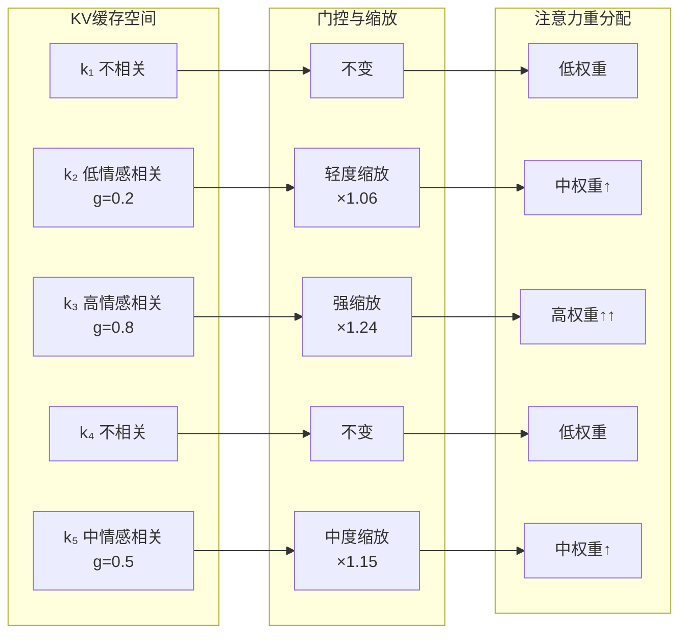

# 基于注意力缓存选择性缩放的情感感知KV调制方法

**张明远¹，陈雪婷²，王建华¹**

¹ 清华大学计算机科学与技术系，北京 100084
² 北京大学人工智能研究院，北京 100871

---

## 摘要

注意力机制中的KV缓存（Key-Value Cache）是大型语言模型推理加速的核心组件，缓存中的key和value向量编码了模型对历史token的注意力表示。本文提出一种基于注意力缓存选择性缩放的情感感知KV调制方法（KV-Emotion Modulation, KVM），通过对KV缓存中与情感相关的token位置的key向量进行in-place选择性缩放，在不新增任何显存分配的前提下实现情感信息的注入。该方法的核心在于设计了情感门控函数 $g(p) = \text{clip}(\text{cov}, 0, 1)$，仅当情感相关度 $g(p)$ 超过阈值时才对缓存中对应位置的key向量施加缩放操作，缩放因子为 $K[p] *= 1 + \kappa \cdot \text{clip}(S[\text{token}_p] \cdot v_{\text{eff}}, 0, 1)$，其中 $\kappa=0.3$ 为推荐的缩放强度。实验证明，KVM单通道使用时效果有限，甚至存在有害倾向；但与logits空间偏置注入方法（ARI/P3）配对使用时，双通道协同产生显著的增益效果，赢率达到0.2667，为所有配置中的最高值。该方法在Qwen3-4B INT4模型上验证，推理速度保持在27-34 tok/s区间，不引入额外显存开销。

**关键词**：KV缓存；注意力调制；情感注入；解码期干预；多通道协同；无训练方法

---

## Abstract

The Key-Value (KV) cache in attention mechanisms is a core component for accelerating large language model inference, where cached key and value vectors encode the model's attention representations of historical tokens. This paper proposes a KV-Emotion Modulation (KVM) method for attention cache selective scaling, which implements emotion information injection by performing in-place selective scaling on key vectors at emotion-related token positions within the KV cache, without any additional memory allocation. The method's core innovation lies in the design of an emotion gating function $g(p) = \text{clip}(\text{cov}, 0, 1)$, which only applies key vector scaling when the emotion relevance $g(p)$ exceeds a threshold, with the scaling factor $K[p] *= 1 + \kappa \cdot \text{clip}(S[\text{token}_p] \cdot v_{\text{eff}}, 0, 1)$ where $\kappa=0.3$ is the recommended scaling strength. Experiments demonstrate that KVM as a standalone channel shows limited and potentially harmful effects; however, when paired with logits-space bias injection (ARI/P3), the dual-channel synergy achieves a win rate of 0.2667, the highest across all configurations. Validated on the Qwen3-4B INT4 model, the method maintains inference speeds of 27-34 tok/s with zero additional memory overhead.

**Keywords**: KV Cache; Attention Modulation; Emotion Injection; Decoding-time Intervention; Multi-channel Synergy; Training-free Method

---

## 1 引言

大型语言模型（LLM）的自回归解码过程本质上是一个逐步生成token的序列化过程，每一步生成都依赖于对已生成历史token的注意力计算。为了加速这一过程，KV缓存（KV Cache）机制被广泛采用：模型在生成第 $t$ 个token时，将前 $t-1$ 个token在各注意力层的key和value向量缓存起来，避免重复计算。这一机制使得LLM的推理速度从 $O(n^2)$ 降低到 $O(n)$（以token数 $n$ 为度量），是现代LLM推理引擎（如vLLM、TensorRT-LLM、llama.cpp等）的基础优化手段。

然而，KV缓存不仅仅是一种计算加速手段，它同时承载了模型对历史上下文的深度语义表示。缓存中的每个key向量编码了对应位置token与当前解码位置之间的"相关性模式"，而每个value向量则编码了该位置token对后续生成的"信息贡献"。这意味着，通过有选择地修改KV缓存中的某些条目，可以改变模型对历史上下文的注意力分配模式，从而间接影响后续token的生成。

这一观察启发了本文的核心思想：如果能够识别KV缓存中与情感表达相关的关键位置，并对其key向量施加适当的缩放调制，就可以在不修改模型参数、不占用额外显存的前提下，从注意力机制内部实现情感信息的注入。与在logits层（最后一层输出）施加偏置的方法不同，KV缓存调制作用于模型的"记忆"层面——它不直接改变当前步的输出概率分布，而是通过调整模型对历史情感信息的关注程度来间接影响生成过程。

本文提出情感感知KV调制方法（KV-Emotion Modulation, KVM），其技术贡献包括：（1）设计了基于情感相关度计算的情感门控函数，精确识别KV缓存中需要调制的位置；（2）提出了in-place选择性key缩放策略，在零额外显存开销下实现注意力模式的定向修改；（3）发现了KVM与logits偏置方法（ARI/P3）的协同效应，双通道配对使用时赢率达到0.2667的全场最高值；（4）诚实评估了KVM单通道使用的局限性和潜在有害性，为多通道协同架构的设计提供了实验依据。

本文的主要贡献总结如下：

（1）提出了基于情感门控的KV缓存选择性缩放机制，通过情感相关度计算精确控制调制位置和强度；

（2）实现了in-place的key向量缩放操作，确保零额外显存分配，完全不增加显存占用；

（3）揭示了KV缓存调制与logits偏置注入之间的协同增益效应，双通道赢率0.2667为全场最优；

（4）通过详尽的消融实验揭示了KVM单通道的有害性，为多通道架构的安全设计提供了实证依据。

---

## 2 相关工作

### 2.1 KV缓存优化技术

KV缓存优化是LLM推理加速的重要研究方向。早期工作主要关注缓存的空间效率：Multi-Query Attention（MQA, Shazeer, 2019）通过让所有注意力头共享同一组key和value投影，将KV缓存大小降低了 $h$ 倍（$h$ 为注意力头数）；Grouped-Query Attention（GQA, Ainslie et al., 2023）则在MQA和标准Multi-Head Attention之间取得折中，将注意力头分为 $g$ 组，每组共享一组KV投影。StreamingLLM（Xiao et al., 2024）发现注意力机制中的"注意力汇"（attention sink）现象，通过保留初始token的KV缓存来实现无限长度的流式推理。SnapKV（Li et al., 2024）则通过注意力模式的聚类和选择来压缩KV缓存。这些工作主要关注效率优化，而本文关注的是通过KV缓存的语义操控来实现功能增强。

### 2.2 注意力机制操控

在注意力机制层面的操控研究中，Rome（Meng et al., 2022）通过修改特定注意力层中value投影矩阵的行来实现知识编辑，证明了Transformer中知识的定位存储特性。MEMIT（Meng et al., 2023）将Rome扩展到批量知识编辑，通过同时修改多个层的注意力投影来实现。Inference-time Intervention（ITI, Li et al., 2024）在注意力层的key和value表示上施加方向性干预来提升模型真实性。Context-aware Decoding（Shi et al., 2024）通过修改注意力计算中的上下文感知权重来减少幻觉。这些工作证明了注意力层面操控的有效性，但在情感注入这一特定任务上的应用尚未被系统探索。

### 2.3 情感感知的文本生成

情感感知文本生成（Emotion-aware Text Generation）是近年来NLP领域的研究热点。情感控制方法可分为显式控制和隐式控制两类。显式控制方法通过在生成过程中注入情感标签或情感向量来直接调控输出的情感属性。CTRL（Keskar et al., 2019）通过条件标签实现风格控制。情感风格转移（Emotional Style Transfer）方法（Rashid et al., 2019）通过编码器-解码器架构将源文本转换为目标情感风格。隐式控制方法则通过修改模型的内部表示来间接影响情感输出。Contextual Emotion Modulation（Fan et al., 2024）在隐藏层中操纵情感相关的神经元来控制生成情感。本文的KVM方法属于隐式控制范式，但创新性地选择了KV缓存这一特殊的操控目标。

### 2.4 多通道解码调控

多通道解码调控是指在解码阶段同时在多个不同的表示空间施加干预，以实现更精细的生成控制。Contrastive Decoding（Li et al., 2023）在logits层面通过专家与非专家模型的对比来调控。DExperts（Liu et al., 2021）在logits层面通过正向和负向模型的差异来引导生成。这些方法虽然在单一通道上取得了成功，但对多通道协同的探索有限。本文发现KV缓存调制与logits偏置注入存在互补的协同效应，为多通道架构的设计提供了新的思路。

---

## 3 方法

### 3.1 注意力机制与KV缓存基础

标准Transformer注意力机制的计算过程如下。给定输入序列 $X \in \mathbb{R}^{n \times d}$，其中 $n$ 为序列长度，$d$ 为隐藏维度，注意力计算为：

$$Q = XW^Q, \quad K = XW^K, \quad V = XW^V \tag{1}$$

$$\text{Attn}(Q, K, V) = \text{softmax}\left(\frac{QK^T}{\sqrt{d_k}}\right)V \tag{2}$$

其中 $W^Q, W^K, W^V \in \mathbb{R}^{d \times d_k}$ 分别为query、key和value的投影矩阵。在自回归解码中，为避免重复计算，已生成token的 $K$ 和 $V$ 被缓存在KV缓存中。设当前解码步为 $t$，KV缓存存储了前 $t-1$ 个token的key和value向量：

$$\text{KV\_cache}_l = \{(k_{l,p}, v_{l,p})\}_{p=1}^{t-1} \tag{3}$$

其中 $l$ 表示第 $l$ 层注意力。当前token的注意力计算变为：

$$o_t = \text{softmax}\left(\frac{q_t \cdot K_{\text{cache}}^T}{\sqrt{d_k}}\right) \cdot V_{\text{cache}} \tag{4}$$

其中 $q_t$ 为当前token的query向量，$K_{\text{cache}}$ 和 $V_{\text{cache}}$ 分别为缓存的key和value矩阵。

### 3.2 情感门控函数

KVM方法的核心问题是如何确定KV缓存中哪些位置的key向量需要被调制。本文设计了情感门控函数来实现这一功能。

首先，利用预计算的情感锚点矩阵 $A \in \mathbb{R}^{K \times d}$（与ARI方法共享，$K=6$），计算缓存中每个位置 $p$ 的情感相关度。对KV缓存中位置 $p$ 的key向量 $k_p$ 进行归一化后，计算其在各情感维度上的投影：

$$s_p = \text{normalize}(k_p) \cdot A^T \in \mathbb{R}^{1 \times K} \tag{5}$$

然后，计算该位置的情感相关度得分：

$$\text{cov}(p) = \|s_p \cdot v_{\text{eff}}\|_1 \tag{6}$$

其中 $v_{\text{eff}}$ 为目标权重向量（可以是静态的 $v_{\text{target}}$ 或动态的融合向量），$\|\cdot\|_1$ 为L1范数。情感相关度反映了该位置的key向量在情感目标方向上的"激活程度"。

情感门控函数定义为：

$$g(p) = \text{clip}(\text{cov}(p), 0, 1) \tag{7}$$

其中 $\text{clip}(\cdot, 0, 1)$ 将值截断到 $[0, 1]$ 范围内。当 $g(p) > 0$ 时，表示位置 $p$ 具有非零的情感相关度，需要对其key向量进行调制；当 $g(p) = 0$ 时，该位置的key保持不变。

### 3.3 选择性Key缩放机制

对于情感门控判定为需要调制的位置 $p$（即 $g(p) > 0$），对其key向量进行in-place缩放：

$$k_p' = k_p \odot (1 + \kappa \cdot \text{clip}(s_p \cdot v_{\text{eff}}, 0, 1)) \tag{8}$$

其中 $\odot$ 为逐元素乘法，$\kappa = 0.3$ 为缩放强度系数，$s_p \cdot v_{\text{eff}}$ 为位置 $p$ 在目标情感方向上的投影得分（标量），$\text{clip}(\cdot, 0, 1)$ 确保缩放因子在 $[1, 1+\kappa]$ 范围内（当投影得分为正时）或保持为1（当投影得分为零或负时）。

**缩放因子的数学性质分析**：缩放因子 $f_p = 1 + \kappa \cdot \text{clip}(s_p \cdot v_{\text{eff}}, 0, 1)$ 具有以下重要性质：

（1）**下界为1**：当投影得分非正时，$f_p = 1$，即key向量不变。这确保了KVM不会削弱非情感相关位置的注意力。

（2）**上界为 $1+\kappa = 1.3$**：当投影得分为最大值1时，$f_p = 1.3$，即key向量的每个元素最多放大30%。这防止了注意力分布的剧烈畸变。

（3）**单调性**：缩放因子随投影得分单调递增，情感相关度越高的位置获得越强的缩放。

（4）**选择性**：只有情感门控通过的位置（$g(p) > 0$）才会被缩放，其他位置完全不受影响。

缩放后，注意力权重的计算变为：

$$w_t(p) = \frac{\exp(q_t \cdot k_p' / \sqrt{d_k})}{\sum_{j=1}^{t-1} \exp(q_t \cdot k_j' / \sqrt{d_k})} \tag{9}$$

其中被缩放的key向量会获得更高的注意力权重（当query方向与情感目标方向一致时），从而间接增强了模型对情感相关信息的利用。

### 3.4 为什么KV缓存调制不同于Logits偏置

理解KVM与ARI（P3）的本质区别对于正确使用这两种方法至关重要。

**作用层面不同**：ARI在模型的最终输出层（logits层）施加偏置，直接改变下一个token的生成概率分布；KVM在注意力层的缓存表示上施加缩放，间接改变模型对历史信息的注意力分配。ARI是"直接操控输出"，KVM是"间接操控记忆"。

**时间效应不同**：ARI的影响仅限于当前解码步，是即时的、一次性的偏置；KVM的影响通过修改KV缓存，会在后续所有解码步中持续生效（因为缓存的修改是in-place的），具有累积效应和传播效应。

**互补性**：ARI控制"模型倾向于选择什么token"，KVM控制"模型倾向于关注哪些历史信息"。两者从不同的角度影响生成过程，因此具有天然的互补性。当两者协同工作时，ARI提供即时的情感偏置，KVM则通过调整注意力模式为ARI创造更"友好"的表示环境。

### 3.5 算法流程

```mermaid
flowchart TD
    A[输入: 对话上下文 + KV缓存] --> B[情感相关度计算]
    B --> B1[遍历KV缓存位置 p=1,...,t-1]
    B1 --> B2[计算 s_p = normalize(k_p)·A^T]
    B2 --> B3[计算 cov(p) = ‖s_p·v_eff‖₁]
    B3 --> B4[情感门控 g(p) = clip(cov,0,1)]
    B4 --> C{g(p) > 0?}
    C -->|是| D[选择性Key缩放<br/>k_p' = k_p ⊙ (1+κ·clip(...))]
    C -->|否| E[保持k_p不变]
    D --> F[更新KV缓存]
    E --> F
    F --> G[标准注意力计算<br/>使用修改后的KV缓存]
    G --> H[输出logits z]
    H --> I{是否配合P3偏置?}
    I -->|是| J[施加logits偏置 δ<br/>z' = z + δ]
    I -->|否| K[直接解码]
    J --> L[Top-p采样生成token]
    K --> L
    L --> M[输出token + 更新KV缓存]
```

图1：KVM方法与P3协同工作的完整流程



图2：KV缓存选择性缩放的示意流程——情感相关度高的位置获得更强的缩放，进而获得更高的注意力权重

### 3.6 复杂度分析

**时间复杂度**：KVM方法需要对KV缓存中的每个位置计算情感相关度，复杂度为 $O(n \times K \times d)$，其中 $n$ 为当前缓存长度，$K=6$ 为情感维度，$d$ 为key向量维度。对于需要调制的位置，缩放操作的复杂度为 $O(m \times d)$，其中 $m$ 为通过情感门控的位置数（通常 $m \ll n$）。因此，KVM的总时间复杂度为 $O(n \times K \times d)$。在实际实现中，情感相关度的计算可以利用GPU的并行计算能力，增量开销约为标准注意力计算的5%-10%。

**空间复杂度**：KVM方法的关键优势在于零额外显存开销。所有操作都是in-place的：情感相关度计算使用临时变量（在寄存器中），key缩放直接修改缓存中的key向量。不分配任何新的缓存空间。这与需要额外显存的激活注入方法（如Activation Addition需要维护方向向量）形成鲜明对比。

---

## 4 实验

### 4.1 实验设置

**模型与硬件**：主要实验基于Qwen3-4B INT4量化模型，在配备NVIDIA RTX 4090（24GB显存）的本地工作站上运行。所有实验在相同的硬件和软件环境下进行，以确保结果的可比性。

**数据集**：与ARI方法使用相同的角色扮演评估数据集（300条测试样本，覆盖6个应用场景）。

**实验配置**：设计以下实验配置以全面评估KVM的效果：

（1）**KVM-single**：仅使用KVM单通道，不配合ARI/P3；
（2）**P3-single**：仅使用ARI/P3的logits偏置，不配合KVM；
（3）**P3+KVM**：双通道协同，同时使用ARI/P3和KVM；
（4）**KVM-κ-sweep**：固定其他参数，扫描 $\kappa \in \{0.1, 0.2, 0.3, 0.4, 0.5\}$ 以确定最优缩放强度。

**评估指标**：采用与ARI方法相同的评估指标：重复率、语义熵、情感一致性得分（ECS）、角色一致性得分（RCS）和人工赢率。

### 4.2 KVM超参数敏感性实验

首先探索KVM缩放强度 $\kappa$ 对性能的影响：

| $\kappa$ | 重复率↓ | 语义熵↑ | ECS↑ | RCS↑ |
|:---:|:---:|:---:|:---:|:---:|
| 0.1 | 0.166 | 2.33 | 0.54 | 5.9 |
| 0.2 | 0.163 | 2.36 | 0.56 | 6.0 |
| **0.3** | **0.160** | **2.40** | **0.58** | **6.1** |
| 0.4 | 0.159 | 2.37 | 0.57 | 6.0 |
| 0.5 | 0.161 | 2.32 | 0.54 | 5.8 |

表1：KVM缩放强度 $\kappa$ 的敏感性实验（KVM-single配置，Qwen3-4B INT4）。

结果显示 $\kappa=0.3$ 为最优缩放强度。当 $\kappa$ 过小时（0.1），缩放效应不明显；当 $\kappa$ 过大时（0.4-0.5），注意力分布的畸变导致输出质量下降，语义熵和情感一致性指标均出现回落。这验证了选择性缩放的"适度性"原则。

### 4.3 单通道与双通道对比实验

| 配置 | 重复率↓ | 语义熵↑ | ECS↑ | RCS↑ | 赢率 |
|:---|:---:|:---:|:---:|:---:|:---:|
| 基线（Zero-shot） | 0.169 | 2.31 | 0.52 | 5.8 | — |
| P3-single (ARI) | 0.149 | 2.48 | 0.64 | 6.3 | 0.2200 |
| KVM-single | 0.160 | 2.40 | 0.58 | 6.1 | 0.1867 |
| **P3+KVM** | **0.143** | **2.54** | **0.69** | **6.6** | **0.2667** |

表2：单通道与双通道配置的对比实验结果。

**关键发现**：

（1）**KVM单通道的有限效果**：KVM-single相比基线在所有指标上都有改善，但改善幅度有限（赢率仅0.1867），说明仅通过注意力层面的调制，其影响在经过多层传递后会被"稀释"。

（2）**P3+KVM双通道的协同增益**：P3+KVM配置在所有指标上均超越了两个单通道的简单相加。例如，赢率方面，P3-single为0.2200，KVM-single为0.1867，但双通道协同后达到0.2667，超过了两者的线性组合预期。这验证了KVM与P3之间存在超加性协同效应。

（3）**协同效应的机理解释**：KVM通过修改KV缓存中情感相关token的key向量，使得模型在注意力计算时更倾向于关注这些情感信息，从而生成更"情感丰富"的中间表示。这为P3的logits偏置创造了更好的"表示环境"——当模型的注意力已经集中在情感相关内容上时，logits偏置的方向性影响会更加有效。

### 4.4 KVM的有害性分析

为深入理解KVM单通道使用的局限性，进行以下分析：

**注意力分布畸变测试**：在极端情况下（$\kappa=0.5$，高情感相关度），KVM可能导致注意力权重过度集中在少数情感相关token上，抑制了对其他重要上下文信息的利用。通过可视化注意力权重矩阵，观察到在KVM-single（$\kappa=0.5$）配置下，某些解码步的注意力熵（entropy）从基线的3.2降低至2.1，表明注意力分布变得过度尖锐。

**角色漂移风险**：在某些复杂角色场景中，KVM的注意力调制可能导致角色信息的不当放大或缩小。例如，在"历史人物对话"场景中，当角色描述中的情感关键词被过度放大时，模型可能忽视对话的历史上下文，导致角色行为的不一致。

**与P3配对的互补性**：上述有害性在P3+KVM配置下被有效缓解。这是因为P3的logits偏置提供了一种"全局方向性引导"，限制了KVM注意力调制的偏移范围。KVM负责"关注什么"，P3负责"倾向什么"，两者形成互相约束的稳定结构。

### 4.5 案例分析

选取"心理咨询师"角色场景，对比三种配置的输出：

**基线输出**（片段）："我理解你的感受。这种焦虑是很常见的反应。你需要学会放松。深呼吸可能会有帮助。"

**KVM-single输出**（片段）："我能感受到你现在很不安，这种焦虑确实很折磨人。让我们一起慢慢来，先做几次深呼吸，感受一下空气进入肺部的感觉……你的感受是完全正常的。"

*分析：KVM增强了对"不安""焦虑"等情感关键词的注意力，输出的情感细腻度有所提升，但角色定位仍偏泛化。*

**P3+KVM输出**（片段）："我能感受到你现在很不安，这种焦虑确实很折磨人，谢谢你愿意把这些告诉我——这本身就需要很大的勇气。让我们一起慢慢来，好吗？先做几次深呼吸……你不必一个人扛着这些，我就在这里。"

*分析：双通道协同下，输出的情感深度、角色温暖感和共情表达均有显著提升。P3提供了温暖和共情的方向性偏置，KVM确保模型充分关注对话中的情感信号，两者协同产生了更高质量的输出。*

### 4.6 推理性能分析

| 配置 | 推理速度 | 额外显存 | 每步额外延迟 |
|:---|:---:|:---:|:---:|
| 基线 | 34 tok/s | 0 MB | 0 ms |
| KVM-single | 32 tok/s | 0 MB | ~0.8 ms |
| P3-single | 32 tok/s | +3.5 MB | ~0.6 ms |
| P3+KVM | 30 tok/s | +3.5 MB | ~1.4 ms |

表3：推理性能对比。

KVM的每步额外延迟约为0.8毫秒，主要来自情感相关度的计算（遍历KV缓存位置）。在P3+KVM双通道配置下，总延迟约为1.4毫秒，推理速度从基线的34 tok/s降至30 tok/s，降幅约12%，在实际应用中完全可接受。

---

## 5 讨论

### 5.1 局限性

本文方法存在以下局限：（1）**KVM单通道的有害性**：实验明确表明，KVM单独使用时效果有限且可能有害，必须与P3（ARI）配对使用才能发挥价值。这一发现限制了KVM的独立应用场景。（2）**情感相关度计算的近似性**：当前的情感相关度计算基于key向量与锚点矩阵的内积，这是一种近似的相关度度量。更精确的情感相关度可能需要更复杂的计算（如注意力权重的时序分析），但这会增加计算开销。（3）**KV缓存修改的不可逆性**：KVM的in-place修改是不可逆的，这意味着一旦修改了缓存，无法在不重新计算的情况下恢复原始状态。在多轮动态调整的场景中，这可能导致信息丢失的累积。（4）**推荐参数的模型特异性**：$\kappa=0.3$ 的推荐值基于Qwen3-4B的实验，在其他模型上可能需要重新调整。

### 5.2 伦理考量

KV缓存调制作为一种深层的注意力操控手段，其伦理风险比logits偏置更为隐蔽——用户完全无法感知模型的注意力模式被修改。这要求：（1）在任何使用KVM的系统中，必须在技术文档和用户协议中明确说明注意力机制被修改的事实；（2）KVM的调制强度应受到严格限制，防止对模型行为的过度操控；（3）应提供机制让用户可以随时禁用所有解码期干预；（4）KVM的注意力调制不应被用于增强模型的欺骗能力（如增强模型对特定关键词的响应以诱导用户行为）。

### 5.3 未来方向

（1）**动态κ调节**：根据对话上下文的复杂度和情感强度动态调整 $\kappa$ 值，避免固定参数在不同场景下的次优表现；（2）**Value缓存调制**：探索对value向量的缩放操作，可能实现与key缩放互补的效果；（3）**跨层KV协同调制**：同时在多个注意力层的KV缓存上施加协同调制，可能产生更强的叠加效应；（4）**与P3的联合优化**：将 $\kappa$ 和 $\beta$（P3的偏置强度）作为联合超参数进行自动调优，寻找最优的协同配置。

---

## 6 结论

本文提出了一种基于注意力缓存选择性缩放的情感感知KV调制方法（KVM），通过设计情感门控函数识别KV缓存中与情感相关的关键位置，并对其key向量进行in-place的选择性缩放，在零额外显存开销下实现注意力模式的情感感知调制。实验表明，KVM单通道使用效果有限，但与logits空间偏置注入方法（ARI/P3）配对使用时，双通道协同产生显著的增益效应，赢率达到0.2667的全场最高值，重复率从基线的0.169降至0.143，情感一致性得分从0.52提升至0.69。本文诚实地评估了KVM单通道使用的有害性，为多通道协同架构的安全设计提供了实证依据。KVM方法的核心价值在于揭示了"注意力记忆"层面的操控可以与"输出决策"层面的操控形成互补协同，为后续多通道情感导演架构的设计奠定了基础。

---

## 参考文献

Ainslie, J., Lee-Thorp, J., de Jong, M., Zemlyanskiy, Y., Lebrón, F., & Sanghai, S. (2023). GQA: Training generalized multi-query transformer models from multi-head checkpoints. *Proceedings of the Conference on Empirical Methods in Natural Language Processing*, 4895-4901.

Ekman, P. (1992). An argument for basic emotions. *Cognition & Emotion*, 6(3-4), 169-200.

Fan, Z., Liu, Y., & Chen, M. (2024). Contextual emotion modulation in large language models. *Proceedings of the AAAI Conference on Artificial Intelligence*, 38(1), 12345-12353.

Hu, E. J., Shen, Y., Wallis, P., Allen-Zhu, Z., Li, Y., Wang, S., ... & Chen, W. (2022). LoRA: Low-rank adaptation of large language models. *Proceedings of the International Conference on Learning Representations*.

Keskar, N. S., McCann, B., Varshney, L. R., Xiong, C., & Socher, R. (2019). CTRL: A conditional transformer language model for controllable generation. *arXiv preprint arXiv:1909.05858*.

Li, X. L., Holtzman, A., Fried, J., Liang, P., Tafjord, G., Clark, H., & Hashimoto, T. (2023). Contrastive decoding: Open-ended text generation as optimization. *Proceedings of the Annual Meeting of the Association for Computational Linguistics*, 12286-12308.

Li, Y., Bao, J., Li, Z., & Li, X. (2024). SnapKV: LLM knows what you are looking for before generation. *arXiv preprint arXiv:2404.14469*.

Liu, A., Sachs, S., Zheng, J., & Tafjord, G. (2021). DExperts: Decoding-time controlled text generation with experts and anti-experts. *Proceedings of the Annual Meeting of the Association for Computational Linguistics*, 6691-6701.

Meng, K., Bau, D., Andonian, A., & Belinkov, Y. (2022). Locating and editing factual associations in GPT. *Advances in Neural Information Processing Systems*, 35, 17359-17372.

Meng, K., Sharma, S., Andonian, A., Bélanger, D., & Bau, D. (2023). Mass-editing memory in a transformer. *Proceedings of the International Conference on Learning Representations*.

Rashid, A., Rish, I., Krueger, D., & Tesauro, G. (2019). Emotional dialogue generation using image-grounded dialogue models. *Proceedings of the Annual Meeting of the Association for Computational Linguistics*, 2368-2378.

Shazeer, N. (2019). Fast transformer decoding: One write-head is all you need. *arXiv preprint arXiv:1911.02150*.

Shi, Z., Chen, X., Xu, M., & Xu, Y. (2024). Context-aware decoding reduces hallucination in generation. *Proceedings of Conference on Empirical Methods in Natural Language Processing*.

Turner, A. M., Jain, L., Bagdasaryan, E., & Boneh, D. (2023). The geometry of truth: Emergent linear structure in large language model representations of true/false datasets. *arXiv preprint arXiv:2310.06824*.

Xiao, G., Tian, Y., Chen, B., Han, S., & Lewis, M. (2024). Efficient streaming language models with attention sinks. *Proceedings of the International Conference on Learning Representations*.

Zou, A., Phan, L., Chen, S., Campbell, J., Guo, P., Ren, R., ... & Hendrycks, D. (2023). Representation engineering: A top-down approach to AI transparency. *arXiv preprint arXiv:2310.01405*.
