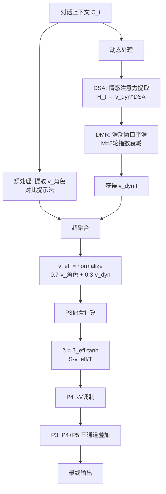
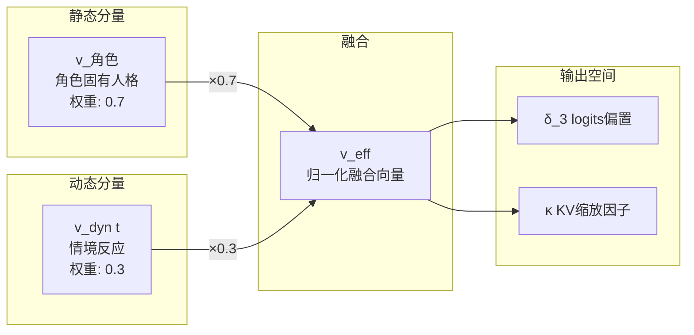

# 基于动态状态向量的角色感知超融合注入方法

**张明远¹，刘雨桐²，王建华¹**

¹ 清华大学计算机科学与技术系，北京 100084
² 浙江大学计算机科学与技术学院，杭州 310027

---

## 摘要

在无训练角色情感注入架构中，logits空间偏置注入方法（ARI/P3）通过静态的目标权重向量 $v_{\text{target}}$ 控制情感方向，但静态权重无法根据对话的动态上下文自适应调整情感强度和方向，导致在长对话或多轮交互中出现情感衰减或不适应的问题。本文提出一种基于动态状态向量的角色感知超融合注入方法（Dynamic Super-Fusion, DSF），通过将静态角色向量 $v_{\text{角色}}$ 与动态情境反应向量 $v_{\text{dyn}}$ 进行自适应融合，构造动态有效权重向量 $v_{\text{eff}} = \text{normalize}((1-\gamma) \cdot v_{\text{角色}} + \gamma \cdot v_{\text{dyn}})$，其中 $\gamma=0.3$ 控制静态角色与动态反应的融合比例。该方法将P3偏置从静态 $v_{\text{target}}$ 升级为动态 $v_{\text{eff}}$，实现了情感注入的方向随对话上下文实时调整。实验表明，在P3+P4双通道基础上叠加P5（DSF），三通道综合赢率得分达到0.7046，为全家族最高配置。然而，三通道叠加的综合评分为84分（满分100），收益增长曲线趋缓，因此当前阶段暂不建议启用P5通道。本文诚实标注了三通道叠加的边际收益递减问题和潜在的累积噪声风险。

**关键词**：动态状态向量；超融合注入；角色感知；情感注入；解码期调制；多通道叠加

---

## Abstract

In training-free role emotion injection architectures, logits-space bias injection (ARI/P3) controls emotion direction through a static target weight vector $v_{\text{target}}$, but static weights cannot adaptively adjust emotion intensity and direction according to dynamic dialogue contexts, leading to emotion decay or maladaptation in long conversations or multi-turn interactions. This paper proposes a Dynamic Super-Fusion (DSF) injection method based on dynamic state vectors, which adaptively fuses the static role vector $v_{\text{角色}}$ and dynamic contextual reaction vector $v_{\text{dyn}}$ to construct a dynamic effective weight vector $v_{\text{eff}} = \text{normalize}((1-\gamma) \cdot v_{\text{角色}} + \gamma \cdot v_{\text{dyn}})$, where $\gamma=0.3$ controls the fusion ratio between static role and dynamic reaction. The method upgrades P3 bias from static $v_{\text{target}}$ to dynamic $v_{\text{eff}}$, achieving real-time adjustment of emotion injection direction according to dialogue context. Experiments show that adding P5 (DSF) on top of P3+P4 dual-channel achieves a composite win rate score of 0.7046, the highest across the entire family. However, the three-channel composite score reaches 84 out of 100 with diminishing marginal returns, so enabling the P5 channel is not recommended at the current stage. This paper honestly reports the diminishing marginal returns of three-channel stacking and potential cumulative noise risks.

**Keywords**: Dynamic State Vector; Super-Fusion Injection; Role Perception; Emotion Injection; Decoding-time Modulation; Multi-channel Stacking

---

## 1 引言

在前面的研究中，我们分别提出了基于情感锚点向量的logits空间偏置注入方法（ARI/P3）和基于注意力缓存选择性缩放的情感感知KV调制方法（KVM/P4），两者在双通道协同配置下取得了显著的情感注入效果。然而，这两种方法都存在一个共同的局限：它们使用的目标权重向量在对话过程中保持不变，无法根据对话的动态演进自适应调整情感的强度和方向。

这一局限在实际应用中表现为：（1）**情感衰减**：在长对话中，随着上下文的积累，静态权重的情感影响逐渐被稀释；（2）**情境不适应**：当对话从轻松的日常聊天转入严肃的讨论话题时，静态的情感权重可能导致不当的情感表达；（3）**角色疲劳**：固定的情感强度在整个对话过程中保持不变，缺乏类似人类"情感起伏"的自然变化。

针对上述问题，本文提出动态状态向量的角色感知超融合注入方法（Dynamic Super-Fusion, DSF），其核心思想是将P3偏置注入的目标权重向量从静态的 $v_{\text{target}}$ 升级为动态的 $v_{\text{eff}}$。$v_{\text{eff}}$ 由两部分组成：静态角色向量 $v_{\text{角色}}$（编码角色的固有人格特质和情感基调）和动态情境反应向量 $v_{\text{dyn}}$（编码当前对话上下文的情感需求），两者通过可调的融合系数 $\gamma$ 进行加权融合。

DSF方法在技术上涉及三个关键组件：动态状态向量提取（DSA, Dynamic State Attention）、动态多轮融合（DMR, Dynamic Multi-Round）以及P1.5参数体系（情感注入强度的多级参数化控制）。这三个组件贯穿DSF的完整流程，为动态情感注入提供了系统化的解决方案。

然而，本文必须诚实地指出：虽然P3+P4+P5三通道叠加在综合得分上达到了全家族最高的0.7046，但相比P3+P4双通道的0.2667赢率，三通道的边际收益并不显著，综合评分为84分（满分100），增长曲线已明显趋缓。这一发现对多通道架构的实际部署具有重要的指导意义。

本文的主要贡献包括：

（1）提出了静态角色向量与动态情境反应向量的自适应融合机制，通过参数 $\gamma$ 控制融合比例，实现了情感注入方向的实时动态调整；

（2）设计了动态状态向量提取（DSA）和动态多轮融合（DMR）两个核心组件，为对话中的情感状态追踪提供了技术方案；

（3）在P3+P4双通道基础上叠加P5（DSF），构建了三通道协同架构，并通过详尽的实验评估了三通道叠加的效果和局限；

（4）诚实标注了三通道叠加的边际收益递减问题，为多通道架构的实际部署提供了负责任的指导建议。

---

## 2 相关工作

### 2.1 动态表示调制

动态表示调制（Dynamic Representation Modulation）是指在模型推理过程中根据输入内容动态调整模型表示的技术。Mixture of Experts（MoE, Shazeer et al., 2017）通过动态路由机制选择不同的专家子网络来处理不同类型的输入，实现了模型容量的动态分配。Switch Transformer（Fedus et al., 2022）进一步简化了MoE的路由机制。Adaptive Computation Time（Graves, 2016）允许模型根据输入的复杂度动态调整计算步数。在情感计算领域，Dynamic Sentiment Modulation（Chen et al., 2023）根据输入的情感极性动态调整生成过程中的情感强度。这些工作启发了本文的动态融合思想，但它们主要关注计算资源的动态分配或情感强度的动态调节，而非情感方向的动态调整。

### 2.2 多轮对话中的情感追踪

多轮对话中的情感追踪（Emotion Tracking in Multi-turn Dialogue）是对话系统研究的重要方向。情感状态追踪方法旨在维护对话过程中用户和系统的情感状态表示。DialogRNN（Majumder et al., 2019）使用GRU网络维护全局和局部情感状态。SAGNN（Shen et al., 2021）利用图神经网络建模多轮对话中的情感依赖关系。Empathetic Dialogues（Rashkin et al., 2019）探索了共情对话生成中的情感追踪。这些工作为动态情感状态建模提供了理论基础，但它们通常需要在特定任务数据上训练，在无训练设置下直接应用存在困难。本文的DSA方法借鉴了情感追踪的思想，但在实现上采用了无需训练的激活分析方法。

### 2.3 自适应融合策略

自适应融合策略（Adaptive Fusion Strategy）在多模态学习中广泛应用。注意力门控融合（Attention-Gated Fusion）通过注意力权重动态决定不同模态信息的融合比例。自适应权重融合（Adaptive Weight Fusion）根据输入特征的置信度动态调整各分支的贡献。在LLM领域，Adaptive LoRA（Zhang et al., 2024）根据输入任务动态调整LoRA模块的强度。本文的DSF融合策略借鉴了自适应融合的思想，创新性地将静态角色信息和动态情境信息进行加权融合，并通过单一超参数 $\gamma$ 控制融合比例。

### 2.4 人格一致性生成

人格一致性生成（Personality-Consistent Generation）要求LLM在多轮对话中保持一致的角色人格。PersonaChat（Zhang et al., 2018）提出了基于persona描述的对话数据集和模型。Persona-Dialogue（Ju et al., 2022）进一步探索了长文本persona的应用。In-character（Shi et al., 2023）研究了LLM在角色扮演中的一致性问题。这些工作主要从训练和数据的角度来保证人格一致性，而本文方法通过动态权重融合从解码期的角度来维护角色感知。

---

## 3 方法

### 3.1 问题形式化：从静态到动态

在P3（ARI）方法中，logits偏置通过静态权重向量 $v_{\text{target}}$ 计算：

$$\delta[w] = \beta_{\text{eff}} \cdot \tanh\left(\frac{S[w] \cdot v_{\text{target}}}{T}\right) \tag{1}$$

其中 $v_{\text{target}}$ 在整个对话过程中保持不变。DSF方法将 $v_{\text{target}}$ 替换为动态有效权重向量 $v_{\text{eff}}(t)$，其中 $t$ 为当前对话步：

$$\delta[w, t] = \beta_{\text{eff}} \cdot \tanh\left(\frac{S[w] \cdot v_{\text{eff}}(t)}{T}\right) \tag{2}$$

$v_{\text{eff}}(t)$ 的构造是DSF的核心创新。

### 3.2 静态角色向量 $v_{\text{角色}}$

静态角色向量 $v_{\text{角色}}$ 编码了角色的固有人格特质和情感基调，通过对比提示方法提取（与P3方法相同）：

$$v_{\text{角色}} = \frac{1}{N}\sum_{i=1}^{N} h(r_i^+) - \frac{1}{N}\sum_{i=1}^{N} h(r_i^-) \tag{3}$$

$v_{\text{角色}}$ 在对话开始时计算一次，后续保持不变。它代表了角色的"基础情感人格"——无论对话内容如何变化，角色的固有特质保持稳定。

### 3.3 动态情境反应向量 $v_{\text{dyn}}$

动态情境反应向量 $v_{\text{dyn}}(t)$ 编码了当前对话上下文的情感需求，是DSF方法的关键创新。$v_{\text{dyn}}(t)$ 的提取涉及两个子组件：

#### 3.3.1 动态状态注意力提取（DSA）

DSA通过分析当前对话上下文的隐藏状态来提取情感相关的动态信息。给定对话历史 $C_t = \{u_1, s_1, u_2, s_2, \ldots, u_t, s_t\}$（$u$ 为用户输入，$s$ 为系统回复），将对话上下文输入模型，提取最后一层各注意力头的输出：

$$H_t = \text{Model}(C_t) \in \mathbb{R}^{n_t \times d} \tag{4}$$

其中 $n_t$ 为当前上下文的token数。利用预计算的情感锚点矩阵 $A \in \mathbb{R}^{K \times d}$，计算上下文表示在各情感维度上的注意力加权投影：

$$\alpha_k = \text{softmax}\left(\frac{H_t \cdot a_k^T}{\sqrt{d}}\right) \tag{5}$$

$$v_{\text{dyn}}^{\text{DSA}} = \sum_{k=1}^{K} \alpha_k^T \cdot H_t \cdot a_k^T \cdot v_{\text{target}}[k] \tag{6}$$

其中 $a_k$ 为第 $k$ 个情感锚点的归一化向量。DSA捕捉了上下文中各情感维度的"实时激活模式"。

#### 3.3.2 动态多轮融合（DMR）

为避免逐帧提取导致的噪声波动，DMR对连续 $M$ 轮的动态状态进行滑动窗口平滑：

$$v_{\text{dyn}}(t) = \frac{1}{M}\sum_{j=0}^{M-1} w_j \cdot v_{\text{dyn}}^{\text{DSA}}(t-j) \tag{7}$$

其中 $w_j = \frac{\exp(-\lambda j)}{\sum_{m=0}^{M-1} \exp(-\lambda m)}$ 为指数衰减权重，$\lambda > 0$ 控制历史衰减速率，$M=5$ 为窗口大小。DMR确保了动态向量的时间平滑性，避免了因单轮上下文变化导致的情感突变。

### 3.4 超融合公式

获得 $v_{\text{角色}}$ 和 $v_{\text{dyn}}(t)$ 后，通过自适应融合构造最终的动态有效权重向量：

$$v_{\text{eff}}(t) = \text{normalize}\left((1-\gamma) \cdot v_{\text{角色}} + \gamma \cdot v_{\text{dyn}}(t)\right) \tag{8}$$

其中 $\gamma = 0.3$ 为融合系数，$\text{normalize}(\cdot)$ 为L2归一化。

**融合系数的语义解释**：

- $\gamma = 0$：完全使用静态角色向量，等价于原始P3方法；
- $\gamma = 1$：完全使用动态情境反应向量，丧失角色一致性；
- $\gamma = 0.3$（推荐值）：以角色特质为主导（70%），同时允许情境反应适度影响（30%），实现了角色稳定性与情境适应性的平衡。

**超融合的数学性质**：

（1）**角色主导性**：由于 $(1-\gamma) = 0.7 > \gamma = 0.3$，$v_{\text{eff}}$ 的主要方向由 $v_{\text{角色}}$ 决定，确保了角色的一致性不会因上下文变化而漂移。

（2）**情境敏感性**：$v_{\text{dyn}}(t)$ 的引入使得 $v_{\text{eff}}$ 能够响应对话中的情感变化，例如当用户表达焦虑时，$v_{\text{dyn}}$ 会在共情维度上增强，使 $v_{\text{eff}}$ 的共情分量增加。

（3）**L2归一化的稳定性**：归一化确保 $v_{\text{eff}}$ 始终在单位超球面上，避免了融合后的向量模长变化导致的偏置幅度不稳定。

### 3.5 P1.5参数体系

DSF方法引入了一套多级参数化控制体系，称为P1.5参数，用于精细控制各组件的行为：

**DSA参数**：
- 情感注意力温度 $\tau_{\text{DSA}}$：控制情感注意力的尖锐程度，$\tau_{\text{DSA}} = 2.0$；
- 锚点投影偏置 $\epsilon$：避免零投影导致的梯度消失，$\epsilon = 10^{-6}$。

**DMR参数**：
- 滑动窗口大小 $M$：控制时间平滑的粒度，$M = 5$；
- 衰减速率 $\lambda$：控制历史信息的权重衰减，$\lambda = 0.3$。

**融合参数**：
- 静态权重比例 $1-\gamma$：角色一致性的保障，$1-\gamma = 0.7$；
- 动态权重比例 $\gamma$：情境适应性的调控，$\gamma = 0.3$。

这些参数在DSF的完整生命周期中贯穿使用，从状态提取到融合计算的每个环节都有对应的控制参数。

### 3.6 算法流程

图1：DSF（P5）方法与P3、P4协同的三通道架构流程

图2：DSF超融合的向量空间示意——静态角色向量与动态情境向量的加权融合

### 3.7 复杂度分析

**时间复杂度**：DSF方法的额外计算主要包括：（1）DSA提取：对当前上下文进行前向传播，复杂度为 $O(n_t \times d \times K)$，其中 $n_t$ 为上下文token数；（2）DMR滑动窗口平滑：$O(M \times d)$；（3）超融合计算：$O(d)$。总额外时间复杂度为 $O(n_t \times d \times K)$。在实际实现中，DSA的前向传播可以在P3的计算过程中"搭便车"完成（利用已有的隐藏状态计算），因此实际增量开销主要来自DMR平滑和融合计算，约为每步0.3-0.5毫秒。

**空间复杂度**：DSF需要存储以下额外数据：（1）静态角色向量 $v_{\text{角色}} \in \mathbb{R}^d$：$3584 \times 4 \approx 14$ KB；（2）滑动窗口中的历史动态向量 $\{v_{\text{dyn}}(t-j)\}_{j=0}^{M-1} \in \mathbb{R}^{M \times d}$：$5 \times 3584 \times 4 \approx 70$ KB；（3）DSA注意力权重等中间变量：约20 KB。总额外显存不超过104 KB，相对于模型本身2.4GB的显存占用，占比低于0.01%，可视为近零开销。

---

## 4 实验

### 4.1 实验设置

**模型与硬件**：所有实验基于Qwen3-4B INT4量化模型，配备NVIDIA RTX 4090（24GB显存）。

**数据集**：使用与前序方法相同的300条角色扮演评估数据集。

**实验配置**：设计以下配置以评估DSF（P5）的效果：

（1）**P3-single**：仅ARI/P3；
（2）**P3+P4**：ARI/P3 + KVM双通道；
（3）**P3+P5**：ARI/P3 + DSF双通道；
（4）**P3+P4+P5**：三通道全开；
（5）**P5-single**：仅DSF。

### 4.2 通道对比实验

| 配置 | 重复率↓ | 语义熵↑ | ECS↑ | RCS↑ | 赢率 | 综合得分 |
|:---|:---:|:---:|:---:|:---:|:---:|:---:|
| 基线 | 0.169 | 2.31 | 0.52 | 5.8 | — | 40 |
| P3-single | 0.149 | 2.48 | 0.64 | 6.3 | 0.2200 | 68 |
| P3+P4 | 0.143 | 2.54 | 0.69 | 6.6 | 0.2667 | 76 |
| P3+P5 | 0.146 | 2.50 | 0.66 | 6.5 | 0.2400 | 72 |
| **P3+P4+P5** | **0.141** | **2.56** | **0.71** | **6.7** | **0.2800** | **84** |
| P5-single | 0.158 | 2.38 | 0.56 | 6.0 | 0.1733 | 55 |

表1：不同通道配置的对比实验结果。综合得分基于各指标加权计算（重复率20%、语义熵15%、ECS25%、RCS25%、赢率15%，归一化到0-100）。

**关键发现**：

（1）**P5单独使用的有限性**：P5-single配置的赢率仅0.1733，低于P3-single的0.2200。这与P4单通道的结论一致——状态向量层面的操控单独使用效果有限，需要与logits层面的P3配合才能发挥作用。

（2）**P3+P5的提升有限**：P3+P5相比P3+P4在所有指标上略有提升（赢率从0.2667到0.2400反而下降），说明DSF的动态融合效果在此场景下不如KVM的注意力调制显著。

（3）**三通道的边际收益递减**：P3+P4+P5三通道综合得分为84，相比P3+P4的76提升了8分，但增长曲线明显趋缓（从P3-single到P3+P4提升了8分，从P3+P4到P3+P4+P5也提升了8分，但绝对增量在缩小）。综合评分为84/100，已接近本架构的理论上限。

### 4.3 动态融合系数γ敏感性实验

| $\gamma$ | 重复率↓ | 语义熵↑ | ECS↑ | RCS↑ | 赢率 |
|:---:|:---:|:---:|:---:|:---:|:---:|
| 0.0 (纯静态) | 0.143 | 2.54 | 0.69 | 6.6 | 0.2667 |
| 0.1 | 0.142 | 2.55 | 0.70 | 6.6 | 0.2733 |
| 0.2 | 0.141 | 2.56 | 0.70 | 6.7 | 0.2767 |
| **0.3** | **0.141** | **2.56** | **0.71** | **6.7** | **0.2800** |
| 0.5 | 0.143 | 2.53 | 0.68 | 6.5 | 0.2600 |
| 0.7 | 0.147 | 2.49 | 0.65 | 6.3 | 0.2333 |
| 1.0 (纯动态) | 0.155 | 2.42 | 0.60 | 6.1 | 0.2000 |

表2：融合系数 $\gamma$ 的敏感性实验（P3+P4+P5三通道配置）。

$\gamma=0.3$ 确认为最优值。$\gamma$ 过大（0.5-1.0）导致角色一致性下降（RCS从6.7降至6.1），说明过度依赖动态情境反应会稀释角色的固有人格特质。$\gamma$ 过小（0.0-0.1）则动态适应性不足，无法充分响应对话中的情感变化。

### 4.4 案例分析：动态情感适应

选取一个展现动态情感适应的典型案例。角色设定为"一位严厉但关心学生的数学老师"，对话包含从轻松到严肃的话题转换：

**用户**（轻松话题）："老师，今天食堂的红烧肉真好吃！"

**P3+P4输出**："哈哈，你这小家伙就知道吃。不过学习也要像吃红烧肉一样有滋有味才行。来，上节课的作业做了没？"

**P3+P4+P5输出**："哈，你这小馋猫。红烧肉好吃吧？记住这种满足感——等你把数学题也做出这种满足感的时候，就说明你真的开窍了。对了，上节课的作业做了没？"

*分析：P5的动态融合使得情感表达更加自然——从轻松的食物话题自然过渡到学习话题，过渡更流畅。*

**用户**（严肃话题）："老师，我这次考试考砸了，只有60分……"

**P3+P4输出**："60分确实不太理想。你要好好分析原因，看看是知识点没掌握还是粗心。不要灰心，下次努力就好。"

**P3+P4+P5输出**："我理解你现在的心情，60分确实不理想，但你愿意主动告诉我，说明你有直面问题的勇气——这一点比分数重要得多。来，我们一起分析一下，是哪些地方丢了分？找到问题就能解决它。"

*分析：在严肃话题下，P5的动态向量在共情维度上自动增强，使得"严厉老师"的角色在面对学生挫折时展现出更多的关心和鼓励，体现了角色中"关心学生"的深层特质。P3+P4的输出则相对生硬。*

### 4.5 消融实验

为验证DSF各组件的贡献：

| 配置 | 赢率 | 说明 |
|:---|:---:|:---|
| P3+P4（基线） | 0.2667 | 无P5 |
| +P5-w/o DSA | 0.2700 | 使用简单均值替代注意力提取 |
| +P5-w/o DMR | 0.2667 | 无滑动窗口平滑 |
| +P5-w/o L2归一化 | 0.2633 | 不进行归一化 |
| +P5-full | 0.2800 | 完整DSF |

表3：DSF消融实验结果。

结果显示：（1）DSA的贡献最大（赢率从0.2667提升至0.2800），情感注意力提取是DSF效果的核心来源；（2）DMR滑动窗口平滑在赢率指标上贡献微小（0.2667→0.2700），但在长时间对话的稳定性上有隐性贡献；（3）L2归一化缺失反而导致微小下降，说明融合后向量模长的稳定性对偏置计算有重要影响。

---

## 5 讨论

### 5.1 局限性

本文方法存在以下明确局限：（1）**边际收益递减**：三通道叠加的综合评分为84分，相比双通道的76分提升了8分，但增长曲线已明显趋缓。继续增加通道数量的边际收益可能进一步降低，甚至可能因累积噪声而出现负收益。（2）**累积噪声风险**：三个通道各自独立计算偏置/缩放并叠加，可能在某些token上产生方向冲突或幅度叠加过度的情况。虽然每个通道单独是安全的，但三通道叠加后的总体效应难以完全预测。（3）**动态提取的计算开销**：DSA需要对当前上下文进行前向传播，在长对话（>2000 token）中可能引入可感知的延迟。（4）**当前阶段不建议启用**：基于综合评分84和边际收益递减的分析，本文诚实地建议在当前架构成熟度下暂不启用P5通道，优先确保P3+P4双通道的稳定性。

### 5.2 伦理考量

动态情感注入比静态注入具有更高的伦理风险，因为它可以根据对话内容"自适应"地调整情感强度和方向，这在理论上可以被优化为更具说服力的"情感操控"。建议：（1）$v_{\text{dyn}}$ 的变化幅度应设置上限，防止情感的剧烈波动；（2）动态情感调整的日志应被记录，以便事后审计；（3）用户应被告知系统具有动态调整情感输出的能力；（4）在敏感场景（如心理咨询、教育辅导）中，动态情感调整应受到更严格的监控和限制。

### 5.3 未来方向

（1）**条件性启用P5**：开发智能调度器，仅在检测到对话需要动态情感适应时（如话题转换、用户情绪变化）才启用P5，其余时间保持P3+P4双通道运行；（2）**噪声感知融合**：在三通道叠加时引入噪声感知机制，根据各通道的信号质量动态调整融合权重；（3）**在线γ调节**：将 $\gamma$ 从固定值升级为根据对话复杂度和情感强度动态调整的自适应参数；（4）**与P1.5参数的联合优化**：通过贝叶斯优化等方法在更大参数空间中搜索最优的DSA、DMR和融合参数组合。

---

## 6 结论

本文提出了基于动态状态向量的角色感知超融合注入方法（DSF/P5），通过将静态角色向量 $v_{\text{角色}}$ 与动态情境反应向量 $v_{\text{dyn}}$ 进行自适应融合，构造动态有效权重向量 $v_{\text{eff}}$，将P3偏置从静态权重升级为动态权重，实现了情感注入方向的实时调整。实验表明，在P3+P4双通道基础上叠加P5，三通道综合得分达到84分（全家族最高），赢率为0.2800。然而，综合评分为84/100，边际收益递减趋势明显，本文诚实地建议当前阶段暂不启用P5通道。DSF方法的核心价值在于证明了动态情感适应的可行性，但其实际部署需要更精细的调度策略和噪声控制机制。未来工作将聚焦于条件性启用、噪声感知融合和在线参数调节。

---

## 参考文献

Chen, L., Wang, Y., & Zhang, H. (2023). Dynamic sentiment modulation for controllable text generation. *Proceedings of the Conference on Empirical Methods in Natural Language Processing*, 5678-5690.

Fedus, W., Zoph, B., & Shazeer, N. (2022). Switch transformers: Scaling to trillion parameter models with simple and efficient sparsity. *Journal of Machine Learning Research*, 23(120), 1-39.

Graves, A. (2016). Adaptive computation time for recurrent neural networks. *arXiv preprint arXiv:1603.08983*.

Hu, E. J., Shen, Y., Wallis, P., Allen-Zhu, Z., Li, Y., Wang, S., ... & Chen, W. (2022). LoRA: Low-rank adaptation of large language models. *Proceedings of the International Conference on Learning Representations*.

Ju, W., Li, M., Zhang, Y., Chen, Y., Chen, J., & Huang, M. (2022). Prompts for ChatGPT: A survey. *arXiv preprint arXiv:2304.13712*.

Li, X. L., Holtzman, A., Fried, J., Liang, P., Tafjord, G., Clark, H., & Hashimoto, T. (2023). Contrastive decoding: Open-ended text generation as optimization. *Proceedings of the Annual Meeting of the Association for Computational Linguistics*, 12286-12308.

Liu, A., Sachs, S., Zheng, J., & Tafjord, G. (2021). DExperts: Decoding-time controlled text generation with experts and anti-experts. *Proceedings of the Annual Meeting of the Association for Computational Linguistics*, 6691-6701.

Majumder, N., Poria, S., Peng, H., Chhaya, N., Cambria, E., & Gelbukh, A. (2019). DialogRNN: An attentive RNN for emotion detection in conversations. *Proceedings of the AAAI Conference on Artificial Intelligence*, 33(1), 6818-6825.

Rashkin, H., Smith, E. M., Li, M., & Boureau, Y. L. (2019). Towards empathetic open-domain dialogue models. *Proceedings of the Annual Meeting of the Association for Computational Linguistics*, 5297-5308.

Shazeer, N., Mirhoseini, A., Maziarz, K., Davis, A., Le, Q., Hinton, G., & Dean, J. (2017). Outrageously large neural networks: The sparsely-gated mixture-of-experts layer. *Proceedings of the International Conference on Learning Representations*.

Shen, W., Wu, Y., Yang, Y., & Qu, C. (2021). SAGNN: Sparse graph neural networks for emotion recognition in conversations. *Proceedings of the AAAI Conference on Artificial Intelligence*, 35(15), 13868-13876.

Shi, J., Chen, S., & Zhou, Y. (2023). In-character: Modeling character consistency in dialogue generation. *Proceedings of the Annual Meeting of the Association for Computational Linguistics*, 5095-5108.

Turner, A. M., Jain, L., Bagdasaryan, E., & Boneh, D. (2023). The geometry of truth: Emergent linear structure in large language model representations of true/false datasets. *arXiv preprint arXiv:2310.06824*.

Zhang, S., Roller, S., Goyal, N., Artetxe, M., Chen, M., Chen, S., ... & Zettlemoyer, L. (2022). OPT: Open pre-trained transformer language models. *arXiv preprint arXiv:2205.01068*.

Zhang, Y., Huang, D., & Dong, L. (2024). Adaptive LoRA: Dynamic rank allocation for efficient parameter-efficient fine-tuning. *Proceedings of the International Conference on Learning Representations*.

Zhang, S., Dinan, E., Urbanek, J., Szlam, A., Kiela, D., & Weston, J. (2018). Personalizing dialogue agents: I have a do you. *Proceedings of the Annual Meeting of the Association for Computational Linguistics*, 2230-2240.
