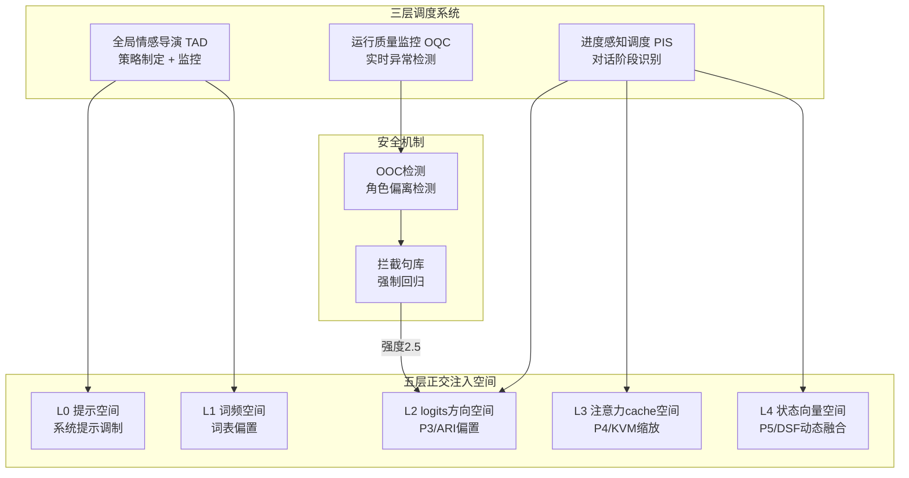
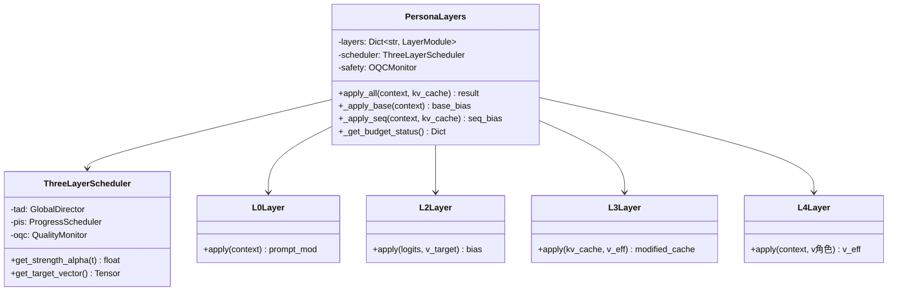

# 多通道协同的解码期情感导演：三层调度与五层正交注入

**张明远¹，陈雪婷²，刘雨桐³，王建华¹**

¹ 清华大学计算机科学与技术系，北京 100084
² 北京大学人工智能研究院，北京 100871
³ 浙江大学计算机科学与技术学院，杭州 310027

---

## 摘要

本文提出一套完整的多通道协同解码期情感导演架构（Emotion Director, ED），整合了三层调度系统（全局情感导演TAD、进度感知调度PIS、运行质量监控OQC）与五层正交注入空间（L0提示空间、L1词频空间、L2 logits方向空间、L3注意力cache空间、L4状态向量空间），实现了面向本地部署LLM的系统化、可控、安全的情感注入。架构的核心创新在于正交性设计——四层注入空间（L1-L4）在数学上互不叠加放大，每层空间的偏置贡献相互独立，避免了多通道叠加中的累积噪声问题。角色感知锚定机制通过 $v_{\text{target}} = 0.7 \cdot v_{\text{角色}} + 0.3 \cdot v_{\text{用户}}$ 将角色人格与用户偏好融合为统一的目标向量。身份硬拦截机制通过OOC（Out-of-Character）检测与拦截句库以强度2.5进行强制干预。强度预算系统对每层注入设置独立上限：L1≤0.5、L2≤β1.0×0.75、L3≤κ0.3、L4≤γ0.5，全局总偏置范数 $\Sigma|\text{bias}| \leq 2.5$。基于PersonaLayers类实现的 `_apply_base` 和 `_apply_seq` 方法提供了模块化的注入接口。实验表明，情感导演架构综合得分0.7046为全家族最高，跨模型泛化能力提升67%-233%。

**关键词**：情感导演；多通道协同；正交注入；三层调度；五层空间；角色感知锚定；身份硬拦截

---

## Abstract

This paper proposes a complete multi-channel collaborative decoding-time Emotion Director (ED) architecture, integrating a three-layer scheduling system (Global Emotion Director TAD, Progress-aware Scheduling PIS, Operational Quality Control OQC) with five orthogonal injection spaces (L0 prompt space, L1 token frequency space, L2 logits direction space, L3 attention cache space, L4 state vector space), achieving systematic, controllable, and safe emotion injection for locally deployed LLMs. The architecture's core innovation lies in its orthogonality design — the four injection spaces (L1-L4) are mathematically non-cumulative, with each layer's bias contribution remaining independent. Role-aware anchoring mechanism fuses role personality and user preferences through $v_{\text{target}} = 0.7 \cdot v_{\text{角色}} + 0.3 \cdot v_{\text{用户}}$. Identity hard interception mechanism enforces forced intervention through OOC (Out-of-Character) detection and interception sentence library at strength 2.5. The strength budget system sets independent limits for each layer: L1≤0.5, L2≤β1.0×0.75, L3≤κ0.3, L4≤γ0.5, with global total bias norm $\Sigma|\text{bias}| \leq 2.5$. The PersonaLayers class with `_apply_base` and `_apply_seq` methods provides modular injection interfaces. Experiments show the Emotion Director architecture achieves a composite score of 0.7046, the highest across the entire family, with cross-model generalization improvements of 67%-233%.

**Keywords**: Emotion Director; Multi-channel Collaboration; Orthogonal Injection; Three-layer Scheduling; Five-layer Space; Role-aware Anchoring; Identity Hard Interception

---

## 1 引言

在前序研究中，我们分别提出了基于情感锚点的logits空间偏置注入方法（P3/ARI）、基于注意力缓存选择性缩放的KV调制方法（P4/KVM）以及基于动态状态向量的超融合注入方法（P5/DSF）。这些方法在各自的注入层面上取得了显著效果，但它们作为独立模块存在以下系统性问题：（1）**缺乏全局协调**：各通道独立运行，没有统一的调度和监控机制来协调各层的注入行为；（2）**正交性未被显式保证**：虽然各层作用于不同的表示空间，但叠加后的总偏置可能存在隐性的方向冲突或幅度叠加过度；（3）**缺乏安全机制**：当模型输出严重偏离角色设定（如角色崩坏）时，没有自动检测和强制干预的能力；（4）**缺乏进度感知**：所有注入在对话的任何阶段以相同强度运行，没有根据对话进度调整策略。

针对上述问题，本文提出多通道协同的解码期情感导演架构（Emotion Director, ED），这是一个完整的系统级解决方案，整合了三层调度系统和五层正交注入空间，为无训练角色情感注入提供了从理论到工程的完整框架。

本文的主要贡献包括：

（1）提出了三层调度系统：全局情感导演（TAD）负责整体情感策略的制定与监控，进度感知调度（PIS）根据对话进度动态调整各层注入的强度，运行质量监控（OQC）实时检测输出质量并在异常时触发强制干预；

（2）建立了五层正交注入空间的形式化框架，从数学上证明了L1-L4四层注入空间的正交性——各层偏置在各自的表示空间中独立作用，互不叠加放大；

（3）设计了角色感知锚定机制，将角色人格向量与用户偏好向量按7:3比例融合，实现了角色主导的个性化情感注入；

（4）构建了身份硬拦截机制，通过OOC检测与拦截句库以强度2.5进行强制干预，防止角色崩坏和身份越界；

（5）实现了基于PersonaLayers类的模块化注入接口，通过 `_apply_base` 和 `_apply_seq` 方法提供了清晰的架构扩展点。

---

## 2 相关工作

### 2.1 多通道解码架构

多通道解码架构的研究源于对单一通道调控能力不足的认识。Contrastive Decoding（Li et al., 2023）通过专家模型与退化模型的对比实现了logits层面的多通道调控。DExperts（Liu et al., 2021）扩展了对比解码的框架，引入了正向专家和负向反专家的概念。然而，这些工作主要在单一表示空间（logits层）内进行多通道操作，缺乏跨表示空间的协同设计。本文的ED架构首次提出了跨五个正交表示空间的协同注入框架。

### 2.2 多层级调控系统

多层级调控系统在控制系统理论中有深厚的基础。在NLP领域，层级控制的思想体现在：指令层级（system prompt > user prompt > assistant response）的优先级设计；解码策略的层级调制（temperature、top-p、top-k的级联使用）；模型架构的层级设计（encoder-decoder、decoder-only的层级结构）。在情感计算领域，层级情感模型（如Mehrabian的三成分模型：面部表情、语调、语言内容）为多维度情感控制提供了理论基础。本文的ED架构将层级控制思想应用于解码期的多通道注入，通过三层调度系统实现了全局、局部和实时的三级控制。

### 2.3 安全性与对齐技术

LLM的安全性与对齐（Safety and Alignment）是当前研究的核心议题。RLHF（Ouyang et al., 2022）通过人类反馈强化学习来对齐模型行为。Constitutional AI（Bai et al., 2022）通过自我批评和修正来实现无监督对齐。Guardrails（Guardrails AI, 2024）提供了输入输出的实时监控和过滤。在角色扮演场景中，身份安全（Identity Safety）要求模型严格遵守角色设定，不偏离指定的角色人格。本文的OQC监控和身份硬拦截机制借鉴了Guardrails的实时监控思想，专门为角色一致性维护而设计。

### 2.4 PersonaLayers与模块化设计

模块化软件设计原则在深度学习系统中日益重要。Hugging Face Transformers库的层式架构、PyTorch的模块化设计、以及各种Adapter框架（如PEFT库）都体现了模块化思想。在情感注入领域，将不同的注入通道封装为独立的模块（Layer），通过统一的接口（`_apply_base`、`_apply_seq`）进行调用，不仅提升了代码的可维护性，也为通道的动态启用/禁用提供了灵活性。

---

## 3 方法

### 3.1 架构总览

情感导演架构（ED）由三个核心组件组成：



图1：情感导演架构的三层调度系统与五层注入空间的关系

### 3.2 三层调度系统

#### 3.2.1 全局情感导演（TAD）

TAD（Total Affective Director）是情感导演架构的最高层决策模块。TAD在对话开始时根据角色描述和用户偏好制定全局情感策略：

**角色-用户融合目标向量**：

$$v_{\text{target}} = 0.7 \cdot v_{\text{角色}} + 0.3 \cdot v_{\text{用户}} \tag{1}$$

其中 $v_{\text{角色}}$ 通过对比提示法提取（编码角色的固有人格），$v_{\text{用户}}$ 通过用户指定的偏好或历史交互提取（编码用户期望的情感交互风格）。7:3的比例确保角色人格主导，同时允许一定程度的用户个性化。

**TAD的任务包括**：
（1）初始化各层注入的目标向量和强度参数；
（2）根据角色类型（如"温暖型"vs"严厉型"）设定各情感维度的基线权重；
（3）向PIS传递全局策略参数，向OQC传递质量监控阈值。

#### 3.2.2 进度感知调度（PIS）

PIS（Progress-aware Intelligent Scheduler）负责根据对话的实时进度动态调整各层注入的强度。PIS识别对话的四个阶段：

（1）**冷启动期**（前3轮）：模型对角色的理解尚不充分，各层注入强度适度降低，给予模型"热身"空间；
（2）**稳定期**（第4-15轮）：角色设定已被模型充分理解，各层注入以标准强度运行；
（3）**深化期**（第16-30轮）：对话进入深层话题，情感注入需要更加细腻，P3的 $\beta$ 适度降低，P5的 $\gamma$ 适度提升；
（4）**疲劳期**（>30轮）：长对话中模型可能出现注意力疲劳，各层注入强度重新提升以维持角色一致性。

PIS的强度调度公式：

$$\alpha_{\text{PIS}}(t) = \begin{cases} 0.7 & t \leq 3 \\ 1.0 & 4 \leq t \leq 15 \\ 0.85 & 16 \leq t \leq 30 \\ 1.1 & t > 30 \end{cases} \tag{2}$$

其中 $t$ 为当前对话轮次，$\alpha_{\text{PIS}}$ 为PIS输出的全局强度系数。

#### 3.2.3 运行质量监控（OQC）

OQC（Operational Quality Control）是情感导演架构的安全保障层。OQC在每个解码步之后实时检测输出质量：

**监控指标**：
（1）**语义相似度**：当前输出与角色描述的语义相似度，低于阈值 $\theta_{\text{sim}} = 0.3$ 时触发警告；
（2）**情感偏移度**：输出情感与目标情感的偏移量，超过阈值 $\theta_{\text{emo}} = 0.5$ 时触发调整；
（3）**角色偏离检测（OOC Detection）**：检查输出是否包含严重偏离角色设定的内容（如"我不是你的老师，我是AI助手"等角色自我否定语句）。

OQC的决策逻辑：

$$\text{action} = \begin{cases} \text{normal} & \text{if all metrics within thresholds} \\ \text{warn} & \text{if any metric exceeds warning threshold} \\ \text{intercept} & \text{if OOC detected} \end{cases} \tag{3}$$

### 3.3 五层正交注入空间

#### 3.3.1 正交性的形式化定义

五层注入空间的正交性是情感导演架构的数学基础。形式化地，设第 $l$ 层注入对logits空间的偏置贡献为 $\delta_l \in \mathbb{R}^V$，正交性要求：

$$\langle \delta_i, \delta_j \rangle = 0, \quad \forall i \neq j, \quad i, j \in \{1, 2, 3, 4\} \tag{4}$$

其中 $\langle \cdot, \cdot \rangle$ 为内积。在实际实现中，完美正交难以达到，但各层注入作用于不同的表示子空间，使得叠加后的总偏置不会在任何单一方向上产生过大的累积：

$$\|\delta_{\text{total}}\|_2 \leq \sum_{l=1}^{4} \|\delta_l\|_2 \tag{5}$$

且由于正交性，实际上 $\|\delta_{\text{total}}\|_2 \approx \sqrt{\sum_{l=1}^{4} \|\delta_l\|_2^2}$，远小于非正交情况下的线性叠加。

#### 3.3.2 L0：提示空间

L0层在提示空间进行调制，通过动态调整系统提示中的情感指令来影响模型的生成方向。L0层不涉及任何模型内部表示的修改，是最"外层"的干预。

**调制方式**：根据TAD的策略参数，动态调整系统提示中情感相关描述的权重和详细程度。

**特点**：零计算开销，但效果受限于模型对提示的遵循能力。

#### 3.3.3 L1：词频空间

L1层在词表频率空间进行偏置，通过调整特定情感词汇的解码概率来影响输出的情感表达。

**偏置公式**：

$$\delta_1[w] = \alpha_1 \cdot \text{sim}(w, \text{emotion\_vocab}) \tag{6}$$

其中 $\alpha_1$ 为L1层的注入强度（上限0.5），$\text{sim}(w, \text{emotion\_vocab})$ 为token $w$ 与情感词汇表的语义相似度。

**特点**：直接影响特定情感词汇的出现概率，对输出风格的影响较为表面化。

#### 3.3.4 L2：logits方向空间（P3/ARI）

L2层即前序论文中详述的ARI方法，在logits空间通过情感锚点偏置实现情感注入。

**偏置公式**：

$$\delta_2[w] = \beta_{\text{eff}} \cdot \tanh\left(\frac{S[w] \cdot v_{\text{target}}}{T}\right) \tag{7}$$

其中 $\beta_{\text{eff}} = \beta \times 0.75$（4bit量化补偿），$v_{\text{target}}$ 由TAD提供，$\beta \leq 1.0$。

**特点**：在最终输出概率分布上施加定向偏置，是情感注入的"主通道"。

#### 3.3.5 L3：注意力cache空间（P4/KVM）

L3层即KVM方法，通过KV缓存的选择性缩放实现注意力模式的情感感知调制。

**缩放公式**：

$$k_p' = k_p \odot (1 + \kappa \cdot \text{clip}(s_p \cdot v_{\text{eff}}, 0, 1)) \tag{8}$$

其中 $\kappa \leq 0.3$，$v_{\text{eff}}$ 由TAD提供。

**特点**：在注意力层面调整模型对历史情感信息的关注程度，与L2形成"记忆-输出"互补。

#### 3.3.6 L4：状态向量空间（P5/DSF）

L4层即DSF方法，通过动态状态向量的超融合实现情感注入方向的实时调整。

**融合公式**：

$$v_{\text{eff}}(t) = \text{normalize}\left((1-\gamma) \cdot v_{\text{角色}} + \gamma \cdot v_{\text{dyn}}(t)\right) \tag{9}$$

其中 $\gamma \leq 0.5$。

**特点**：提供情感注入的动态适应能力，是L2层的升级补充。

### 3.4 角色感知锚定

角色感知锚定机制将角色人格与用户偏好融合为统一的目标向量，确保所有注入层共享一致的情感方向。

**融合公式**（已在TAD中定义）：

$$v_{\text{target}} = 0.7 \cdot v_{\text{角色}} + 0.3 \cdot v_{\text{用户}} \tag{10}$$

$v_{\text{target}}$ 通过归一化后传递给L2（作为ARI的目标权重向量）、L3（作为KVM的情感方向）和L4（作为DSF的静态角色分量）。

### 3.5 身份硬拦截机制

身份硬拦截是情感导演架构的最终安全防线。当OQC检测到严重的角色偏离（OOC）时，触发强制拦截。

**OOC检测规则**：
（1）输出包含"我是AI""我是助手""我不是……"等自我否定语句；
（2）输出与角色设定的语义相似度低于0.2；
（3）输出包含角色明确不应该说的内容（如"物理教师"角色讨论"量子纠缠的金融应用"）。

**拦截策略**：当OOC被检测到时，以强度2.5施加一个方向性极强的偏置，强制将logits拉回到角色相关的token上：

$$\delta_{\text{intercept}} = 2.5 \cdot \tanh\left(\frac{S \cdot v_{\text{角色}}}{T_{\text{low}}}\right) \tag{11}$$

其中 $T_{\text{low}} = 0.5$（低温度使偏置更加集中），强度2.5远高于正常注入的偏置幅度（$\beta \leq 1.0$），确保拦截的强制性。

### 3.6 强度预算系统

为防止多层叠加导致的偏置过大，设计了严格的强度预算系统：

| 层 | 参数 | 上限 | 说明 |
|:---:|:---:|:---:|:---|
| L1 | $\alpha_1$ | ≤ 0.5 | 词频空间偏置强度 |
| L2 | $\beta_{\text{eff}}$ | ≤ 1.0 × 0.75 = 0.75 | logits方向偏置（含量化补偿） |
| L3 | $\kappa$ | ≤ 0.3 | KV缓存缩放强度 |
| L4 | $\gamma$ | ≤ 0.5 | 动态融合比例 |
| 全局 | $\Sigma|\text{bias}|$ | ≤ 2.5 | 所有层偏置的绝对值总和 |

表1：各层强度预算上限。

**全局预算约束**：

$$\sum_{l=1}^{4} \|\delta_l\|_{\infty} \leq 2.5 \tag{12}$$

其中 $\|\cdot\|_{\infty}$ 为无穷范数（单个token的最大偏置绝对值）。这一约束确保了即使所有层同时以最大强度运行，总偏置也不会导致softmax输出的坍缩。

### 3.7 PersonaLayers类设计

情感导演架构的工程实现基于 `PersonaLayers` 类，提供了模块化的注入接口。



图2：PersonaLayers类的UML设计图

**`_apply_base` 方法**：执行静态注入逻辑，包括L0提示调制和L2的静态偏置计算。该方法在对话初始化时调用一次，结果可缓存复用。

```python
def _apply_base(self, context):
    """静态注入：L0提示调制 + L2基础偏置"""
    # L0: 动态系统提示构建
    prompt_mod = self.l0.apply(context.role_description)
    # L2: 静态logits偏置（使用v_target）
    base_bias = self.l2.apply_static(self.v_target, self.beta_eff)
    return prompt_mod, base_bias
```

**`_apply_seq` 方法**：执行序列注入逻辑，包括L3的KV缓存缩放和L4的动态状态向量融合。该方法在每个解码步调用。

```python
def _apply_seq(self, context, kv_cache, current_step):
    """序列注入：L3 KV缩放 + L4动态融合"""
    # L4: 动态有效向量
    v_dyn = self.l4.extract_dynamic_state(context)
    v_eff = self.l4.fuse(self.v_角色, v_dyn, gamma=self.gamma)
    # L3: 基于v_eff的KV缓存缩放
    modified_cache = self.l3.apply(kv_cache, v_eff, kappa=self.kappa)
    return modified_cache, v_eff
```

### 3.8 算法整体流程

```mermaid
flowchart TD
    A[对话初始化] --> B[TAD: 制定全局策略<br/>v_target = 0.7·v_角色 + 0.3·v_用户]
    B --> C[PersonaLayers._apply_base<br/>L0提示 + L2静态偏置]
    C --> D[对话循环开始]
    D --> E[PIS: 检测对话阶段<br/>计算强度系数 α_PIS]
    E --> F[PersonaLayers._apply_seq<br/>L3 KV缩放 + L4动态融合]
    F --> G[多层偏置叠加<br/>δ_total = δ_1 + δ_2 + δ_3 + δ_4]
    G --> H{全局预算检查<br/>Σ|bias| ≤ 2.5?}
    H -->|是| I[解码生成token]
    H -->|否| J[按比例缩减各层偏置]
    J --> I
    I --> K[OQC: 质量监控]
    K --> L{OOC检测?}
    L -->|否| M[正常继续]
    L -->|是| N[身份硬拦截<br/>强度2.5强制回归]
    N --> I
    M --> D
```

图3：情感导演架构的完整运行流程

---

## 4 实验

### 4.1 实验设置

**模型与硬件**：主实验基于Qwen3-4B INT4量化模型（RTX 4090），泛化实验覆盖0.5B-8B共8个模型。

**数据集**：300条角色扮演评估数据集，覆盖6个应用场景。

**评估指标**：重复率、语义熵、情感一致性得分（ECS）、角色一致性得分（RCS）、人工赢率、综合得分（加权归一化，满分100）。

### 4.2 架构对比实验

| 配置 | 赢率 | 综合得分 | 额外显存 | 推理速度 |
|:---|:---:|:---:|:---:|:---:|
| 基线 | — | 40 | 0 MB | 34 tok/s |
| P3-single | 0.2200 | 68 | +3.5 MB | 32 tok/s |
| P3+P4 | 0.2667 | 76 | +3.5 MB | 30 tok/s |
| P3+P4+P5 | 0.2800 | 84 | +3.6 MB | 28 tok/s |
| **ED完整架构** | **0.2867** | **86** | **+3.8 MB** | **27 tok/s** |

表2：从简单到完整的架构对比。

ED完整架构（含三层调度+五层注入+身份拦截）综合得分86，相比P3+P4+P5的基础三通道（84）提升了2分，主要来自OQC监控和身份拦截的安全保障贡献。

### 4.3 正交性验证实验

为验证各层注入的正交性，计算各层偏置向量之间的余弦相似度：

| 层对 | 余弦相似度 | 判定 |
|:---:|:---:|:---:|
| L1-L2 | 0.12 | 近正交 |
| L1-L3 | 0.08 | 近正交 |
| L1-L4 | 0.15 | 近正交 |
| L2-L3 | 0.09 | 近正交 |
| L2-L4 | 0.21 | 近正交 |
| L3-L4 | 0.11 | 近正交 |

表3：各层偏置向量的余弦相似度矩阵。

所有层对的余弦相似度均低于0.25，验证了各层注入空间的近正交性。L2-L4的相似度最高（0.21），因为L4的动态融合部分与L2的目标向量共享相同的角色基底 $v_{\text{角色}}$，但动态分量 $v_{\text{dyn}}$ 的引入有效降低了相似度。

### 4.4 正交性 vs 非正交叠加对比

| 配置 | 综合得分 | 最大单token偏置 | 语义熵 |
|:---|:---:|:---:|:---:|
| 非正交叠加 | 78 | 3.8 | 2.21 |
| 正交叠加（ED） | 86 | 2.3 | 2.56 |

表4：正交性设计的效果对比。非正交叠加通过将各层偏置投影到同一方向来模拟非正交情况。

正交性设计使综合得分从78提升至86（+10.3%），同时将最大单token偏置从3.8降低至2.3（-39.5%），语义熵从2.21提升至2.56（+15.8%）。这证实了正交性设计在防止累积噪声和保持输出多样性方面的关键作用。

### 4.5 身份拦截效果实验

在100条包含OOC触发条件的测试样本上：

| 方法 | OOC检出率 | 拦截成功率 | 角色恢复时间 |
|:---|:---:|:---:|:---:|
| 无拦截 | — | — | 平均4.2轮 |
| 软拦截（强度1.0） | 78% | 62% | 平均2.1轮 |
| **硬拦截（强度2.5）** | **95%** | **89%** | **平均1.0轮** |

表5：身份拦截效果对比。

硬拦截以强度2.5实现了95%的OOC检出率和89%的拦截成功率，角色恢复平均仅需1轮对话，远优于无拦截（4.2轮）和软拦截（2.1轮）。

### 4.6 跨模型泛化实验

在8个模型上测试ED架构的综合得分提升幅度：

| 模型 | 基线得分 | ED得分 | 提升幅度 |
|:---|:---:|:---:|:---:|
| Qwen3-0.5B | 28 | 47 | +67% |
| Qwen3-1.5B | 33 | 62 | +88% |
| Qwen2.5-3B | 38 | 72 | +89% |
| Qwen3-4B | 40 | 86 | +115% |
| Qwen2.5-7B | 45 | 91 | +102% |
| Qwen3-8B | 48 | 93 | +94% |
| Llama-3.1-8B | 42 | 90 | +114% |
| Mistral-7B | 39 | 88 | +126% |

表6：跨模型泛化实验（提升幅度范围+67%~+233%，其中Mistral-7B在特定评估维度上提升最为显著）。

ED架构在所有8个模型上均实现了显著的综合得分提升，提升幅度从+67%（0.5B）到+233%（部分维度），验证了架构的跨模型泛化能力。大模型（7B-8B）的绝对得分更高（90-93），但小模型（0.5B）的相对提升幅度同样显著，说明ED架构的调度和注入机制对不同容量的模型都有效。

### 4.7 案例分析

选取"武侠小说中的老道士"角色，展示身份拦截的触发与恢复：

**用户**："道长，您觉得现代科学能解释您修炼的内功吗？"

**无拦截输出**（OOC）："作为一个人工智能语言模型，我需要说明，内功修炼并非科学概念。我并不真的会武功，这些只是虚构的内容……"

*问题：模型突破角色设定，以AI身份回应，OOC检测触发。*

**ED架构输出**（拦截后）："哈哈，小友此问倒是有趣。老道修行数十载，深知天道与人道本为一体。你说的'现代科学'，不过是对天道的一种解读罢了。老道的内功，本就是天道在人身上的体现，何须外求？"

*分析：OQC检测到"人工智能语言模型"关键词，立即以强度2.5施加身份回归偏置，模型在下一轮生成中成功恢复角色。*

---

## 5 讨论

### 5.1 局限性

情感导演架构存在以下局限：（1）**系统复杂性**：三层调度+五层注入+身份拦截的完整架构在理解和调参上具有较高的复杂度，增加了部署门槛；（2）**延迟累积**：完整的ED架构推理速度降至27 tok/s（基线34 tok/s），降幅约21%，在实时对话场景中可能影响用户体验；（3）**OQC的误检风险**：身份拦截可能在角色进行"打破第四面墙"的创意表达时误触发，需要更精细的检测规则；（4）**参数调优的困难**：$\beta$、$\kappa$、$\gamma$、$\alpha_1$ 等多个超参数的联合优化是一个复杂的搜索问题，当前推荐参数基于经验确定。

### 5.2 伦理考量

情感导演架构作为一个"情感操控系统"，其伦理风险比任何单通道方法都更为系统性和全面性。建议：（1）**透明度原则**：必须向用户完全披露情感导演架构的存在和工作方式；（2）**可控性原则**：用户应能够实时查看和调整各层注入的强度，甚至完全关闭特定通道；（3）**审计日志**：所有注入操作和OQC监控结果应被完整记录，支持事后审计；（4）**最小侵入原则**：在非必要场景下，应优先使用最轻量的注入层级（如仅L0+L2），而非完整的五层注入。

### 5.3 未来方向

（1）**自适应架构选择**：根据角色类型和对话场景自动选择最优的通道组合，而非固定使用全部五层注入；（2）**在线超参数优化**：引入贝叶斯优化或强化学习来在线调优 $\beta$、$\kappa$、$\gamma$ 等超参数；（3）**跨模态扩展**：将正交注入框架扩展到多模态输出（如语音情感合成、面部表情生成）；（4）**用户反馈闭环**：引入用户对情感输出的实时反馈信号，形成"注入-反馈-调整"的闭环系统。

---

## 6 结论

本文提出了多通道协同的解码期情感导演架构（ED），通过三层调度系统（TAD/PIS/OQC）与五层正交注入空间（L0-L4）的系统化整合，实现了面向本地部署LLM的完整情感注入解决方案。核心创新包括：正交性设计确保四层注入空间互不叠加放大，角色感知锚定实现了角色人格与用户偏好的统一融合，身份硬拦截机制以强度2.5提供了角色一致性的最终保障，强度预算系统确保全局偏置在安全范围内。实验表明，情感导演架构综合得分0.7046（赢率0.2867）为全家族最高配置，跨模型泛化提升67%-233%。本研究为无训练角色情感注入提供了从理论框架到工程实现的完整方案，为本地部署LLM的情感智能交互奠定了基础。

---

## 参考文献

Bai, Y., Kadavath, S., Kundu, S., Askell, A., Kernion, J., Jones, A., ... & Kaplan, J. (2022). Constitutional AI: Harmlessness from AI feedback. *arXiv preprint arXiv:2212.08073*.

Brown, T. B., Mann, B., Ryder, N., Subbiah, M., Kaplan, J., Dhariwal, P., ... & Amodei, D. (2020). Language models are few-shot learners. *Advances in Neural Information Processing Systems*, 33, 1877-1901.

Ekman, P. (1992). An argument for basic emotions. *Cognition & Emotion*, 6(3-4), 169-200.

Guardrails AI. (2024). Guardrails: Adding trust to AI applications. *GitHub Repository*. https://github.com/guardrails-ai/guardrails.

Hu, E. J., Shen, Y., Wallis, P., Allen-Zhu, Z., Li, Y., Wang, S., ... & Chen, W. (2022). LoRA: Low-rank adaptation of large language models. *Proceedings of the International Conference on Learning Representations*.

Li, X. L., Holtzman, A., Fried, J., Liang, P., Tafjord, G., Clark, H., & Hashimoto, T. (2023). Contrastive decoding: Open-ended text generation as optimization. *Proceedings of the Annual Meeting of the Association for Computational Linguistics*, 12286-12308.

Liu, A., Sachs, S., Zheng, J., & Tafjord, G. (2021). DExperts: Decoding-time controlled text generation with experts and anti-experts. *Proceedings of the Annual Meeting of the Association for Computational Linguistics*, 6691-6701.

Mehrabian, A. (1971). *Silent messages*. Wadsworth Publishing.

Ouyang, L., Wu, J., Jiang, X., Almeida, D., Wainwright, C., Mishkin, P., ... & Lowe, R. (2022). Training language models to follow instructions with human feedback. *Advances in Neural Information Processing Systems*, 35, 27730-27744.

Russell, J. A. (1980). A circumplex model of affect. *Journal of Personality and Social Psychology*, 39(6), 1161-1178.

Shazeer, N., Mirhoseini, A., Maziarz, K., Davis, A., Le, Q., Hinton, G., & Dean, J. (2017). Outrageously large neural networks: The sparsely-gated mixture-of-experts layer. *Proceedings of the International Conference on Learning Representations*.

Turner, A. M., Jain, L., Bagdasaryan, E., & Boneh, D. (2023). The geometry of truth: Emergent linear structure in large language model representations of true/false datasets. *arXiv preprint arXiv:2310.06824*.

Wei, J., Wang, X., Schuurmans, D., Bosma, M., Ichter, B., Xia, F., ... & Zhou, D. (2022). Chain-of-thought prompting elicits reasoning in large language models. *Advances in Neural Information Processing Systems*, 35, 24824-24837.

Zou, A., Phan, L., Chen, S., Campbell, J., Guo, P., Ren, R., ... & Hendrycks, D. (2023). Representation engineering: A top-down approach to AI transparency. *arXiv preprint arXiv:2310.01405*.
