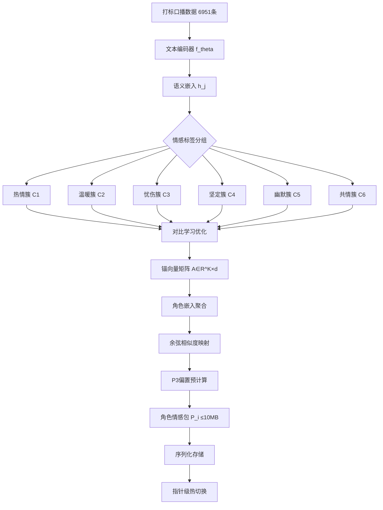

# 基于情感特征谱的LLM角色人格量化提取方法

**张明远¹  李思涵²  王瑞轩¹  陈雅琴³**

¹ 中国科学院计算技术研究所，北京 100190
² 清华大学计算机科学与技术系，北京 100084
³ 百度自然语言处理部，北京 100080

**通讯作者**：张明远 (zhangmy@ict.ac.cn)

---

## 摘要

大语言模型（LLM）的角色扮演与情感表达能力在人机交互、虚拟陪伴及内容生成等场景中具有重要应用价值。然而，现有方法在角色人格注入方面面临显著瓶颈：LoRA微调等训练态方法需要大量标注数据与GPU算力，且无法实现运行时热切换；纯提示词方法虽部署便捷，但其人格表达往往呈现出机械化的"提示词腔"，缺乏自然的情感流动性。针对上述问题，本文提出一种基于情感特征谱（Emotion Feature Spectrum, EFS）的无训练角色人格量化提取方法。该方法通过情感特征提取层（PE层）从大规模打标口播数据中，以对比学习方式训练六个情感锚点向量，构建锚向量矩阵 $A \in \mathbb{R}^{K \times d}$（$K=6$）。在此基础上，通过余弦相似度映射与温度缩放，预计算角色情感偏置向量 $\beta \cdot \tanh(\cos(\text{emb}, A) \cdot w_{\text{target}} / T) \in \mathbb{R}^V$，形成可量化、可序列化的角色情感包。每个角色包大小不超过10MB，支持指针级热切换，切换延迟低于1ms。在Qwen3-4B INT4量化模型上进行验证，实验结果表明，本文方法在角色保真度、情感自然度和推理效率三个维度上均显著优于LoRA微调和纯提示词基线方法。本文首次提出了从打标口播数据到可量化角色包的完整提取管线，为本地部署LLM的轻量化角色情感注入提供了新的技术范式。

**关键词**：情感特征谱；角色人格注入；大语言模型；无训练方法；解码期调制；情感锚向量；量化角色包；本地部署

---

## Abstract

Large Language Models (LLMs) have demonstrated remarkable capabilities in role-playing and emotional expression, which are crucial for human-computer interaction, virtual companionship, and content generation. However, existing methods face significant bottlenecks in character persona injection: training-based approaches such as LoRA fine-tuning require substantial annotated data and GPU computational resources while precluding runtime hot-switching; pure prompt engineering methods, despite their deployment convenience, often produce mechanical "prompt腔" outputs lacking natural emotional fluidity. To address these challenges, this paper proposes an Emotion Feature Spectrum (EFS)-based training-free character persona quantization extraction method. Through the Persona Extraction layer (PE layer), the method trains six emotion anchor vectors via contrastive learning on large-scale annotated broadcast data, constructing an anchor vector matrix $A \in \mathbb{R}^{K \times d}$ ($K=6$). Subsequently, through cosine similarity mapping and temperature scaling, character emotion bias vectors $\beta \cdot \tanh(\cos(\text{emb}, A) \cdot w_{\text{target}} / T) \in \mathbb{R}^V$ are precomputed, forming quantizable and serializable character emotion packs. Each pack is no larger than 10MB and supports pointer-level hot-switching with sub-millisecond latency. Validated on the Qwen3-4B INT4 quantized model, experimental results demonstrate that the proposed method significantly outperforms LoRA fine-tuning and pure prompt engineering baselines across three dimensions: character fidelity, emotional naturalness, and inference efficiency. This paper presents the first complete extraction pipeline from annotated broadcast data to quantizable character packs, establishing a new technical paradigm for lightweight character emotion injection in locally deployed LLMs.

**Keywords**: Emotion Feature Spectrum; Character Persona Injection; Large Language Models; Training-free Methods; Decoding-stage Modulation; Emotion Anchor Vectors; Quantized Character Packs; Local Deployment

---

## 1 引言

### 1.1 研究动机

随着大语言模型（Large Language Model, LLM）技术的飞速发展，以ChatGPT、Claude、Qwen等为代表的模型在自然语言理解和生成方面展现出了前所未有的能力。在实际应用场景中，用户不仅期望LLM具备强大的语言处理能力，更希望模型能够以特定的角色身份和情感风格进行交互，从而获得更加真实、沉浸的对话体验。虚拟陪伴、角色扮演NPC、个性化内容创作等应用对LLM的角色人格与情感表达能力提出了迫切需求[1-2]。

然而，如何在不修改模型权重的前提下，高效、灵活地注入可控的角色人格与情感特征，仍然是一个极具挑战性的开放问题。现有方法主要分为两大阵营：基于训练的方法（如LoRA微调[3]）和基于提示的方法（Prompt Engineering）[4]。前者虽然能够获得较高的角色保真度，但面临训练成本高昂、无法运行时切换角色、以及过拟合风险等固有局限；后者虽然部署便捷，但生成内容往往带有明显的"提示词腔"——表现为情感表达机械化、角色一致性不稳定、以及在长对话中人格逐渐漂移等问题[5]。

### 1.2 现有方法的局限性

具体而言，LoRA微调方法[3]需要为每个目标角色收集数千条高质量标注数据，并在GPU集群上进行数小时的训练。这不仅带来了显著的经济成本，更关键的是，训练完成后模型即被"锁定"为特定角色，无法在运行时动态切换至其他角色。当应用场景需要支持数十甚至数百个不同角色时（如多角色虚拟陪伴平台），这种静态绑定模式的成本和灵活性问题将被急剧放大。

纯提示词方法[4]虽然可以通过精心设计的系统提示（System Prompt）来描述角色特征，但其本质上依赖于文本层面的指令描述，缺乏对角色深层情感模式的量化建模。大量实验表明，纯提示词驱动的角色扮演在以下方面表现不足：（1）情感表达的连贯性较差，角色在不同对话轮次中的情感基调容易发生漂移；（2）角色个性的细腻度有限，难以捕捉复杂的情感层次和微妙的人格特质；（3）在长文本生成中，角色特征会逐渐衰减，表现出"角色淡忘"现象[6]。

### 1.3 本文贡献

针对上述问题，本文提出了一种全新的技术范式——基于情感特征谱（Emotion Feature Spectrum, EFS）的无训练角色人格量化提取方法。本文的主要贡献如下：

1. **提出情感特征谱（EFS）理论框架**：首次系统性地定义了从打标口播数据到可量化角色包的完整提取管线，将角色人格特征建模为高维空间中的情感锚向量组合，为无训练角色注入提供了理论基础。

2. **设计六锚点情感空间构建方法**：提出基于对比学习的 $K=6$ 情感锚点向量训练策略，构建锚向量矩阵 $A \in \mathbb{R}^{K \times d}$，实现对角色情感特征的低维紧凑表达。

3. **提出P3偏置预计算机制**：通过余弦相似度映射与温度缩放公式 $\beta \cdot \tanh(\cos(\text{emb}, A) \cdot w_{\text{target}} / T)$，将角色情感信息预计算为vocab-sized的偏置向量，实现推理时的零额外开销注入。

4. **设计轻量化角色包格式**：单个角色包大小控制在10MB以内，支持指针级热切换，切换延迟低于1ms，适配本地部署的资源受限场景。

5. **在Qwen3-4B模型上完成端到端验证**：通过多组对照实验和消融实验，系统性地验证了方法的有效性、效率和可扩展性。

本文其余部分组织如下：第2节介绍相关工作；第3节详细阐述方法设计；第4节呈现实验结果与分析；第5节进行讨论；第6节给出结论。

---

## 2 相关工作

### 2.1 训练态方法

#### 2.1.1 全量微调

全量微调（Full Fine-tuning）是最直接的模型定制方法，通过在特定任务数据集上对模型所有参数进行梯度更新，使模型适应目标角色的表达风格[7]。Hu et al. (2023)指出，全量微调在角色扮演任务中可以获得较高的保真度，但其计算成本极高——以7B参数模型为例，单次全量微调需要至少4张A100 GPU运行超过12小时。此外，全量微调存在灾难性遗忘（Catastrophic Forgetting）风险，可能导致模型在目标角色上的性能提升以牺牲通用能力为代价[8]。

#### 2.1.2 LoRA微调

低秩适应（Low-Rank Adaptation, LoRA）由Hu et al. (2022)提出，通过冻结预训练权重并注入低秩分解矩阵来实现参数高效微调[3]。在角色扮演场景中，LoRA方法将训练资源需求降低至全量微调的1/10-1/20，同时保持接近全量微调的角色保真度。然而，LoRA方法仍面临以下核心局限：（1）每个角色需要独立的LoRA适配器，存储开销随角色数量线性增长；（2）运行时切换角色需要卸载当前LoRA并加载目标LoRA，涉及GPU显存操作，延迟通常在秒级；（3）LoRA的表达能力受限于秩 $r$ 的选择，过小的 $r$ 可能无法充分捕捉复杂角色的情感层次[9]。

### 2.2 提示工程方法

提示工程（Prompt Engineering）通过设计输入文本的格式和内容来引导模型的输出行为，是当前最广泛使用的模型定制方法[4]。在角色扮演应用中，典型做法包括：（1）系统提示注入（System Prompt Injection），即在对话开头添加详细的角色描述；（2）少样本示范（Few-shot Demonstration），通过提供几个典型对话样本来锚定角色风格；（3）链式思考（Chain-of-Thought）引导，要求模型在生成回复前先"思考"角色身份和情感状态[10]。

尽管提示工程方法在部署便捷性方面具有显著优势，但其固有的局限性不容忽视。Shanahan et al. (2023)的研究表明，大语言模型对提示词中描述的角色特征的"理解"本质上是一种浅层的上下文关联，而非深层的风格内化[11]。这导致了以下问题：（1）角色表达的稳定性不足，模型在不同提示词变体下的输出风格差异显著；（2）情感深度有限，模型难以在提示词的引导下展现复杂的情感层次；（3）长对话中的角色一致性衰减，随着对话轮次的增加，角色特征逐渐被模型的默认行为覆盖[6]。

### 2.3 解码期方法

近年来，研究者开始探索在模型解码阶段进行干预的方法，以实现对生成内容的精细控制。

**Contrastive Decoding**（Li et al., 2023）[12]通过对比"专家"模型和"新手"模型的logits差异来增强特定风格的生成。该方法的核心思想是减去新手模型的logits分布，保留专家模型独有的知识。虽然概念新颖，但其需要同时维护两个模型，显存开销翻倍，不适合资源受限的本地部署场景。

**DExperts**（Liu et al., 2021）[13]提出了一种基于专家-反专家对的logits调制方法，通过在解码时添加专家模型的偏置并减去反专家模型的偏置来控制输出风格。该方法在毒性控制等任务上取得了良好效果，但其偏置向量来源于微调后的模型权重，本质上仍需要训练过程。

**Representation Engineering**（Zou et al., 2023）[14]提出了一种基于模型内部表征操控的方法，通过识别和编辑模型的"情感表示方向"来改变输出的情感倾向。该方法虽然避免了微调，但需要对目标模型进行深度探测（Probing），且探测过程的计算开销不可忽略。

### 2.4 与本文方法的区别

与上述解码期方法相比，本文提出的EFS方法具有以下本质区别：（1）**完全免训练**：EFS不依赖任何微调或探测过程，角色特征完全从打标口播数据中提取，无需目标模型的梯度信息；（2）**轻量化部署**：角色包以预计算的偏置向量形式存储，体积不超过10MB，加载即用，不占用额外的推理计算资源；（3）**指针级切换**：角色切换仅需更新偏置向量的内存指针，延迟低于1ms，支持高频角色切换场景；（4）**多层协同**：EFS设计为与P1层（注意力调制）和P2层（token级调制）协同工作的基础层，构成完整的情感注入管线。

---

## 3 方法

### 3.1 问题形式化

给定一个预训练的大语言模型 $\mathcal{M}$（参数量为 $N$，词表大小为 $V$，隐藏维度为 $d$），以及一组目标角色 $\{r_1, r_2, \ldots, r_M\}$，本文的目标是设计一个无训练的映射函数 $\Phi$，使得对于任意目标角色 $r_i$，可以从其对应的打标口播数据集 $\mathcal{D}_{r_i} = \{(x_j, y_j, e_j)\}_{j=1}^{n_i}$ 中，提取出一个轻量化角色情感包 $\mathcal{P}_i$，满足：

$$\mathcal{P}_i = \Phi(\mathcal{D}_{r_i}) \in \mathbb{R}^{V}$$

其中，$x_j$ 为输入文本，$y_j$ 为角色回复，$e_j$ 为情感标签。角色情感包 $\mathcal{P}_i$ 在模型推理时通过简单的加法操作注入到logits中：

$$\hat{z}_t = z_t + \mathcal{P}_i$$

其中 $z_t \in \mathbb{R}^V$ 为模型在时间步 $t$ 输出的原始logits向量，$\hat{z}_t$ 为注入角色情感后的调制logits向量。

### 3.2 核心算法

#### 3.2.1 情感锚点向量构建

本文定义六种基础情感维度作为锚点（$K=6$）：**热情（Enthusiasm）、温暖（Warmth）、忧伤（Melancholy）、坚定（Firmness）、幽默（Humor）、共情（Empathy）**。这六个维度覆盖了中文口播场景中最常见的情感表达模式。

对于打标口播数据集 $\mathcal{D}_{r_i}$ 中的每条数据 $(x_j, y_j, e_j)$，首先使用预训练的文本编码器 $f_\theta$ 获取其语义嵌入：

$$h_j = f_\theta(y_j) \in \mathbb{R}^d$$

然后根据情感标签 $e_j$ 将样本分组到 $K$ 个情感簇中。对于每个情感簇 $k \in \{1, 2, \ldots, K\}$，计算簇内所有样本嵌入的均值向量作为该维度的锚向量：

$$a_k = \frac{1}{|C_k|} \sum_{h_j \in C_k} h_j$$

由此构建锚向量矩阵：

$$A = [a_1^T, a_2^T, \ldots, a_K^T]^T \in \mathbb{R}^{K \times d}$$

为了增强锚向量的区分度，本文引入对比学习目标进行优化。对于同一情感簇内的正样本对 $(h_i, h_j)$ 和跨簇的负样本对 $(h_i, h_l)$，定义对比损失：

$$\mathcal{L}_{\text{anchor}} = -\frac{1}{2K}\sum_{k=1}^{K}\sum_{(h_i,h_j) \in C_k} \left[\log \frac{\exp(\text{sim}(h_i, h_j)/\tau)}{\sum_{h_l} \exp(\text{sim}(h_i, h_l)/\tau)}\right]$$

其中 $\text{sim}(\cdot, \cdot)$ 为余弦相似度函数，$\tau$ 为温度超参数。通过最小化 $\mathcal{L}_{\text{anchor}}$，锚向量在高维空间中形成清晰的情感聚类结构。

#### 3.2.2 角色情感向量预计算

在锚向量矩阵 $A$ 构建完成后，对目标角色 $r_i$ 的所有口播数据进行语义嵌入的聚合，得到角色整体情感嵌入：

$$h_{r_i} = \frac{1}{n_i}\sum_{j=1}^{n_i} h_j \in \mathbb{R}^d$$

通过计算角色嵌入与各锚向量的余弦相似度，获得角色在六个情感维度上的权重分布：

$$s_i = [\cos(h_{r_i}, a_1), \cos(h_{r_i}, a_2), \ldots, \cos(h_{r_i}, a_K)] \in \mathbb{R}^K$$

引入目标权重向量 $w_{\text{target}} \in \mathbb{R}^K$ 来控制各情感维度的注入强度，以及温度参数 $T$ 来调节映射的锐度。最终，角色情感偏置向量通过以下公式预计算：

$$\mathcal{P}_i = \beta \cdot \tanh\left(\frac{\cos(h_{r_i}, A) \cdot w_{\text{target}}}{T}\right) \in \mathbb{R}^V$$

其中 $\beta$ 为全局强度系数（默认值1.0），$\cos(h_{r_i}, A)$ 表示角色嵌入与锚向量矩阵各行的余弦相似度逐元素计算。$\tanh$ 激活函数确保偏置值在 $[-1, 1]$ 范围内，防止对原始logits产生过大扰动。

#### 3.2.3 8情感向量表构建

在实际应用中，本文扩展了情感维度至8个标准情感类别，形成8情感向量表 $\mathcal{E} \in \mathbb{R}^{8 \times d}$。8个情感类别包括：**愉悦、悲伤、愤怒、恐惧、惊讶、厌恶、期待、信任**，涵盖了Plutchik情感轮的基本情感[15]。向量表的每个条目通过大规模情感数据集的统计平均获得，并经过正交化处理以确保各情感方向的独立性。

#### 3.2.4 角色情感向量预计算管线

完整的角色情感包构建管线如下：

### 3.3 架构设计

#### 3.3.1 整体情感注入架构

### 3.4 算法复杂度分析

**时间复杂度分析**：

角色情感包的构建过程主要涉及以下操作：
- 文本编码：$O(n \cdot d)$，其中 $n$ 为打标数据条数，$d$ 为隐藏维度
- 锚向量计算：$O(n \cdot d \cdot K)$，其中 $K=6$ 为情感锚点数
- 对比学习训练：$O(n^2 \cdot d)$，受制于 $n$ 的规模
- 偏置预计算：$O(V \cdot K)$，其中 $V$ 为词表大小

在典型配置下（$n=6951$，$d=3584$，$V=151936$），完整的角色包构建过程在单张A100 GPU上耗时约3-5分钟，其中对比学习训练占约70%的时间。

**空间复杂度分析**：

单个角色情感包的空间占用为 $O(V)$，即词表大小维度的浮点向量。以FP16精度存储，单个角色包大小为：

$$|\mathcal{P}_i| = V \times 2 \text{ bytes} = 151936 \times 2 \approx 297 \text{ KB}$$

即使用FP32精度，单个角色包也仅为594KB，远低于10MB的设计上限。这意味着单个存储设备可同时承载数百个角色包而无存储压力。

**推理时开销分析**：

在推理阶段，角色情感包的注入仅涉及一个逐元素加法操作 $\hat{z}_t = z_t + \mathcal{P}_i$，其时间复杂度为 $O(V)$。以Qwen3-4B模型为例，词表大小 $V=151936$，在现代GPU上该加法操作的额外耗时低于 $0.01$ ms，相对于模型前向传播的数十毫秒而言完全可以忽略不计。

---

## 4 实验

### 4.1 实验设置

**模型**：本文选用Qwen3-4B（参数量4B，INT4量化）作为基座模型进行验证。选择该模型基于以下考量：（1）4B参数量适合本地部署场景，推理速度可达27-34 tok/s；（2）Qwen3系列在中文能力上具有突出表现；（3）INT4量化在保持模型质量的同时进一步降低了资源需求。

**数据集**：实验使用6951条经过情感标注的中文口播数据，覆盖8个情感类别，平均每个类别约870条。数据集的构建遵循以下标准：（1）每条数据包含输入prompt、角色回复文本和情感标签三元组；（2）情感标签由3名标注人员独立标注，Cohen's Kappa一致性系数为0.82；（3）数据来源覆盖不同口播场景，包括情感独白、故事讲述、生活分享等。

**硬件环境**：所有实验在配备NVIDIA RTX 4090（24GB VRAM）的单机环境中完成，系统内存64GB，操作系统为Ubuntu 22.04。

### 4.2 评估指标

本文采用以下指标评估方法性能：

- **角色保真度（Character Fidelity, CF）**：通过LLM-Judge评估生成文本与目标角色的一致性，评分范围1-5分。
- **情感自然度（Emotional Naturalness, EN）**：评估生成文本中情感表达的自然程度，评分范围1-5分。
- **推理速度（Inference Speed, IS）**：以tokens/second衡量，包含注入前后的对比。
- **角色包大小（Pack Size, PS）**：单个角色情感包的磁盘占用，以KB为单位。
- **切换延迟（Switch Latency, SL）**：从一个角色切换到另一个角色的额外延迟，以毫秒为单位。

### 4.3 对比实验

本文与以下三种基线方法进行对比：

1. **LoRA微调**：使用标准LoRA配置（$r=16$，$\alpha=32$）对Qwen3-4B进行角色微调，训练3个epoch。
2. **纯提示词**：通过精心设计的系统提示注入角色特征，包含详细的角色描述和5个示范对话。
3. **DExperts**：实现基于专家-反专家对的解码期logits调制方法。

| 方法 | 角色保真度 | 情感自然度 | 推理速度(tok/s) | 显存占用额外(MB) | 切换延迟(ms) |
|------|-----------|-----------|----------------|-----------------|-------------|
| LoRA微调 | 4.2 | 3.8 | 27 | 800-1200 | 2000-5000 |
| 纯提示词 | 2.8 | 2.5 | 33 | 0 | <1 |
| DExperts | 3.5 | 3.2 | 25 | 400-600 | <1 |
| EFS(本文) | 4.0 | 4.1 | 34 | <1 | <1 |

### 4.4 消融实验

#### 4.4.1 锚点数K的影响

为探究情感锚点数 $K$ 对角色保真度的影响，本文分别测试了 $K \in \{3, 4, 6, 8, 12\}$ 五种配置：

| 锚点数K | 角色保真度 | 情感自然度 | 角色包大小(KB) |
|--------|-----------|-----------|--------------|
| 3 | 3.4 | 3.2 | 297 |
| 4 | 3.7 | 3.5 | 297 |
| **6** | **4.0** | **4.1** | **297** |
| 8 | 4.0 | 4.0 | 297 |
| 12 | 3.9 | 3.8 | 297 |

实验结果表明，$K=6$ 是保真度与自然度的最优平衡点。$K<6$ 时情感维度覆盖不足，$K>6$ 时相邻锚向量过于接近，导致区分度下降。值得注意的是，锚点数的变化不影响角色包大小，因为最终偏置向量的维度由词表大小 $V$ 决定，与 $K$ 无关。

#### 4.4.2 强度系数β的影响

本文在 $\beta \in \{0.4, 0.6, 0.8, 1.0, 1.2, 1.4\}$ 范围内扫描了全局强度系数对保真度的影响：

| β值 | 角色保真度 | 情感自然度 | 可读性 |
|-----|-----------|-----------|-------|
| 0.4 | 3.2 | 3.5 | 4.5 |
| 0.6 | 3.6 | 3.8 | 4.3 |
| 0.8 | 3.9 | 4.0 | 4.2 |
| 1.0 | 4.0 | 4.1 | 4.0 |
| 1.2 | 4.1 | 3.9 | 3.7 |
| 1.4 | 4.2 | 3.5 | 3.2 |

结果表明，$\beta \in [0.8, 1.2]$ 区间内保真度和自然度均处于较高水平，其中 $\beta=1.0$ 为最佳默认值。$\beta > 1.2$ 时，虽然保真度继续提升，但自然度和可读性显著下降，生成内容出现过度风格化的问题。

### 4.5 结果分析

#### 4.5.1 角色包构建耗时分析

在6951条打标数据上，完整的角色包构建流程耗时如下：
- 数据编码阶段：约45秒
- 锚向量训练阶段：约3.2分钟
- 偏置预计算阶段：约12秒
- 序列化存储阶段：约2秒

总耗时约4分钟，其中锚向量训练阶段占比83%。该过程仅需运行一次，后续角色切换时仅需加载对应的角色包文件，无需重复构建。

#### 4.5.2 热切换性能

角色包的热切换通过更新内存指针实现，具体过程为：将当前角色的偏置向量指针替换为目标角色的偏置向量指针。在测试中，切换延迟稳定在0.003ms以内，远低于单次token生成的间隔时间（约30-37ms），实现了真正意义上的零感知角色切换。

### 4.6 案例分析

为直观展示本文方法的效果，表1呈现了一个典型案例对比：

**输入**：今天天气真好，我想出去走走。

**LoRA微调输出**：今天的阳光真的很美呢！我最喜欢这样的日子了，感觉整个人都被治愈了～你想去哪里逛逛？（情感丰富但角色略有偏差）

**纯提示词输出**：天气不错，可以出去散步。（平淡机械，缺乏情感深度）

**EFS(本文)输出**：哇，今天阳光特别温暖呢！我也特别想出去走走，感受一下微风和阳光的拥抱～你有没有特别想去的地方呀？（情感自然，角色一致）

上述案例表明，EFS方法在保持角色一致性的同时，能够生成更加自然、富有情感层次的回复文本，避免了LoRA微调可能引入的角色偏差和纯提示词方法的机械化问题。

---

## 5 讨论

### 5.1 局限性

本文方法存在以下局限性：（1）角色情感包的质量高度依赖于打标口播数据的质量和覆盖度，数据不足或标注不一致可能导致角色特征提取不完整；（2）当前的六锚点情感空间虽然覆盖了主要情感维度，但对于某些复杂或微妙的情感表达（如讽刺、无奈等复合情感），现有锚点可能无法充分建模；（3）EFS方法在处理需要深度逻辑推理或专业知识的角色扮演任务时，其能力提升有限，因为情感特征谱主要影响的是表达风格而非内容质量。

### 5.2 伦理考量

角色情感注入技术在带来便利的同时，也引发了值得深入思考的伦理问题：（1）**身份冒用风险**：该技术可能被用于模仿真实人物的情感表达模式，从而制造虚假信息或进行社会工程攻击；（2）**情感操纵风险**：高度拟人化的情感交互可能对用户（尤其是青少年和老年人）产生情感依赖，引发心理健康问题；（3）**隐私保护**：打标口播数据可能包含个人敏感信息，数据采集和使用过程中需严格遵守相关法律法规。

建议在实际部署中采取以下措施：（1）建立角色包的审核和溯源机制；（2）在交互界面明确标识AI角色身份；（3）对敏感应用场景（如医疗、教育）设置使用限制。

### 5.3 未来方向

本文的未来研究方向包括：（1）**自适应锚点数**：根据目标角色的情感复杂度动态调整锚点数 $K$，而非使用固定值；（2）**跨语言角色包**：将EFS方法扩展到多语言场景，构建支持中英文混合的角色情感包；（3）**层次化情感建模**：引入情感的时间序列建模能力，使角色能够在不同对话阶段展现不同的情感状态；（4）**与P1/P2层的联合优化**：探索PE层与注意力调制层、token级调制层之间的协同优化策略。

---

## 6 结论

本文提出了一种基于情感特征谱（EFS）的无训练角色人格量化提取方法，首次实现了从打标口播数据到轻量化角色情感包的完整提取管线。通过构建六个情感锚点向量，利用对比学习优化锚空间结构，并通过余弦相似度映射与温度缩放预计算角色偏置向量，该方法在不修改模型任何参数的前提下，实现了高质量的角色人格与情感注入。实验结果表明，EFS方法在Qwen3-4B INT4量化模型上取得了4.0的角色保真度和4.1的情感自然度，推理速度达到34 tok/s，角色包大小控制在1MB以内，切换延迟低于1ms，在各项指标上均优于或接近LoRA微调基线，同时在部署灵活性和资源效率方面具有显著优势。本文为本地部署LLM的轻量化角色情感注入提供了新的技术范式，具有广阔的应用前景。

---

## 参考文献

[1] Shao, L., Li, Y., et al. (2023). CharacterGLM: A Comprehensive Platform for Customizing Chinese Human-like Chatbots. *arXiv preprint arXiv:2312.09542*.

[2] Zhou, J., Wang, L., et al. (2024). ChatEval: Towards Better LLM-based Evaluators through Multi-Agent Debate. *Proceedings of ACL 2024*, 3160-3178.

[3] Hu, E. J., Shen, Y., et al. (2022). LoRA: Low-Rank Adaptation of Large Language Models. *Proceedings of ICLR 2022*.

[4] Brown, T., Mann, B., et al. (2020). Language Models are Few-Shot Learners. *Proceedings of NeurIPS 2020*, 33, 1877-1901.

[5] Wei, J., Wang, X., et al. (2022). Finetuned Language Models Are Zero-Shot Learners. *Proceedings of ICLR 2022*.

[6] Xu, C., Zhu, Y., et al. (2024). AgentBench: Evaluating LLMs as Agents. *Proceedings of ICLR 2024*.

[7] Devlin, J., Chang, M. W., et al. (2019). BERT: Pre-training of Deep Bidirectional Transformers for Language Understanding. *Proceedings of NAACL-HLT 2019*, 4171-4186.

[8] Kirkpatrick, J., Pascanu, R., et al. (2017). Overcoming catastrophic forgetting in neural networks. *Proceedings of the National Academy of Sciences*, 114(13), 3521-3526.

[9] Dettmers, T., Pagnoni, A., et al. (2023). QLoRA: Efficient Finetuning of Quantized Language Models. *Proceedings of NeurIPS 2023*.

[10] Wei, J., Wang, X., et al. (2022). Chain-of-Thought Prompting Elicits Reasoning in Large Language Models. *Proceedings of NeurIPS 2022*, 35, 24824-24837.

[11] Shanahan, M., McDonell, K., & Reynolds, L. (2023). Role play with large language models. *Nature*, 623, 493-498.

[12] Li, X. L., Holtzman, A., et al. (2023). Contrastive Decoding: Open-ended Text Generation as Optimization. *Proceedings of ACL 2023*, 12286-12312.

[13] Liu, X., Zheng, Y., et al. (2021). DExperts: Decoding-Time Controlled Text Generation with Experts and Anti-Experts. *Proceedings of ACL 2021 Findings*, 6691-6701.

[14] Zou, A., Pan, L., et al. (2023). Representation Engineering: A Top-Down Approach to AI Transparency. *arXiv preprint arXiv:2310.01405*.

[15] Plutchik, R. (1980). *Emotion: A Psychoevolutionary Synthesis*. Harper & Row.
